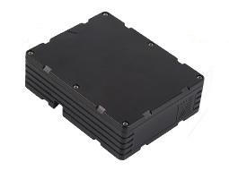

# EElink - GPT50

El GPT50 es un rastreador GPS de fabricación robusta diseñado para despliegues de larga duración y uso intensivo en campo. Pensado para el seguimiento de activos y vehículos cuando la disponibilidad de energía es limitada, el dispositivo combina posicionamiento multi‑GNSS con respaldo por Wi‑Fi y LBS y conectividad celular global para ofrecer datos de ubicación y telemetría confiables. Su carcasa IP67 y su capacidad de espera extendida lo hacen adecuado para remolques, contenedores, maquinaria pesada y otros activos distribuidos que requieren monitoreo continuo.

Como dispositivo compatible con Plaspy, el GPT50 transmite posiciones y telemetría a Plaspy para seguimiento en tiempo real, supervisión de flotas e informes históricos. Los modos de trabajo seleccionables y las capacidades de gestión remota permiten a su organización equilibrar la vida útil de la batería y la fidelidad del rastreo, mientras que Plaspy centraliza alertas, reglas de geocercas y aprovisionamiento de dispositivos para flotas extensas o activos distribuidos.

## Puntos destacados

- Autonomía en espera prolongada con dos baterías de litio de 12000 mAh que permiten despliegues extendidos y reducen ciclos de mantenimiento.
- Posicionamiento multi GNSS con respaldo por Wi‑Fi y LBS para mayor fiabilidad de la ubicación en entornos urbanos e interiores.
- Cobertura celular global en redes LTE y GSM para mantener el rastreo consistente entre regiones.
- Varios modos de funcionamiento, incluidos modo de larga espera, modo de emergencia en tiempo real y activación por sensores para estrategias de reporte flexibles.
- Sensor de temperatura integrado y soporte de geocercas para telemetría ambiental básica y alertas basadas en ubicación.
- Carcasa resistente con certificación IP67 y amplio rango de temperatura de operación, ideal para seguimiento de activos al aire libre e industriales.

## Cómo funciona con Plaspy

Al conectarse con Plaspy, el GPT50 envía posiciones GNSS y telemetría del dispositivo a través de enlaces celulares, lo que permite a Plaspy mostrar ubicaciones en vivo, estados y trayectos históricos en una sola plataforma. Plaspy ingiere los datos del dispositivo y aplica reglas, notificaciones e informes acordes con sus flujos de trabajo de gestión de flota o activos.

- Actualizaciones de ubicación en vivo y estado del dispositivo para ofrecer visibilidad en tiempo real y supervisión operativa en los paneles de Plaspy.
- Telemetría de temperatura y eventos de geocerca que pueden activar alertas, notificaciones y flujos de trabajo automatizados en Plaspy.
- Respaldo por Wi‑Fi y LBS que incrementa la cantidad de soluciones útiles cuando el GNSS se ve degradado, mejorando la precisión en mapa de Plaspy para activos en interiores o entornos urbanos.
- Disparadores configurables de activación y modo de emergencia que permiten a Plaspy recibir actualizaciones de alta frecuencia cuando se requiere rastreo inmediato.
- Configuración remota y actualizaciones OTA para ajustar de forma centralizada intervalos de reporte y umbrales mediante las herramientas de gestión de Plaspy.

## Casos de uso típicos

- Gestión de flotas para remolques, vehículos en leasing y equipos fuera de la red con acceso de mantenimiento limitado.
- Monitoreo antirrobo y recuperación de activos mediante geocercas y rastreo en tiempo real de emergencia combinado con alertas de Plaspy.
- Supervisión remota de equipos y contenedores donde se requiere telemetría de temperatura y comprobaciones periódicas.
- Rastreo de maquinaria pesada en construcción, minería y patios de almacenamiento que demandan hardware resistente.
- Activos estacionales o de acceso poco frecuente en los que la larga autonomía y la verificación periódica de ubicación son prioritarios.

## Por qué elegir este rastreador con Plaspy

El GPT50 es una alternativa práctica para organizaciones que necesitan un rastreador duradero y de bajo mantenimiento junto a una plataforma centralizada de gestión. Su capacidad de larga espera contribuye a reducir el costo total de propiedad para activos distribuidos, mientras que el posicionamiento multi GNSS y los métodos de respaldo mejoran la consistencia de los datos de ubicación usados en enrutamiento, análisis histórico e investigaciones de incidentes. Usar Plaspy como capa de gestión e informes facilita el aprovisionamiento escalable de dispositivos, la consolidación de alertas y los reportes operativos para flotas y tipos de activos mixtos.

Para obtener más información sobre cómo Plaspy puede integrarse con el GPT50, visite https://www.plaspy.com. Las especificaciones del producto, la disponibilidad y los detalles del fabricante pueden cambiar; para la información técnica más actual verifique directamente con el fabricante en https://www.eelink.com.cn/.
