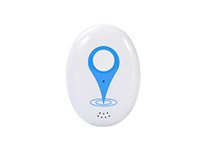

# EElink - K30

El K30 es un rastreador GPS portátil y compacto diseñado para la seguridad personal y el monitoreo de personal. Ligero y resistente al agua, el dispositivo combina posicionamiento por GPS, Wi‑Fi y LBS con seguimiento en tiempo real y funciones de emergencia como un botón SOS y voz bidireccional, lo que ayuda a cuidadores y equipos operativos a mantener visibilidad y responder con rapidez cuando se presentan incidentes.

Como dispositivo compatible con Plaspy, el K30 integra sus datos de ubicación y eventos en la plataforma Plaspy para mapeo, alertas e informes. La configuración remota mediante la plataforma, la aplicación o SMS facilita la incorporación y permite a las organizaciones centralizar geocercas, umbrales de alarma y supervisión operativa para el rastreo de personas y la protección ligera de activos.

## Aspectos destacados

- Rastreador portátil compatible con Plaspy, pensado para seguridad personal y monitoreo de personal.
- Posicionamiento triple mediante GPS, Wi‑Fi y LBS para mejorar la precisión en diferentes entornos.
- Alerta de emergencia SOS y voz bidireccional para apoyar una respuesta rápida ante incidentes.
- Funciones de geocercas y alarmas para notificaciones de entrada/salida y alertas de batería baja.
- Ahorro de energía inteligente para extender el tiempo de operación entre cargas.
- Diseño compacto con clasificación IP65, apto para uso diario y tareas de servicio ligero.
- Configuración remota desde la plataforma, la app o por SMS para agilizar actualizaciones a gran escala.

## Cómo funciona con Plaspy

Al integrarse con Plaspy, el K30 envía posiciones y telemetría de eventos que la plataforma utiliza para poblar mapas, activar notificaciones y generar reportes históricos. Plaspy recibe las actualizaciones de posición y eventos del dispositivo para que los administradores puedan monitorear personas en tiempo real, automatizar alertas y revisar actividades pasadas desde una sola interfaz.

- Ubicación y estado en tiempo real mostrados en los mapas y paneles de Plaspy.
- Activaciones de SOS y eventos de voz integrados en los flujos de alerta de Plaspy para atención inmediata.
- Información de movimiento y conteo de pasos disponible para monitoreo de actividad y reportes básicos.
- Notificaciones de entrada y salida de geocercas que disparan alertas en Plaspy para control perimetral y cumplimiento.
- Configuración remota y ajuste de intervalos de reporte a través de Plaspy o canales soportados por el dispositivo.

## Casos de uso típicos

- Seguridad infantil y monitoreo parental con notificaciones SOS rápidas y visibilidad de ubicación.
- Cuidado de personas mayores y protección de trabajadores aislados donde alertas rápidas e historial de ubicación respaldan a los cuidadores.
- Seguimiento de personal en campus o en operaciones con sitios mixtos para supervisión de actividad y gestión de incidentes.
- Control de pertenencias personales o mochilas donde el factor de forma compacto y las alarmas ayudan a prevenir pérdidas.
- Supervisión de eventos e instalaciones para vigilar movimiento de personal y hacer cumplir zonas designadas.

## Por qué elegir este rastreador con Plaspy

El K30 está enfocado en la telemetría de personas y activos ligeros, ofreciendo un equilibrio entre posicionamiento, comunicación de emergencia y autonomía de batería adecuada para uso diario. Para organizaciones que requieren wearables compatibles con Plaspy, el dispositivo brinda las funciones esenciales para flujos de trabajo de seguridad sin la complejidad de la telemática orientada a vehículos.

Integrar el K30 con Plaspy proporciona una visibilidad centralizada de ubicaciones, eventos SOS y actividad de geocercas, mientras que las opciones de configuración remota reducen la carga de mantenimiento. Su diseño compacto, resistente al agua y su conjunto de funciones sencillo lo convierten en una opción práctica para programas centrados en la seguridad del personal, el cuidado y el rastreo de personas en movimiento.

Para obtener más información sobre Plaspy y el soporte de dispositivos compatibles, visite https://www.plaspy.com. Las especificaciones del producto, disponibilidad y detalles del fabricante pueden cambiar con el tiempo, por lo que se recomienda confirmar los datos técnicos y la información de soporte con la documentación oficial del fabricante en https://www.eelink.com.cn/.
