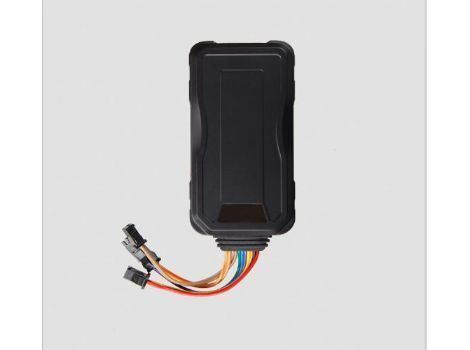

# EV - EV-300

El EV-300 Vehicle/Motorcycle GPS Tracker de EV es un dispositivo compacto diseñado para entregar información de ubicación estable y en tiempo real tanto para vehículos como para motocicletas. Pensado para una amplia gama de voltajes de operación y con antenas internas, el EV-300 prioriza un desempeño consistente y facilidad de instalación. Incluye múltiples entradas y salidas, un puerto RS232 para integrar accesorios, memoria interna para almacenamiento de waypoints, batería de respaldo y un acelerómetro interno para detección de movimiento y modos de ahorro de energía.

Como dispositivo compatible con Plaspy, el EV-300 puede enviar posiciones y eventos de alarma en vivo a la plataforma de gestión de flotas para proporcionar visibilidad y supervisión operativa. Plaspy puede mostrar el historial de ubicaciones capturado por el equipo, recibir alertas de geocerca y exceso de velocidad, y reportar eventos de I/O y pérdidas de alimentación para ayudar a los equipos a monitorear vehículos y motocicletas en flotas mixtas. Esta combinación convierte al EV-300 en una opción práctica para organizaciones que necesitan reportes de ubicación confiables integrados en los flujos de trabajo de Plaspy.

## Características principales

- Seguimiento en línea en tiempo real para visibilidad continua de la ubicación
- Amplio rango de voltaje de operación, apto para vehículos y motocicletas
- Múltiples entradas y salidas más puerto RS232 para integración de accesorios
- Acelerómetro interno de 3 ejes para detección de movimiento y ahorro de energía
- Memoria flash integrada con capacidad para almacenar hasta 60,000 waypoints para registro sin conexión
- Gestión de geocercas, alarma por exceso de velocidad y alertas por batería baja o pérdida de energía
- Batería de respaldo y soporte para actualización de firmware por aire (OTA) para mantenimiento

## Cómo funciona con Plaspy

El EV-300 transmite datos de posición, alarma y eventos que Plaspy puede procesar para presentar mapas, alertas y recorridos históricos. Dentro de Plaspy, los eventos del dispositivo y los waypoints almacenados ayudan a mantener la continuidad del historial de ubicaciones y facilitan los reportes operativos.

- Mostrar ubicaciones en vivo de vehículos y motocicletas en los mapas de Plaspy para visibilidad de la flota
- Recibir y gestionar alertas de geocerca y exceso de velocidad dentro de los flujos de trabajo de notificación de Plaspy
- Usar los waypoints almacenados en el dispositivo para completar el historial de ubicaciones cuando la conectividad es intermitente
- Mostrar notificaciones de pérdida de energía y batería baja en Plaspy para mantenimiento proactivo
- Combinar eventos de I/O y señales de control remoto con los reportes de Plaspy para obtener información operativa

## Casos de uso típicos

- Monitoreo diario de flotas mixtas de vehículos y motocicletas
- Servicios de entrega y mensajería que requieren ubicación en tiempo real y registro de rutas
- Procedimientos de seguridad y recuperación de activos mediante funciones de escucha y corte remoto
- Programas de renta y vehículos compartidos que necesitan seguimiento de uso y control por geocerca
- Supervisión remota de vehículos donde la batería de respaldo preserva la continuidad durante interrupciones de energía

## Por qué elegir este rastreador con Plaspy

El EV-300 combina un hardware de seguimiento práctico con un conjunto de funciones que se alinean bien con las necesidades de visibilidad de flotas y telemática básica. Su operación estable en un amplio rango de voltajes, antenas internas que facilitan la instalación y el almacenamiento a bordo para miles de waypoints lo convierten en una elección sensata para organizaciones que dependen de reportes continuos de ubicación. Al integrarse con Plaspy, las alertas del dispositivo y el historial registrado permiten a los equipos mantener supervisión y responder a eventos desde una plataforma centralizada.

Para más detalles sobre cómo usar el EV-300 con Plaspy y cómo puede adaptarse a sus necesidades operativas, conozca más sobre Plaspy en el sitio web principal https://www.plaspy.com. Las especificaciones del producto, la disponibilidad y los detalles del fabricante pueden cambiar con el tiempo, por lo que verifique la información técnica y la compatibilidad actual en la documentación del fabricante en http://www.eviewltd.com/
