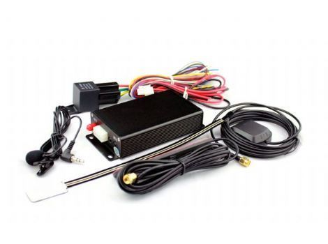

# EV - EV-601

El EV EV-601 es un rastreador GPS compacto pensado para su uso en vehículos y motocicletas. Combina reportes de ubicación continuos con un módulo de memoria integrado y opciones de comunicación que permiten el rastreo mediante un servicio web gratuito y por SMS. El equipo incluye funciones habituales en seguridad vehicular y monitoreo operativo, como geocercas, alertas de movimiento y SOS, y controles de inmovilización remota.

Como dispositivo compatible con Plaspy, el EV-601 puede integrarse en el entorno de monitoreo de flotas de Plaspy para ofrecer visibilidad y gestión centralizada. Su accesibilidad vía web y SMS, junto con alertas y almacenamiento histórico, lo convierten en una opción práctica para equipos que requieren actualizaciones de posición fiables y notificaciones estándar de eventos vehiculares dentro de la plataforma Plaspy.

## Características principales

- Diseñado para vehículos y motocicletas con seguimiento y supervisión en tiempo real
- Seguimiento en línea gratuito vía web y acceso por SMS para consultas de ubicación inmediatas
- Memoria interna de 8 MB para almacenamiento y recuperación local de datos
- Soporte de geocercas y múltiples alertas vehiculares, incluyendo SOS y alarma por movimiento
- Capacidad de corte remoto del motor o del suministro de combustible para inmovilización cuando sea necesario
- Emplea chipset GPS U Blox para mayor precisión y soporta actualizaciones de firmware por aire

## Cómo funciona con Plaspy

Cuando se utiliza con Plaspy, el EV-601 envía información de ubicación y eventos a una plataforma centralizada para que los operadores de flota puedan supervisar activos, configurar alertas y revisar historiales. La integración se orienta a la visibilidad y al control operativo más que a la configuración a bajo nivel del dispositivo.

- Entregar actualizaciones de ubicación en tiempo real a Plaspy para monitorización en el mapa y visibilidad de rutas
- Reenviar alertas de entrada y salida de geocercas a Plaspy para control perimetral y notificaciones
- Enviar alertas SOS, de movimiento y de pérdida de señal a Plaspy para activar flujos de trabajo operativos
- Conservar datos históricos de posiciones para revisión y elaboración de reportes dentro de Plaspy
- Utilizar alertas y eventos de inmovilización remota en Plaspy para apoyar procedimientos de seguridad

## Casos de uso típicos

- Seguimiento de flotas de vehículos ligeros donde se requieren ubicación y alertas de eventos
- Monitoreo de flotas de motocicletas para servicios de entrega, mensajería o operación de conductores
- Flujos de respuesta y recuperación ante robos usando alertas SOS e inmovilización remota
- Supervisión de vehículos de renta con geocercas y notificaciones de movimiento
- Operaciones que necesitan seguimiento histórico básico y consultas de ubicación por SMS bajo demanda

## Por qué elegir este rastreador con Plaspy

El EV-601 es una opción práctica para organizaciones que requieren un rastreador sencillo para vehículos o motocicletas con un conjunto comprobado de funciones de monitoreo. Su combinación de acceso web, reportes por SMS, almacenamiento integrado y capacidad de inmovilización cubre necesidades comunes de seguridad y supervisión de flotas y puede incorporarse a Plaspy para centralizar el rastreo y las notificaciones.

Plaspy añade valor al centralizar los datos del EV-601 junto con la información de otros activos, permitiendo a los operadores ver, filtrar y actuar sobre eventos en una flota mixta. Dado que el dispositivo soporta actualizaciones de firmware por aire y canales de mensajería estándar, puede mantenerse a lo largo del tiempo mientras permanece conectado a Plaspy para las operaciones diarias.

To learn more about Plaspy and how compatible trackers like the EV-601 can be used within the platform, visit https://www.plaspy.com. Product specifications, features, and availability can change over time, so please verify current details and official documentation with the manufacturer at http://www.eviewltd.com/.
