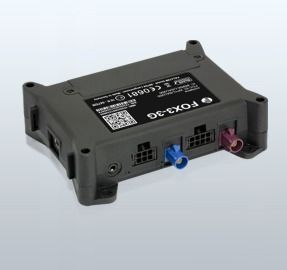

# Falcom - FOX3-3G

La serie FOX3-3G de Falcom es un dispositivo telemático y pasarela vehicular compacto y versátil que combina conectividad de datos de alta velocidad con posicionamiento GNSS avanzado. Diseñado como una unidad todo en uno, ofrece una amplia gama de entradas y salidas, soporte para antenas externas y opciones de expansión con cajas IO adicionales para ampliar su funcionalidad. Esta familia está pensada para cubrir necesidades telemáticas comunes como localización de vehículos, monitoreo de comportamiento y recolección de datos logísticos, e incorpora funciones integradas como cifrado de datos, modos de historial múltiples, monitoreo eco drive y de conducta del conductor, detección de interferencias (jamming), informes de estado, mensajería de alertas, soporte de llamadas de audio en modelos específicos y geocercas.

Como dispositivo compatible con Plaspy, el FOX3-3G puede alimentar la plataforma con datos de ubicación y operación para ofrecer visibilidad de la flota y supervisión operativa. Sus opciones flexibles de entradas y salidas y los módulos expandidos lo hacen útil en flotas mixtas y despliegues que requieren personalización moderada. Al integrarlo con Plaspy, usted puede centralizar el seguimiento, las alertas y los reportes para que los equipos operativos supervisen activos y tomen decisiones basadas en datos sin necesidad de trabajos de integración especializados para flujos telemáticos básicos.

## Aspectos clave

- Pasarela telemática compacta y todo en uno, adecuada para instalación en vehículos
- Conexión de datos de alta velocidad combinada con posicionamiento GNSS avanzado
- Amplia variedad de entradas y salidas para integración flexible con sistemas vehiculares
- Soporte para antenas externas y expansiones IOBOX opcionales para mayor funcionalidad
- Funciones Premium integradas como cifrado de datos, modos de historial múltiples, monitoreo eco drive y detección de jamming
- Capacidades estándar que incluyen informes de estado, mensajería de alertas, geocercas y funciones de llamada de audio en modelos seleccionados

## Cómo funciona con Plaspy

El FOX3-3G envía información de posición y estado que Plaspy ingiere para proporcionar visibilidad en tiempo real y seguimiento histórico de la flota. Plaspy organiza los datos entrantes en mapas, líneas de tiempo y reportes para que los encargados de la flota puedan supervisar activos, recibir alertas y analizar patrones operativos.

- Ubicación en vivo y reproducción de historial para movimientos y rutas de vehículos
- Alertas y notificaciones configurables para eventos de geocerca, cambios de estado y anomalías detectadas
- Reportes agregados sobre comportamiento del conductor y tendencias de eco driving basados en eventos del dispositivo
- Monitoreo de salud del dispositivo y conectividad para rastrear el estado en línea y la disponibilidad de telemetría básica
- Paneles operativos y reportes exportables para apoyar la planificación logística y el cumplimiento

## Casos de uso típicos

- Seguimiento de vehículos de flota para operaciones de reparto y transporte comercial
- Monitoreo del comportamiento del conductor y programas de eco driving en flotas mixtas
- Supervisión logística y de rutas para equipos de distribución y servicios de campo
- Localización de activos e informes de estado para operaciones de renta y leasing
- Ampliación de capacidades telemáticas mediante antenas externas y módulos IOBOX para necesidades especializadas

## Por qué elegir este rastreador con Plaspy

La serie FOX3-3G es una opción práctica para organizaciones que requieren una pasarela telemática flexible con funciones integradas que respaldan flujos de trabajo comunes en flotas. Su ampliabilidad con módulos IOBOX opcionales y el soporte para antenas externas lo hacen adaptable a distintos tipos de vehículos y requisitos operativos. Al integrarlo con Plaspy, el dispositivo aporta datos de ubicación y eventos que reducen el trabajo manual de seguimiento y mejoran la conciencia situacional en toda la operación.

Dado que las capacidades y las variantes de modelo pueden diferir, considere la familia FOX3-3G como una plataforma versátil y no como una solución única para todos los casos. Por ejemplo, las interfaces de audio están disponibles en el modelo FOX3-3G-AU mientras que otros modelos de la serie no incluyen esa función. Plaspy puede ayudarle a evaluar cómo encaja este dispositivo en sus necesidades de seguimiento y reportes, y a convertir los datos del dispositivo en información útil para la gestión de la flota.

Para obtener más información sobre el uso de dispositivos Falcom FOX3-3G con Plaspy visite https://www.plaspy.com y consulte las especificaciones y detalles de modelos en el sitio del fabricante https://www.falcom.de. Las especificaciones de producto, la disponibilidad y las características del fabricante pueden cambiar con el tiempo, por lo que le recomendamos verificar la documentación técnica más reciente en el sitio oficial de Falcom.
