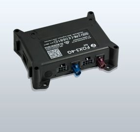

# Falcom - FOX3-4G-NA

La serie FOX3-4G de Falcom es ideal para aplicaciones industriales de IoT que requieren velocidades de banda ancha. Con tecnología de red LTE Cat 4 y capacidad de recuperación en redes 3G y 2G, este dispositivo garantiza la conectividad de datos y protege la inversión a futuro.

Este dispositivo telemático de vanguardia cuenta con tecnología de comunicación móvil 4G y es compatible con redes móviles 3G/2G en todo el mundo. Además, utiliza la última tecnología GNSS para un posicionamiento preciso. La serie FOX3-4G es altamente personalizable y ofrece una variedad de entradas y salidas para satisfacer los requisitos más exigentes.

Para ampliar la funcionalidad de la serie FOX3-4G, se puede utilizar una caja \(IOBOX-MINI, IOBOX-CAN o IOBOX-WLAN\) que ofrece opciones de expansión flexibles. Este dispositivo está diseñado para funcionar con antenas internas o externas, y las antenas internas se apagan automáticamente cuando se utilizan las antenas externas. Esto simplifica la logística, la instalación y el soporte posterior a la instalación.

La serie FOX3-4G también cuenta con las "Características Premium" desarrolladas por FALCOM, que incluyen cifrado de datos, varios modos de historia, Eco-Drive/Behavior, registro de datos y detección de atascos GSM/GPS. Además, ofrece características estándar como informes de estado, mensajes de alerta y geofencing.

