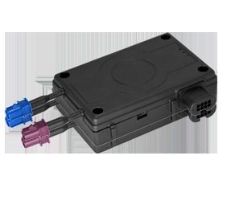

# Falcom - FOX-EN

El Falcom FOX-EN es un rastreador GPS versátil diseñado para supervisión de vehículos y flotas con alto grado de configuración. Se describe como un equipo configurable que puede adaptarse a diversas necesidades, desde AVL y gestión de flotas hasta seguridad y recuperación de vehículos. El FOX-EN soporta operación autónoma, interacción con sensores y actuadores, registro histórico y múltiples opciones de mensajería para actualizaciones de estado y alertas.

Como dispositivo compatible con Plaspy, el FOX-EN puede enviar información de ubicación y eventos a Plaspy para monitoreo y generación de informes centralizados. Su capacidad para remitir reportes de estado y mensajes de alerta a servidores o directamente a usuarios lo hace útil cuando se requiere visibilidad centralizada, control de geocercas y registro de actividad del conductor dentro de una plataforma de gestión de flotas.

## Aspectos destacados

- Configurable y adaptable a múltiples casos de uso, incluyendo AVL, gestión de flotas y recuperación
- Se integra con sistemas de seguimiento existentes para intercambiar información relevante con servidores y usuarios
- Envía reportes de estado y mensajes de alerta vía SMS y TCP para notificar a los operadores en tiempo real
- Combina funciones de comodidad y seguridad como llamadas de voz periódicas y opción de llamada de emergencia por voz
- Registro completo de historial y datos estilo bitácora del conductor para el mantenimiento de registros operativos
- Capacidad de geocercas para detectar y reportar violaciones a rutas o zonas predefinidas

## Cómo funciona con Plaspy

El FOX-EN puede integrarse en Plaspy para aportar ubicación del vehículo, alertas de eventos y registros históricos junto con otros datos de la flota. Cuando se conecta a Plaspy, el rastreador suministra a la plataforma la información necesaria para el monitoreo y la supervisión operativa.

- Visibilidad en tiempo real de la ubicación en Plaspy para seguimiento de vehículos y decisiones de despacho
- Alertas de violación de geocercas reenviadas a Plaspy para control de cumplimiento de rutas
- Registros históricos y entradas de bitácora del conductor disponibles para informes y auditorías dentro de Plaspy
- Reportes de estado y mensajes de alerta transmitidos a servidores habilitados para Plaspy para notificación inmediata
- Eventos y alarmas del dispositivo usados para activar alertas de plataforma y flujos operativos

## Casos de uso típicos

- Gestión de flotas para operaciones pequeñas y medianas que requieren seguimiento configurable
- Seguridad y recuperación de vehículos donde las alertas y opciones de llamada añaden conciencia situacional
- Monitoreo de cumplimiento de rutas usando geocercas para reportar desviaciones de recorridos definidos
- Conservación de registros y seguimiento de la actividad del conductor para revisiones operativas y regulatorias
- Despliegues de seguimiento de bajo costo que necesitan un equipo flexible capaz de integrarse con una plataforma de gestión

## Por qué elegir este rastreador con Plaspy

El FOX-EN es una opción práctica para organizaciones que requieren un rastreador configurable capaz de apoyar múltiples roles operativos. Su combinación de opciones de reporte, alertas y funciones de historial lo hace apropiado para equipos que desean centralizar la visibilidad y el manejo de eventos en Plaspy sin reemplazar flujos de trabajo de seguimiento ya existentes.

Si usted está evaluando rastreadores para usar con Plaspy, el FOX-EN ofrece un equilibrio entre flexibilidad y funciones que se pueden alinear con flujos de trabajo comunes de flota y seguridad. Para saber más sobre cómo Plaspy puede trabajar con dispositivos compatibles visite https://www.plaspy.com. Tenga en cuenta que las especificaciones y la disponibilidad de productos pueden cambiar con el tiempo, por lo que debe verificar los detalles técnicos actuales y las indicaciones del fabricante en el sitio oficial de Falcom https://www.falcom.de.
