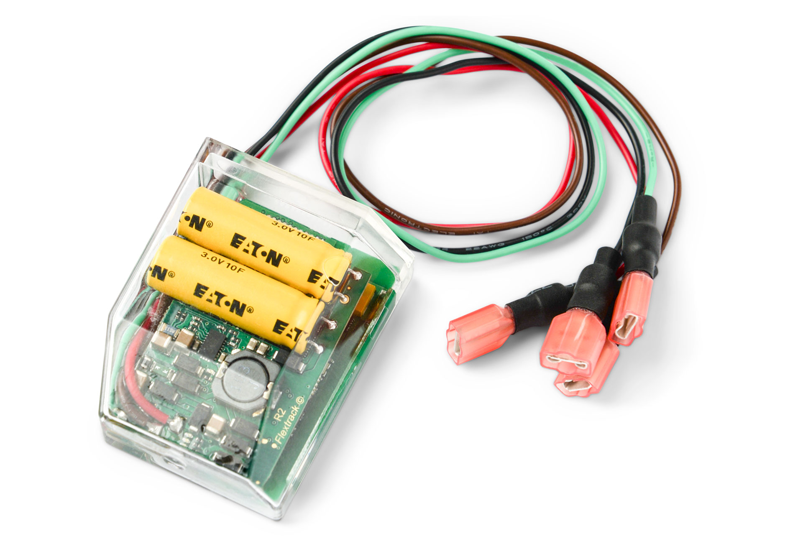

# Flextrack - Lommy Capture

Lommy Capture es un localizador GPS compacto y fácil de instalar, diseñado para el monitoreo persistente y de bajo mantenimiento de remolques, caravanas y otros activos remolcados. Su carcasa discreta para luminarias y su alimentación interna lo hacen ideal en escenarios donde se prefieren largos intervalos entre visitas de servicio, ofreciendo al mismo tiempo seguimiento en tiempo real y recuperación de rutas históricas para la supervisión de activos.

Como dispositivo compatible con Plaspy, Lommy Capture puede enviar datos de posición, movimiento y alarmas a Plaspy para ofrecer visibilidad centralizada de flotas de remolques y equipos remolcados. La combinación de recuperación de energía desde los circuitos de iluminación del vehículo, posicionamiento GNSS asistido y respaldo celular se integra con los flujos de trabajo de Plaspy para alertas, geocercas e informes, permitiendo mantener supervisión continua con un mantenimiento mínimo en sitio.

## Aspectos clave

- Dispositivo compatible con Plaspy diseñado para ofrecer ubicación en tiempo real y rutas históricas de activos remolcados.
- Recuperación de energía desde los circuitos de iluminación del vehículo que reduce la necesidad de cambios de batería y disminuye el mantenimiento.
- Informes persistentes cuando está alimentado por las luces traseras y envío de reportes limitados como respaldo si se quita la alimentación externa.
- GNSS multiconstelación con posicionamiento asistido para fijaciones rápidas y mejor precisión en entornos variados.
- Respaldo celular pensado para mantener la conectividad cuando el GNSS es deficiente, ayudando a conservar la continuidad de la telemetría.
- Carcasa compacta y robusta con protección IP65 para una instalación discreta dentro de luminarias y operación fiable en campo.

## Cómo funciona con Plaspy

Lommy Capture transmite mensajes de posición, movimiento y alarma usando formatos de ingestión estándar y puede registrarse en Plaspy para proporcionar telemetría continua y flujos de eventos. Una vez integrado, los gestores de flota pueden ver posiciones en vivo, recibir alertas y revisar rutas almacenadas de cada remolque o activo remolcado dentro de Plaspy.

- Actualizaciones de ubicación en tiempo real y feeds de telemetría para la supervisión en directo de remolques y caravanas.
- Alertas de energía y desconexión que permiten a Plaspy detectar posibles manipulaciones o equipos desenchufados.
- Recuperación de rutas históricas desde la memoria a bordo para cumplimiento, análisis y reproducción en Plaspy.
- Notificaciones basadas en eventos a partir de la detección de movimiento para disparar alarmas inmediatas y acciones en los flujos de trabajo.
- Mensajería amigable para integraciones que permite a Plaspy ingerir payloads de posición y alarma sin gateways especializados.

## Casos de uso típicos

- Prevención de robo y recuperación para flotas de remolques y equipos desmontables mediante instalación interna discreta.
- Monitoreo de utilización y rutas de remolques para optimizar la asignación y reducir recorridos vacíos.
- Planificación de mantenimiento basada en uso real y datos de movimiento en lugar de calendarios fijos.
- Geocercas y control de paradas para respaldar flujos de entrega y cumplimiento de tiempos.
- Visibilidad de activos con alimentación intermitente donde la recuperación de energía ayuda a extender los reportes remotos.

## Por qué elegir este localizador con Plaspy

Lommy Capture es una opción práctica para operadores que necesitan seguimiento de bajo mantenimiento de activos remolcados y desean consolidar la telemetría en una única plataforma de gestión de flotas. Su forma discreta y su diseño con recuperación de energía reducen la carga de servicio, manteniendo los datos esenciales de ubicación y movimiento que los equipos de flota requieren en Plaspy para alertas, geocercas e informes.

Para organizaciones con flotas mixtas, Lommy Capture puede aportar visibilidad fiable a nivel de remolque que complementa otras fuentes de datos de vehículos gestionadas en Plaspy. El dispositivo es especialmente útil cuando reducir visitas de mantenimiento en sitio y mantener los rastreadores ocultos dentro de luminarias son prioridades operativas.

Para conocer más sobre cómo Plaspy puede trabajar con Lommy Capture y otros dispositivos compatibles visite https://www.plaspy.com. Las especificaciones y la disponibilidad del producto pueden cambiar con el tiempo, por lo que es importante verificar los detalles técnicos actuales y las guías de instalación en el sitio del fabricante https://flextrack.dk.
