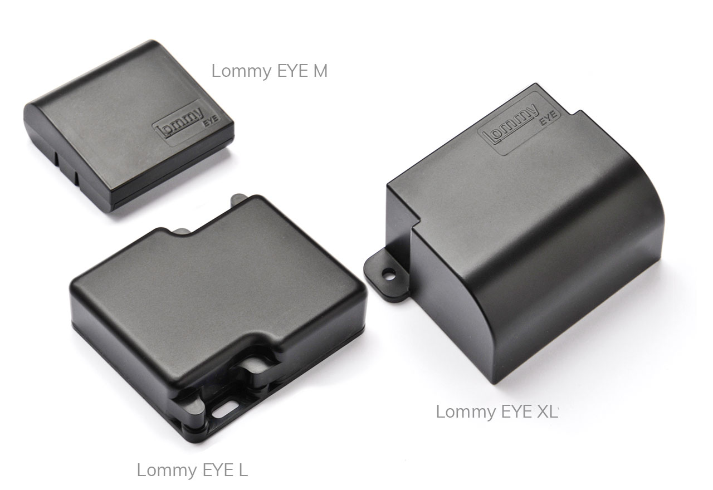

# Flextrack - Lommy Eye

# Lommy Eye

Lommy Eye de Flextrack es un localizador GPS compacto accionado por batería, diseñado para el monitoreo remoto a largo plazo, recuperación discreta y un historial de posición fiable. Diseñado como un dispositivo compatible con Plaspy, Lommy Eye combina una larga duración de la batería y posicionamiento GNSS de múltiples constelaciones con un fallback celular inteligente y recuperación RF activa para proporcionar a los gestores de flotas y a los propietarios de activos un seguimiento fiable de remolques, contenedores, maquinaria y activos portátiles de alto valor.

Listo para usar, Lommy Eye es fácil de montar sin necesidad de cableado y está disponible en varias variantes de tamaño para adaptarse a diferentes tipos de activos. Envía informes de ubicación programados por defecto y puede configurarse de forma remota vía UDP o SMS para aumentar la frecuencia de informes o activar actualizaciones basadas en movimiento para un seguimiento casi en tiempo real cuando se detecta movimiento, lo que lo convierte en una opción práctica de localizador GPS para usuarios de Plaspy centrados en la gestión de flotas, recuperación anti-robos y telemetría a largo plazo.

## Aspectos Clave

- Dispositivo compatible con Plaspy que admite informes programados y basados en eventos para un seguimiento en tiempo real flexible cuando está configurado.
- GNSS de alta sensibilidad y multi-constelación \(GPS/GLONASS/GALILEO/BEIDOU/QZSS\) con soporte SBAS y una sensibilidad de -166 dBm para fijaciones fiables.
- Enlace principal 4G \(FDD LTE Cat M1 B3/B8/B20\) con respaldo 2G cuádruple banda \(850/900/1800/1900 MHz\) para mantener la conectividad en distintas regiones.
- Capacidad RF activa de 868 MHz para ayudar en la localización en interiores y la recuperación cuando la recepción GNSS es limitada.
- Acelerómetro de 3 ejes para informes basados en movimiento y configuraciones de geocerca y alarmas para alertas de robo y movimiento.
- Instalación simple sin cableado, múltiples factores de forma \(M, L, XL\) para adaptarse a remolques, equipos y artículos de alto valor.
- Gestión segura de datos y cumplimiento con ISAE3402, CE, RoHS y WEE para implementaciones de nivel empresarial.

## Cómo Funciona con Plaspy

Lommy Eye se integra con Plaspy transmitiendo datos de ubicación y de eventos por UDP o SMS a la plataforma de Plaspy. Por defecto envía informes programados \(diarios\), pero los administradores pueden configurar de forma remota los intervalos de informes para incrementar la frecuencia y obtener seguimiento casi en tiempo real durante el movimiento o para alertas. Plaspy procesa posiciones GNSS, triangulación celular y posiciones asistidas por RF para presentar mapas precisos, historial y herramientas de recuperación en el tablero.

- Actualizaciones de ubicación y telemetría en tiempo real cuando se incrementa la frecuencia de informes o se habilita el informe por movimiento.
- Alertas de movimiento y desplazamiento mediante el acelerómetro de 3 ejes integrado para notificaciones inmediatas en Plaspy.
- Señales RF activas de 868 MHz utilizadas para localización en interiores y recuperación cuando la recepción GNSS es limitada.
- Respaldo de triangulación celular cuando GNSS no está disponible, mejorando la continuidad posicional para mapas de Plaspy e informes de geocercas.
- Almacenamiento en flash local \(2 MB\) conserva el historial de posición durante lagunas de cobertura, para que Plaspy pueda sincronizar los datos perdidos una vez restablecida la conectividad.

## Visión Técnica

| Conectividad | 4G \(FDD LTE Cat M1\) como enlace principal; respaldo 2G cuádruple banda |
| --- | --- |
| Banda | LTE Cat M1 B3 / B8 / B20; GSM 850 / 900 / 1800 / 1900 MHz |
| Transmisión de Datos | UDP o SMS a puntos finales del servidor |
| GNSS | GPS, GLONASS, GALILEO, BEIDOU, QZSS; SBAS \(WAAS/EGNOS/MSAS/GAGAN\) |
| Sensibilidad GNSS | -166 dBm \(sensibilidad de seguimiento\) |
| RF | Antena RF activa de 868 MHz para localización en interiores y recuperación |
| Sensores | Acelerómetro de 3 ejes \(informes basados en movimiento\) |
| Almacenamiento | 2 MB de memoria flash interna para registro local de la posición |
| Antenas | Antenas GNSS, LTE/GSM y RF internas |
| Gestión Remota | Configuración remota de intervalos de informes y ajustes de movimiento vía UDP/SMS |
| Seguridad y Cumplimiento | Seguridad de datos y cumplimiento con ISAE3402; CE, RoHS y WEE |
| Temperatura de Operación | -20 °C a +60 °C |
| Modelos y Factor de Forma | Lommy Eye M \(9L2\): 55×52×12 mm, 56 g, baterías reemplazables por el usuario;  \ \         Lommy Eye L \(9L8\): 83×80×25 mm, 106 g, baterías reemplazables por el usuario, IP67;  \ \         Lommy Eye XL \(9L6\): 80×54×37 mm, 154 g, cambio de batería en taller, IP68 |
| Capacidad de Informes | Hasta 1.200 posiciones \(M\), 2.400 \(L\), 6.000 \(XL\) |
| Alimentación | Funciona con batería; la duración de la batería se optimiza mediante LTE Cat M1 y un manejo eficiente de la red \(la duración real depende de las condiciones de funcionamiento y de la calidad de la red\) |

## Casos de Uso

- Gestión de flotas: seguimiento discreto a largo plazo de remolques y activos fuera de vehículo, donde es fundamental una operación con batería de bajo mantenimiento.
- Antirrobo y recuperación: posicionamiento combinado GNSS/GSM/RF y alertas de movimiento para una recuperación más rápida de activos robados o desplazados.
- Seguimiento de equipos y maquinaria: informes programados con configuración remota para la planificación de mantenimiento y el historial de utilización.
- Monitoreo de artículos de alto valor: formato compacto para una colocación discreta y un historial de posición fiable para seguros y prevención de pérdidas.

## Por qué Elegir Este Localizador con Plaspy

Lommy Eye ofrece un conjunto equilibrado de características para usuarios de Plaspy que requieren localizadores GPS robustos y de bajo mantenimiento que funcionen tanto en entornos rurales como urbanos. Su GNSS de múltiples constelaciones, alta sensibilidad de seguimiento y soporte SBAS mejoran la fiabilidad de las fijaciones, mientras que LTE Cat M1 con respaldo 2G y la triangulación celular ayudan a mantener la continuidad cuando la cobertura satelital o LTE se reduce. El canal RF activo de 868 MHz y el sensor de movimiento proporcionan capacidades anti-robos y de recuperación que complementan el mapeo, las alertas y los informes históricos de Plaspy.

Aunque Lommy Eye se centra en GNSS, RF y telemetría basada en movimiento, la plataforma de Plaspy también admite una amplia gama de campos de telemetría, como encendido, estado del inmovilizador, monitorización de combustible y sensores Bluetooth, cuando esas interfaces estén disponibles en un dispositivo. La integración de Lommy Eye con Plaspy ofrece gestión de flotas escalable, flujos prácticos de anti-robo y manejo seguro de datos \(ISAE3402\) para organizaciones que requieren un seguimiento discreto y fiable de activos con opciones de integración API o de marca blanca.

