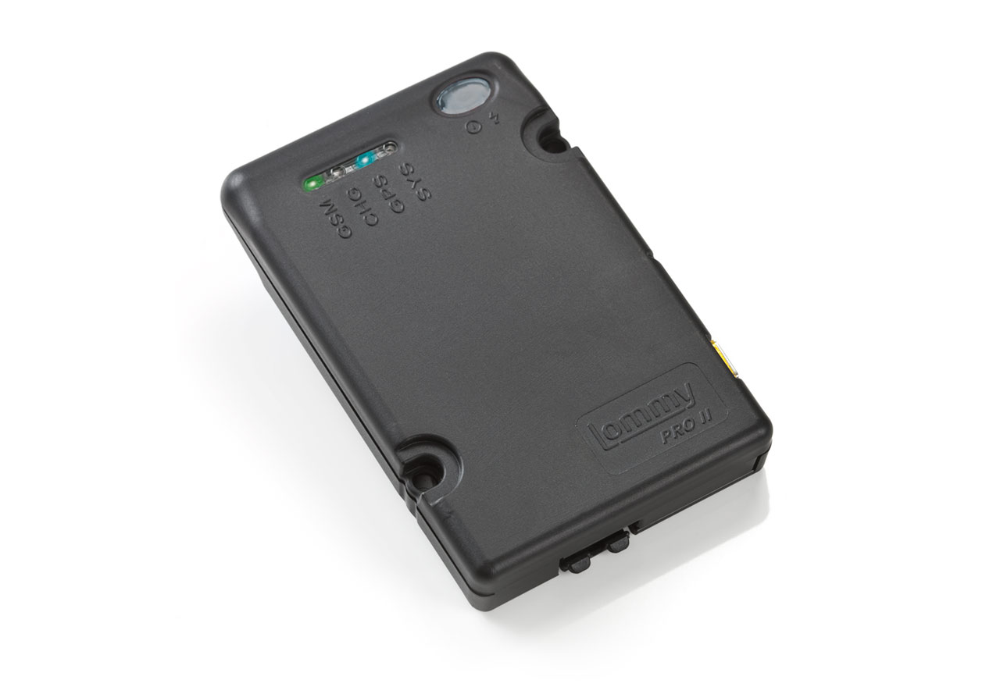

# Flextrack - Lommy Pro

Lommy Pro es un rastreador GPS compacto y de bajo consumo diseñado para ofrecer seguimiento confiable en tiempo real de vehículos, maquinaria, embarcaciones y otros activos móviles. El equipo combina posicionamiento GNSS con múltiples constelaciones y conectividad celular para proporcionar actualizaciones continuas de ubicación, movimiento y telemetría, pensado para gestión de flotas y soluciones antirrobo donde la visibilidad persistente y una administración energética sensata son esenciales.

Como dispositivo compatible con Plaspy, Lommy Pro puede enviar ubicación y telemetría a los paneles, alertas y reportes de Plaspy. Sus modos de reposo configurables, detección de movimiento integrada y batería de respaldo recargable lo hacen adecuado para instalaciones mixtas, desde montajes con alimentación fija en vehículos hasta despliegues autónomos con batería. Además, su API abierta y soporte para canales de alerta permiten integrarlo con Plaspy para supervisión operativa y respuestas automatizadas.

## Características principales

- Rastreador compatible con Plaspy que ofrece posicionamiento fiable usando posicionamiento GNSS con múltiples constelaciones para fijaciones de ubicación consistentes.
- Conectividad celular diseñada para amplia cobertura y reporte continuo de telemetría a Plaspy.
- Diseño compacto y de bajo consumo con batería interna recargable de respaldo para soportar despliegues con respaldo por batería.
- Detección de movimiento integrada y modos de reposo configurables para extender la vida útil en campo cuando se pierde la alimentación principal.
- Soporta registro de viajes y odómetro, detección de exceso de velocidad y ralentí, y control de inmovilizador para operaciones de flota.
- Monitoreo de temperatura y soporte para sensores externos para supervisión de condiciones en remolques refrigerados y activos similares.
- Soporte para accesorios ampliables que facilitan etiquetado localizado e identificación mejorada de activos en entornos mixtos.

## Cómo funciona con Plaspy

Lommy Pro transmite fijaciones GNSS y telemetría a Plaspy, donde los datos se normalizan para seguimiento en vivo, análisis histórico y generación de alertas automatizadas. Plaspy ingiere posiciones y eventos, aplica reglas configuradas y presenta esa información en paneles y reportes para que los equipos puedan supervisar movimiento, condición y cumplimiento.

- Actualizaciones de ubicación en tiempo real y reproducción de viajes para visibilidad de la flota y revisión de rutas.
- Alertas y notificaciones automatizadas por eventos como exceso de velocidad, ralentí, activación del inmovilizador y violaciones de geocerca.
- Informes históricos de odómetro y resúmenes de viajes para apoyar análisis operativo y programación.
- Monitoreo de sensores y condiciones para temperatura, eventos de puertas y otras señales externas que apoyan flujos de trabajo de cadena de frío y salud de activos.
- Gestión y configuración remotas del dispositivo a través de la plataforma para mantener el flujo de telemetría y aplicar cambios de políticas a escala.

## Casos de uso típicos

- Gestión de flotas con seguimiento continuo de vehículos, registro de viajes e informes operativos.
- Protección antirrobo y recuperación con control de inmovilizador, detección de arranques/paradas y alertas de geocerca.
- Monitoreo de combustible y telemetría del motor para apoyar análisis de consumo y planificación de mantenimiento.
- Vigilancia de temperatura para remolques refrigerados y supervisión de condiciones en la cadena de frío.
- Rastreo de activos en entornos mixtos, incluidos remolques, equipos y aplicaciones marinas mediante emparejamiento de accesorios.

## Por qué elegir este rastreador con Plaspy

Lommy Pro es una opción práctica para organizaciones que requieren un equilibrio entre posicionamiento preciso, gestión energética adecuada y opciones de telemetría de nivel vehicular. Al integrarse con Plaspy, el dispositivo provee los elementos básicos para la supervisión en tiempo real de la flota, alertas basadas en eventos e informes históricos sin necesidad de personalizaciones complejas.

La plataforma de Plaspy acepta posición y telemetría de Lommy Pro y las presenta en paneles e informes que los equipos de operaciones y seguridad utilizan para tomar decisiones. Para empresas que necesitan seguimiento escalable, funciones antirrobo y monitoreo ambiental, Lommy Pro combinado con Plaspy ofrece un camino directo hacia visibilidad consolidada y alertas automatizadas.

Obtenga más información sobre Plaspy y cómo funciona con dispositivos compatibles en el sitio web de Plaspy https://www.plaspy.com. Las especificaciones del producto, disponibilidad y detalles del fabricante pueden cambiar con el tiempo, por lo que le recomendamos verificar las especificaciones técnicas actuales y las opciones de accesorios en el sitio del fabricante https://flextrack.dk.
