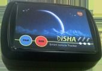

# Fortuna Impex - Disha 9310

El Fortuna Impex Disha 9310 es un sistema inteligente de rastreo vehicular diseñado para que empresas de servicios, reparto y transporte supervisen y gestionen sus activos móviles. Ofrece seguimiento en tiempo real y registro histórico a través de una interfaz web, así como envío de alertas, eventos e informes programados por SMS y correo electrónico. El equipo está pensado para una implementación práctica, con antenas GPS y GPRS integradas que reducen la exposición a daños mecánicos.

Como dispositivo compatible con Plaspy, el Disha 9310 puede integrarse en la plataforma para proporcionar visibilidad centralizada y supervisión de la flota. Al combinarlo con Plaspy, este rastreador incorpora sus actualizaciones de ubicación, funciones de alerta y salidas de reporte en un flujo de trabajo único de gestión de flotas, ayudando a convertir la información recopilada en mejoras operativas concretas.

## Principales características

- Seguimiento de vehículos en tiempo real e histórico accesible por web para visibilidad de la flota
- Alertas, eventos y reportes programados configurables, entregados por SMS y correo electrónico
- Instalación sencilla con montaje en tablero y conexión de alimentación directa
- Antenas GPS y GPRS integradas para menor riesgo de daños externos y una instalación más simple
- Diseñado para soportar operaciones de servicios, reparto y transporte
- Contribuye a optimizar la utilización de recursos mediante la recopilación y análisis de datos de activos

## Cómo funciona con Plaspy

Una vez conectado a Plaspy, el Disha 9310 envía datos de ubicación y eventos a los paneles y herramientas de informes de Plaspy, permitiendo la supervisión y gestión centralizada de los vehículos junto con otros dispositivos compatibles.

- Consolide datos de ubicación en vivo e históricos para supervisar rutas y control de flota
- Reciba y gestione alertas y eventos del dispositivo dentro de Plaspy, junto con notificaciones por correo y SMS
- Use los informes programados del rastreador junto con las herramientas de reporte de Plaspy para monitorear la utilización y el desempeño
- Visualice los movimientos de los vehículos en los mapas de Plaspy para apoyar la toma de decisiones operativas y el despacho
- Combine la información del Disha 9310 con las herramientas de Plaspy para realizar reportes y supervisión a nivel de flota

## Casos de uso típicos

- Rastreo de flotas para operaciones de reparto y mensajería para mejorar la visibilidad de rutas
- Monitoreo de vehículos de servicio para aumentar la utilización y reducir tiempos de inactividad
- Supervisión de flotas de transporte para coordinación de horarios y operaciones
- Informes programados para revisiones operativas y reportes de gestión
- Alertas para eventos que requieren intervención o notificación oportuna al responsable

## Por qué elegir este rastreador con Plaspy

El Disha 9310 es una opción práctica para organizaciones que necesitan rastreo vehicular directo y alertas confiables sin instalaciones accesorias complejas. Su diseño con antenas integradas y sus funciones de seguimiento web simplifican tanto la puesta en marcha como la operación continua, lo que lo hace adecuado para flotas centradas en servicios, reparto y transporte.

Al integrarlo con Plaspy, las capacidades principales del rastreador forman parte de una plataforma de gestión de flotas más amplia que prioriza la visibilidad, el reporte y el control operativo. Si usted está evaluando dispositivos para monitoreo centralizado de flotas, el Disha 9310 ofrece un equilibrio entre rastreo, alertas e instalación sencilla que se puede incorporar en los flujos de trabajo de Plaspy.

Para obtener más información sobre Plaspy y cómo dispositivos compatibles como el Disha 9310 pueden utilizarse con la plataforma visite https://www.plaspy.com. Las especificaciones del producto, la disponibilidad y los datos del fabricante pueden cambiar con el tiempo, por lo que le recomendamos verificar las especificaciones actuales en el sitio del fabricante http://fortunaindia.com/.
