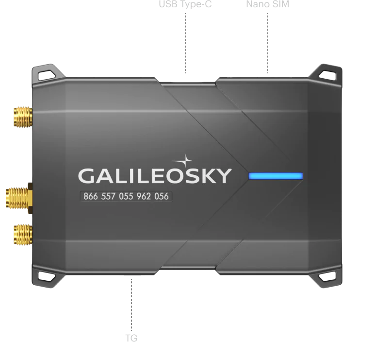

# GalileoSky - 10

El GalileoSky 10 es un terminal GPS/GLONASS diseñado para fines de monitoreo, control y gestión. Con este terminal, puedes conectar fácilmente cualquier sensor y tener un control total sobre ellos. Lo que distingue a este dispositivo es su capacidad para procesar incluso el nivel más bajo de señal analógica de los sensores sin necesidad de una resistencia externa adicional.

Una de las características destacadas del GalileoSky 10 es su capacidad para encontrar datos de dos buses CAN simultáneamente. Esto significa que puedes descifrar fácilmente más de 13,000 parámetros del bus CAN utilizando el protocolo J1939. Esto te ahorra tiempo valioso al buscar información importante sobre el estado de tu vehículo.

La instalación del GalileoSky 10 es muy sencilla, gracias a sus 4 puntos de montaje. Las dimensiones compactas del terminal, que mide solo 91x66.5x25.5 mm, lo hacen increíblemente fácil de sujetar en la palma de tu mano. A pesar de su tamaño pequeño, este terminal ofrece una funcionalidad y rendimiento excepcionales.

### Características destacadas:

- Terminal GPS/GLONASS para monitoreo, control y gestión
- Capacidad para conectar cualquier sensor y controlarlos
- Procesa incluso el nivel más bajo de señal analógica de los sensores sin una resistencia externa
- Encuentra datos de dos buses CAN simultáneamente
- Descifra más de 13,000 parámetros del bus CAN utilizando el protocolo J1939
- Dimensiones compactas para una fácil instalación

