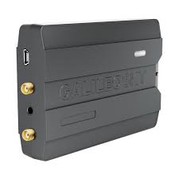

# GalileoSky - 7x

El GalileoSky 7x es un terminal GPS GLONASS programable pensado para aplicaciones flexibles de rastreo y telemática. Permite la activación remota de relés, LEDs, parlantes, alarmas y otras salidas, lo que facilita el control de dispositivos y periféricos conectados. El equipo puede recibir datos de dos buses CAN simultáneamente y está diseñado para seguir registrando la posición y transfiriendo datos al servidor incluso durante la actualización del firmware.

Como dispositivo compatible con Plaspy, el 7x resulta relevante para organizaciones que requieren un rastreador adaptable integrado en una plataforma completa de gestión de flotas. Su capacidad de programación y la recepción dual de CAN lo convierten en una opción práctica para enviar ubicación, estado del vehículo y eventos de control a Plaspy para monitoreo, alertas e informes, mientras que la grabación continua ayuda a mantener la continuidad de los datos durante labores de mantenimiento.

## Aspectos destacados

- Terminal GPS GLONASS programable, adecuado para diversas tareas de rastreo
- Activación remota de relés, LEDs, parlantes, buzinas y salidas similares
- Recepción simultánea de datos desde dos buses CAN para mayor visibilidad del vehículo
- Continúa registrando y transfiriendo datos de rastreo durante las actualizaciones de firmware
- Adaptable a flujos de trabajo de monitoreo de flotas y activos y a lógica personalizada
- Diseñado para integrarse con plataformas de rastreo como Plaspy para supervisión operativa

## Cómo funciona con Plaspy

Al integrarse con Plaspy, el GalileoSky 7x envía eventos de ubicación y telemática a la plataforma para que los operadores puedan visualizar, analizar y actuar sobre esa información. Plaspy puede mostrar recorridos en tiempo real y históricos, generar alertas y reflejar cambios de estado, además de soportar reportes operativos basados en las entradas que proporcione el rastreador.

- Visibilidad de posición y movimiento en mapas y paneles de Plaspy en tiempo real
- Alertas y notificaciones basadas en eventos del dispositivo y entradas programables
- Comandos remotos y acciones de control iniciadas desde Plaspy cuando están soportadas
- Reproducción de rutas históricas e informes para revisiones operativas
- Continuidad de datos en Plaspy durante la actualización del firmware del rastreador
- Monitorización del estado del equipo e integración en los flujos de trabajo de la flota

## Casos de uso típicos

- Rastreo de vehículos de flota y supervisión operativa
- Monitoreo y control de activos móviles valiosos
- Activación remota de periféricos del vehículo para seguridad o servicios
- Recolección de flujos de datos del vehículo para diagnósticos y toma de decisiones
- Mantenimiento del rastreo continuo durante tareas de mantenimiento o actualizaciones del dispositivo

## Por qué elegir este rastreador con Plaspy

El GalileoSky 7x combina programabilidad, recepción multi-bus y un comportamiento de rastreo persistente, lo que lo convierte en una opción flexible para organizaciones que usan Plaspy en la gestión de flotas y activos. Su capacidad para controlar salidas y capturar flujos de datos del vehículo complementa las funcionalidades de Plaspy al permitir un monitoreo accionable y la intervención remota como parte de una estrategia telemática más amplia.

Dado que las líneas de producto y las características pueden variar, es recomendable evaluar el 7x dentro de una valoración de integración más amplia con Plaspy para asegurar que cubre necesidades operativas y de reporte específicas. Para quienes buscan un terminal configurable que preserve la continuidad del rastreo, el 7x es un candidato sólido a considerar junto con la plataforma Plaspy.

Para saber más sobre cómo Plaspy trabaja con dispositivos como el GalileoSky 7x, visite https://www.plaspy.com. Las especificaciones del producto, disponibilidad y detalles del fabricante pueden cambiar con el tiempo, por lo que debería verificar la información técnica actual en el sitio del fabricante https://galileosky.com/.
