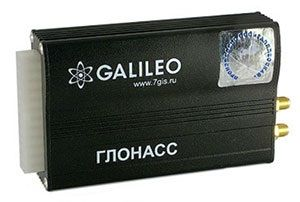

# GalileoSky - GALILEOSKY V2.2.8

El rastreador GPS GALILEOSKY GLONASS / GPS v2.2.8 de la marca GalileoSky es una opción confiable para el monitoreo de vehículos. Con su puerto RS-232, permite una comunicación continua con el servidor, lo que facilita el seguimiento en tiempo real. Además, cuenta con un modo "invisible" que permite una comunicación discreta y un modo de vigilancia fuera de línea que permite cargar archivos guardados a través de USB.

Una característica destacada de este rastreador es su capacidad para conectar una cámara de video y grabar video continuo, así como ajustar la grabación de video en función de eventos específicos. También ofrece dos vías de comunicación de voz GSM entre el conductor y el despachador, lo que facilita la comunicación en tiempo real.

El GALILEOSKY GLONASS / GPS v2.2.8 también cuenta con funciones adicionales, como el sistema de alarma y el arranque remoto del motor a través de la interfaz CAN \(J1939, FMS-estándar\). Además, tiene un escáner integrado CAN-bus y un protocolo de transferencia de datos ajustable que permite ahorrar tráfico GPRS.

Otras características incluyen la capacidad de actualizar el firmware de forma remota a través de la red GSM, un ajuste fácil del dispositivo mediante una herramienta de configuración y una memoria no volátil que puede almacenar hasta 14,000 puntos. También cuenta con protección contra sobretensiones de dos niveles y la capacidad de identificar impactos y la inclinación del vehículo.

