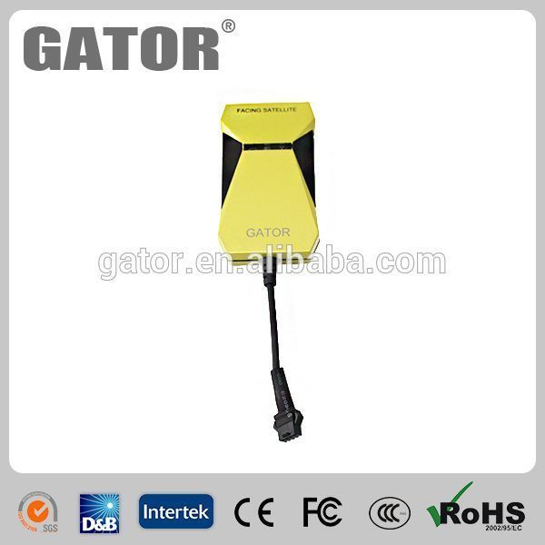

# Gator - M588T

El Gator M588T es un rastreador GPS orientado a vehículos que integra un receptor GPS y un módulo de comunicación GSM para ofrecer datos de ubicación continuos y confiables. Está diseñado para transmitir información de posición a un servidor, de modo que usted pueda consultar la ubicación y el historial del dispositivo desde un PC o un teléfono móvil. El M588T se instala frecuentemente en motocicletas, taxis, automóviles, autobuses y camiones cuando se requiere seguimiento estable y entrega sencilla de datos.

Como dispositivo compatible con Plaspy, el M588T puede enviar actualizaciones de ubicación y eventos de alarma a Plaspy para monitoreo y reportes centralizados. Sus capacidades principales —como soporte de bandas GSM, amplia tolerancia de voltaje del vehículo, posicionamiento continuo y un conjunto de funciones de seguridad— lo convierten en una opción práctica para organizaciones que desean consolidar la visibilidad de su flota y las alertas operativas dentro de Plaspy.

## Características principales

- Diseño con módulos dobles que combina posicionamiento GPS y transmisión de datos GSM para reportes de ubicación continuos.
- Soporte quad-band GSM para amplia cobertura y compatibilidad en distintas regiones.
- Amplio rango de entrada de 9 a 36 V DC, adecuado para diversos tipos de vehículos.
- Posicionamiento GPS continuo con intervalos de reporte configurables para mantener el seguimiento actualizado.
- Funciones de prevención contra robo y seguridad integradas, incluyendo alarma por vibración, botón SOS y alerta por corte de alimentación.
- Funcionalidades orientadas a flotas como detección de encendido (ACC), capacidad de corte remoto, configuración de geocercas y estadísticas de kilometraje.

## Integración con Plaspy

Cuando se conecta a Plaspy, el Gator M588T proporciona registros de ubicación y notificaciones de eventos que Plaspy muestra en mapas y paneles de control de flota. Plaspy procesa los datos del dispositivo para entregar conocimiento situacional, permitir revisiones históricas y soportar flujos operativos.

- Visualización en tiempo real y seguimiento en vivo de unidades individuales y de la flota completa.
- Gestión de eventos y alarmas para que SOS, vibración, corte de alimentación y otras alertas lleguen a los operadores.
- Rastreos históricos y reportes de kilometraje para revisar rutas y analizar desempeño operativo.
- Alertas de geocerca y monitoreo de límites integradas en las notificaciones y registros de Plaspy.
- Paneles de control a nivel de flota para monitorear estado de vehículos, actividad reciente y métricas resumidas.

## Casos de uso típicos

- Operaciones de flota que requieren ubicación continua del vehículo y reportes de kilometraje.
- Servicios de taxi y transporte que necesitan seguimiento en tiempo real y alertas de seguridad para pasajeros.
- Flotas de paquetería y logística que monitorean rutas y cumplimiento de geocercas.
- Transportes públicos y operadores de autobuses que rastrean ubicación y cumplimiento de horarios.
- Prevención y recuperación ante robos mediante alarma por vibración, SOS y alertas por corte de alimentación.

## ¿Por qué elegir este rastreador con Plaspy?

El Gator M588T resulta apropiado para organizaciones que buscan un rastreador vehicular sencillo, con funciones de seguridad integradas y amplia compatibilidad eléctrica. Su soporte para quad-band GSM y posicionamiento continuo lo hace útil en flotas mixtas que operan en entornos variados, mientras que sus alarmas y funciones de geocerca proporcionan señales operativas relevantes que Plaspy puede centralizar y gestionar.

En conjunto con Plaspy, el M588T se integra en una solución unificada de gestión de flotas donde la visibilidad de ubicación, la enrutación de alertas y la generación de reportes se manejan junto con otros dispositivos. Esta combinación ayuda a los equipos a supervisar activos, responder a incidentes y obtener reportes accionables sin tener que administrar múltiples sistemas de distintos proveedores.

Para más información sobre cómo Plaspy puede gestionar dispositivos como el Gator M588T, visite https://www.plaspy.com. Las especificaciones del producto, la disponibilidad y los detalles del fabricante pueden cambiar con el tiempo, por lo que le recomendamos verificar la información técnica actual en el sitio del fabricante http://en.gatorgroup.cn.
