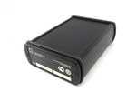

# Gelix - Gelix 2

El Gelix 2 es un rastreador GPS versátil diseñado para monitoreo de vehículos y activos. Ofrece seguimiento activo con registro de datos en el dispositivo, mensajería de eventos y alarmas, y soporte para múltiples opciones de conectividad. Además incluye funciones de escucha y comunicación de voz, así como control remoto de salidas y capacidades de configuración del sistema, lo que lo hace adecuado para necesidades variadas de supervisión.

Como dispositivo compatible con Plaspy, el Gelix 2 puede enviar información de ubicación, eventos y estado del dispositivo a Plaspy para obtener visibilidad unificada y supervisión operativa. Sus funciones de mensajería y gestión remota encajan bien en los flujos de trabajo de monitoreo de flotas, permitiendo que las organizaciones consoliden datos de posición, alertas y estado del equipo en una vista única dentro de Plaspy.

## Puntos clave

- Seguimiento activo con registro de datos en el dispositivo para historial de posiciones y revisión de rutas
- Funciones de escucha y comunicación de voz para acceso remoto de audio cuando se requiera
- Mensajería de alarmas y eventos para notificar condiciones e incidentes predefinidos
- Control remoto de salidas y control de relés activado por eventos para acciones operativas
- Gestión del sistema y configuración junto con posibilidad de actualización de firmware por redes móviles
- Soporta múltiples modos de conectividad, incluyendo mensajería móvil e interfaces seriales para despliegues flexibles

## Cómo funciona con Plaspy

El Gelix 2 puede transmitir actualizaciones de posición, mensajes de evento y estado del dispositivo a Plaspy, donde esos datos se visualizan junto con otros activos de la flota. Plaspy ofrece tableros centralizados, historial y alertas para que la información proveniente del Gelix 2 sea accionable en operaciones y reportes.

- Muestre la ubicación en tiempo real y el historial reciente de recorridos mediante las funciones de mapas y reproducción de Plaspy
- Haga visibles las alarmas y mensajes de evento en las notificaciones y feeds de incidentes de Plaspy para una respuesta rápida
- Incluya el estado del dispositivo y eventos generados por sensores en reportes y tableros de Plaspy para supervisión operativa
- Utilice el control remoto de salidas desde Plaspy, cuando esté soportado, para activar salidas del dispositivo según acciones o eventos de la plataforma
- Gestione la configuración y las actualizaciones del dispositivo a través de flujos de gestión remota cuando se utilicen las herramientas de Plaspy junto con el flujo de trabajo del dispositivo

## Casos de uso típicos

- Seguimiento de vehículos de flota para operaciones diarias y verificación de rutas
- Seguridad de activos y vehículos con notificaciones de alarmas y eventos
- Monitoreo remoto donde la escucha o la comunicación de voz son útiles para seguridad o verificación
- Supervisión logística y de entregas combinando ubicación, alertas por eventos e historial
- Programas de vehículos en renta o compartidos que requieren monitoreo de estado y opciones de control remoto

## Por qué elegir este rastreador con Plaspy

El Gelix 2 combina un conjunto amplio de funciones de seguimiento y comunicación que se adaptan bien a las necesidades comunes de gestión de flotas y activos. Sus capacidades de mensajería de eventos y control remoto lo hacen práctico para equipos que requieren alertas inmediatas y la opción de actuar sobre salidas del dispositivo desde una plataforma central como Plaspy.

Aunque las capacidades del dispositivo se describen de forma general aquí, el Gelix 2 es una buena opción para organizaciones que desean un modelo de rastreador único que soporte historial de ubicaciones, alertas y gestión remota dentro de Plaspy. Para más detalles sobre Plaspy y cómo puede integrarse con dispositivos Gelix, visite el sitio de Plaspy en https://www.plaspy.com. Las especificaciones del producto y los servicios del fabricante pueden cambiar con el tiempo, por lo que verifique la información actual en el sitio oficial de Gelix http://www.gelix.com/ antes de la compra final.
