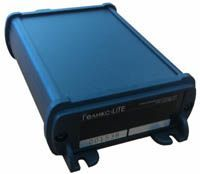

# Gelix - Gelix G Lite

El Gelix G Lite es un rastreador GPS telemático compacto diseñado para proporcionar información de ubicación precisa y fiable de vehículos y activos móviles. Combina navegación GLONASS y GPS con comunicación GSM GPRS para capturar datos de posición con rapidez, con un tiempo de arranque reportado de alrededor de 29 segundos tras encenderse. El equipo admite modos de recepción multicanal para aumentar la fiabilidad del posicionamiento y está pensado para aplicaciones generales de seguimiento de flotas y activos.

Como dispositivo compatible con Plaspy, el Gelix G Lite puede enviar información de ubicación y estado a la plataforma Plaspy para monitorización y generación de informes. Su soporte para control por relé y la compatibilidad con sensores de nivel de combustible y adaptadores de bus CAN del vehículo permiten integrarlo en un flujo de trabajo de seguimiento gestionado por Plaspy, ofreciéndole a usted y a su equipo una visibilidad consolidada de los activos en movimiento y de datos seleccionados del vehículo a través de la interfaz de Plaspy.

## Aspectos destacados

- Soporte dual de navegación GLONASS y GPS para mayor fiabilidad en el posicionamiento
- Arranque rápido con captura de ubicación en aproximadamente 29 segundos tras el encendido
- Modos de recepción multicanal para mejorar la adquisición de señal y la consistencia del rastreo
- Soporte de relé para control remoto de cierres electrónicos y salidas sencillas
- Compatibilidad con sensores de nivel de combustible para monitorizar métricas relacionadas con combustible
- Funciona con adaptadores de bus CAN del vehículo para integrarse con sistemas de monitorización vehicular

## Cómo funciona con Plaspy

Cuando se utiliza con Plaspy, el Gelix G Lite suministra actualizaciones periódicas de ubicación y estado del dispositivo que Plaspy procesa para seguimiento en vivo, historial e informes. Plaspy puede presentar los datos entrantes como parte de paneles de flota, alertas e informes operativos para ayudarle a gestionar sus activos de forma eficaz.

- Visibilidad de la ubicación en tiempo real en los mapas de Plaspy para vehículos individuales y flotas agrupadas
- Geocercas y alertas para notificarle sobre llegadas, salidas o eventos de límite de área
- Reproducción de rutas históricas e informes de trayectos para apoyar revisiones operativas
- Uso de salidas de relé a través de Plaspy para gestionar cierres electrónicos o controles remotos sencillos
- Consolidación de entradas de sensores, como nivel de combustible y métricas derivadas del bus CAN, dentro de los informes de Plaspy

## Casos de uso típicos

- Monitorización de vehículos de empresa para asegurar cumplimiento de rutas y conocimiento de ubicaciones
- Seguimiento de activos y equipos que requieren informes de posición fiables
- Control remoto de cierres electrónicos en remolques o compartimentos asegurados
- Monitorización de combustible y agregación básica de datos del vehículo cuando se conecta con sensores compatibles
- Gestión de flotas pequeñas y medianas donde se valora la adquisición rápida de posición y un GNSS confiable

## Por qué elegir este rastreador con Plaspy

El Gelix G Lite ofrece un equilibrio entre adquisición rápida de GNSS y puntos de integración prácticos que lo convierten en una opción útil para organizaciones que buscan capacidades de rastreo sencillas y efectivas. Su recepción combinada GLONASS y GPS mejora la fiabilidad del posicionamiento en entornos variados, mientras que la compatibilidad con relés y sensores amplía su utilidad más allá de la mera localización.

Integrado con Plaspy, el dispositivo pasa a formar parte de un flujo de trabajo centralizado de gestión de flotas donde la ubicación, las alertas y datos básicos del vehículo están disponibles en un solo lugar. Para equipos que necesitan actualizaciones de posición confiables y la opción de integrar cierres o sensores, el Gelix G Lite puede ser una adición sensata a un despliegue gestionado por Plaspy.

Para obtener más información sobre cómo Plaspy puede trabajar con rastreadores compatibles como el Gelix G Lite visite https://www.plaspy.com. Las especificaciones del producto, la disponibilidad y los detalles del fabricante pueden cambiar con el tiempo, por lo que le recomendamos verificar la información técnica actual en el sitio del fabricante http://www.gelix.com/ antes de tomar decisiones de adquisición.
