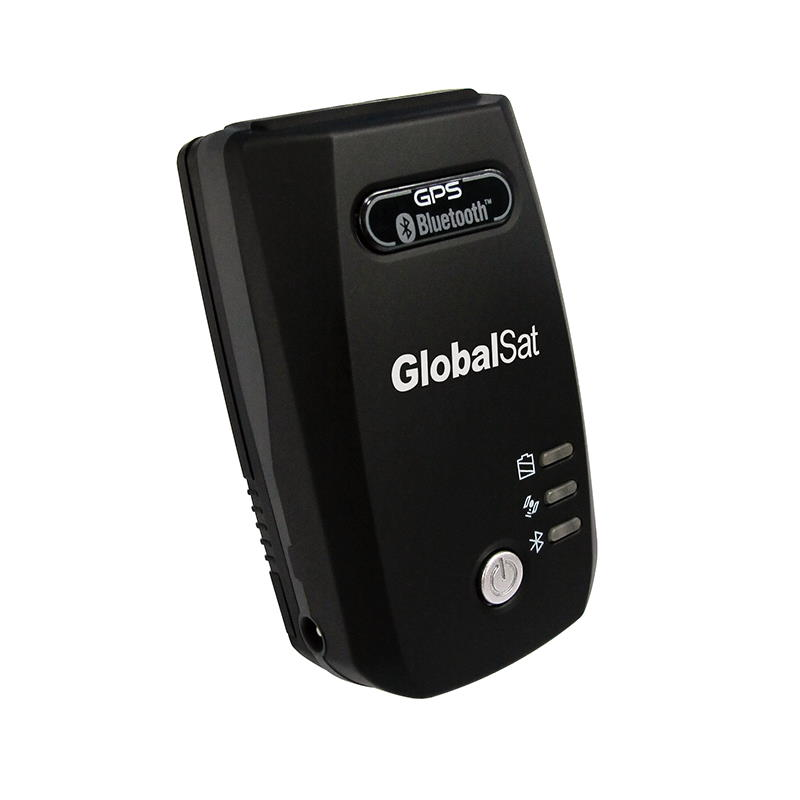

# GlobalSat - BT-821C

El receptor GNSS Bluetooth BT-821C es un dispositivo de posicionamiento compacto y de alto rendimiento, diseñado para ampliar la ubicación satelital precisa a smartphones, tabletas, computadoras portátiles y otros hosts con Bluetooth. Como fuente de posicionamiento compatible con Plaspy, el BT-821C ofrece flujos de datos GNSS confiables que mejoran el seguimiento en tiempo real y la calidad de la ubicación para mapeo, tableros de gestión de flotas y aplicaciones de telemetría en campo.

El BT-821C combina un chipset GNSS de alto rendimiento de MediaTek \(MTK\), una antena integrada de alta ganancia y soporte para los protocolos estándar NMEA-0183 y RTCM para proporcionar un Time-To-First-Fix \(TTFF\) rápido y un rendimiento sólido ante señales débiles. Con hasta 24 horas de operación continua con su batería de ion de litio recargable y indicadores LED de estado claros para bloqueo de satélites, batería y conexión Bluetooth, este receptor está preparado para uso móvil prolongado en navegación, recopilación GIS y flujos de trabajo de rastreo habilitados por Plaspy.

## Aspectos Clave

- Fuente GNSS externa compatible con Plaspy — se empareja vía Bluetooth para proporcionar ubicación precisa a apps y gateways que usan Plaspy para rastreo en tiempo real.
- Chipset MTK de alta sensibilidad — admite hasta 210 canales PRN, 66 canales de búsqueda y 22 canales de seguimiento simultáneo para TTFF rápido y mejor recepción ante señales débiles.
- Soporte de protocolos estándar — genera sentencias NMEA-0183 \(GGA, GSA, GSV, RMC\) y admite correcciones RTCM para mejorar la precisión de posicionamiento donde esté disponible.
- Larga duración de la batería — batería recargable de ion de litio que ofrece hasta 24 horas de operación continua para trabajo de campo durante todo el día sin recarga.
- Antenna integrada y formato compacto — solución simple y portátil para complementar el GNSS integrado en tabletas y teléfonos.
- LEDs de estado visual — indicadores de satélite \(verde\), batería \(rojo/ámbar\) y Bluetooth \(azul\) que facilitan la configuración y supervisión en campo.
- SBAS y augmentación regional — soporta WAAS, EGNOS, GAGAN, MSAS y QZSS para mejorar la precisión en las regiones compatibles.

## Cómo Funciona con Plaspy

El BT-821C se integra con hosts habilitados para Plaspy transmitiendo sentencias GNSS NMEA estándar y datos de corrección por Bluetooth. Cuando se empareja a un dispositivo o gateway compatible con Plaspy, el receptor se convierte en la fuente principal de posicionamiento, posibilitando el rastreo en tiempo real, telemetría mejorada y datos de ubicación de mayor calidad para los paneles y alertas de Plaspy.

- Actualizaciones de ubicación y telemetría en tiempo real mediante sentencias NMEA \(GGA, GSA, GSV, RMC\) transmitidas por Bluetooth.
- El soporte RTCM permite usar correcciones diferenciales para reducir el error de posición cuando existan correcciones de red disponibles.
- Compatibilidad SBAS y QZSS para mejoras de precisión regional utilizadas por mapeo y geocercas de Plaspy.
- El emparejamiento Bluetooth simplifica la integración sin cableado adicional — ideal para dispositivos móviles e instalaciones temporales.
- Proporciona una fuente de posición fiable que complementa la telemetría de vehículos, el monitoreo de combustible y los flujos de trabajo del inmovilizador cuando se combina con hardware telemático conectado a Plaspy.

## Resumen Técnico

| Model | BT-821C |
| --- | --- |
| Chipset | Chipset GNSS de alto rendimiento de MediaTek \(MTK\) |
| Conectividad | Interfaz Bluetooth inalámbrica para emparejar con dispositivos móviles y gateways |
| Bands | No aplica \(receptor GNSS, no celular\) |
| Potencia y Batería | Batería recargable de ion de litio; hasta 24 horas de operación continua |
| Interfaces | Bluetooth \(salida de datos GNSS\). No se especifican entradas de encendido/inmovilizador por cable |
| GNSS | Soporta hasta 210 canales PRN, 66 canales de búsqueda, 22 canales de seguimiento simultáneo; SBAS \(WAAS, EGNOS, GAGAN, MSAS\) y soporte QZSS; NMEA-0183 \(GGA, GSA, GSV, RMC\); RTCM |
| Bluetooth | Emparejamiento inalámbrico con smartphones, tabletas, laptops y gateways compatibles con Bluetooth para la transmisión de datos GNSS |
| Gestión Remota | No especificado \(gestión de firmware o FOTA no descrita\) |
| Forma | Receptor GNSS compacto y portátil con antena integrada e indicadores LED de estado |
| Indicadores | LEDs para posicionamiento satelital \(verde\), estado de la batería \(rojo/ámbar\), conexión Bluetooth \(azul\) |

## Casos de Uso

- Navegación al aire libre y mejora del GPS personal: proporciona una ubicación más precisa para smartphones y tabletas cuando el GNSS nativo es insuficiente.
- GIS y trabajo de campo de mapeo: fuente de posición fiable para apps de levantamiento, recopilación de datos y mapeo sin conexión en dispositivos habilitados para Plaspy.
- Mejora de la gestión de flotas: proporciona datos de ubicación de mayor precisión a plataformas Plaspy para un mejor rastreo de vehículos y verificación de rutas al utilizarse junto con las unidades telemáticas de vehículos.
- Telemetría portátil e instrumentación de campo: actúa como fuente GNSS independiente para sistemas de telemetría móviles e instalaciones temporales.
- Desarrollo y pruebas móviles: una fuente GNSS Bluetooth conveniente para desarrolladores de apps y testers que requieren datos de satélite consistentes entre dispositivos.

## Por qué elegir este receptor con Plaspy

Emparejar el BT-821C con Plaspy ofrece una vía práctica hacia datos de ubicación más precisos sin necesidad de reconfigurar o reemplazar los dispositivos existentes. Su chipset MTK de alta sensibilidad, soporte SBAS/QZSS y compatibilidad RTCM lo convierten en una opción GNSS externo robusta para escenarios de rastreo en tiempo real y gestión de flotas que requieren una precisión confiable. Su larga duración de batería y su diseño compacto mantienen las operaciones móviles y simples, mientras la conectividad Bluetooth facilita una configuración rápida con hosts compatibles con Plaspy.

Para organizaciones que usan Plaspy para telemetría, rastreo en tiempo real, flujos de trabajo anti-robo, paneles de monitoreo de combustible o control de inmovilizador ligado a geocercas precisas, el BT-821C proporciona la capa de posicionamiento que mejora la precisión de detección y reduce alertas falsas. Debido a que emite datos NMEA y RTCM estándar, el BT-821C se integra sin problemas en entornos Plaspy y complementa los sistemas telemáticos y sensores Bluetooth existentes para ofrecer información de ubicación confiable en el campo.

