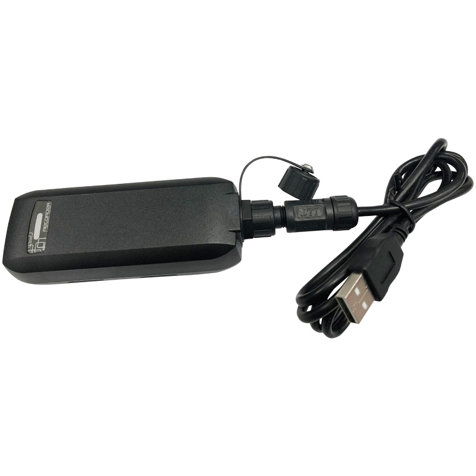

# GlobalSat - DG-388

El GlobalSat DG-388 es un registrador de datos GPS compacto y resistente, diseñado para seguimiento personal y uso en exteriores. Registra puntos de ubicación precisos junto con fecha, hora, velocidad y altitud mediante un chipset GNSS de alto rendimiento. Con una carcasa impermeable IPX7, gestión de energía inteligente, batería recargable y gran memoria interna, el DG-388 está pensado para capturar trayectos prolongados y un historial de rutas detallado sin necesidad de conexión continua.

Como dispositivo compatible con Plaspy, el DG-388 es una fuente fiable de telemetría histórica para importación de rutas, generación de informes de actividad y análisis sin conexión. Las sesiones registradas pueden exportarse con la herramienta de PC incluida y cargarse en Plaspy para su mapeo, revisión en línea de tiempo y elaboración de informes, lo que convierte al dispositivo en un complemento práctico para flujos de trabajo de Plaspy cuando se requieren pistas verificadas o evidencias offline.

## Puntos clave

- Compatible con Plaspy para importación de rutas históricas y análisis de telemetría mediante la herramienta de exportación para PC incluida.
- Chipset GNSS de alto rendimiento para fijaciones más rápidas y mejor precisión posicional en los tracks registrados.
- Gran capacidad interna, capaz de almacenar hasta 500,000 puntos de ubicación para viajes prolongados.
- Carcasa resistente e impermeable IPX7 con un formato compacto adecuado para uso en exteriores y viajes.
- Gestión inteligente de energía y batería recargable que ofrecen más de 50 horas de funcionamiento según la configuración de registro.
- Sensor de movimiento incorporado y funciones de retroalimentación sencilla para soportar registro automático y marcadores de actividad.
- Modos de registro flexibles por tiempo, distancia o intervalo de velocidad que permiten ajustar la densidad de datos según las necesidades de informe.

## Cómo funciona con Plaspy

El DG-388 funciona como un registrador GPS independiente que almacena localmente datos de ubicación y telemetría de alta calidad. Tras un trayecto, usted utiliza la herramienta de PC incluida para descargar las sesiones registradas y exportar archivos de track estándar que Plaspy puede procesar. Este flujo de trabajo permite a los usuarios de Plaspy integrar datos históricos precisos junto con fuentes de seguimiento en tiempo real para un análisis y reportes más completos.

- Los archivos de track exportados incluyen fecha y hora, velocidad, altitud y coordenadas para una reconstrucción precisa de la ruta en Plaspy.
- La carga por lotes de sesiones registradas posibilita la importación de archivos de archivo y la revisión retrospectiva dentro de los paneles de Plaspy.
- Los eventos basados en el sensor de movimiento y los marcadores de actividad pueden emplearse para filtrar y segmentar tracks durante el análisis en Plaspy.
- Las opciones de registro por intervalos permiten equilibrar la autonomía de la batería y la resolución de datos en los informes de Plaspy.
- El registro offline hace que el DG-388 sea útil en despliegues con conectividad celular limitada y que requieran importación a Plaspy en un momento posterior.

## Casos de uso típicos

- Seguimiento de actividades al aire libre y aventuras como senderismo, ciclismo y running con historial de rutas detallado.
- Registro de rutas de viaje para trayectos de larga distancia y análisis de la línea de tiempo en Plaspy.
- Monitoreo de seguridad personal y cuidado de personas mayores mediante registros activados por movimiento y alertas audibles.
- Recolección de evidencias y flujos de trabajo anti robo que dependen de pistas históricas verificadas para revisión de incidentes.
- Historial de ubicación de activos o equipos en entornos donde el seguimiento en vivo continuo no es necesario.

## Por qué elegir este rastreador con Plaspy

El DG-388 es una opción práctica cuando necesita telemetría histórica de alta resolución y confiable para complementar los registros de Plaspy. Su gran capacidad de almacenamiento, modos de registro flexibles y construcción impermeable lo hacen idóneo para actividades al aire libre, viajes y situaciones donde se prefiere la captura offline del historial de ubicaciones. Al exportar los archivos de track verificados a Plaspy, usted podrá combinar estas sesiones registradas con otros datos de seguimiento de flotas o personales para crear informes y cronologías integrales.

Para obtener más información sobre Plaspy y cómo puede incorporar tracks históricos desde dispositivos como el GlobalSat DG-388 visite https://www.plaspy.com. Las especificaciones del producto, la disponibilidad y los detalles del fabricante pueden cambiar con el tiempo, por lo que le recomendamos verificar la información actual en el sitio oficial de GlobalSat https://www.globalsat.com.tw/.
