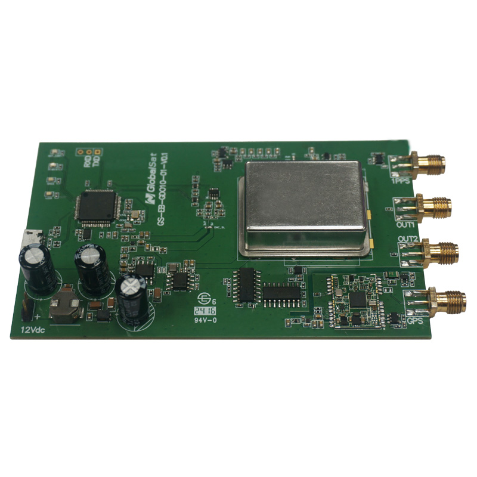

# GlobalSat - GDO-10

El GlobalSat GDO-10 es un oscilador disciplinado por GNSS basado en OCXO, diseñado para proporcionar referencias de tiempo y frecuencia de calidad de laboratorio con sincronización GNSS. Ofrece una salida 1PPS de alta precisión y una onda cuadrada de 10 MHz bloqueada en fase, derivadas del OCXO interno y de un receptor GNSS sensible que soporta GPS, GLONASS y Galileo. La unidad incluye una fuente de alimentación activa de antena de +5.0 V integrada para facilitar el uso de la antena y asegurar la adquisición fiable de señal en entornos donde la precisión temporal es crítica.

Como dispositivo compatible con Plaspy por diseño, el GDO-10 puede incorporarse a arquitecturas de monitorización y telemetría gestionadas por Plaspy para exponer el estado de sincronización y métricas de salud. Aunque el GDO-10 no está pensado como rastreador GPS para vehículos, sus salidas de temporización precisas e indicadores de bloqueo GNSS lo convierten en un endpoint de timing útil para supervisar junto con otros activos en Plaspy, permitiendo una supervisión operativa centralizada y elaboración de informes.

## Características principales

- OCXO como referencia para una fuerte estabilidad a corto plazo y disciplinamiento por GNSS para precisión a largo plazo.
- Salida 1PPS de alta precisión, adecuada para marcas de tiempo precisas y sincronización a nivel de segundos.
- Onda cuadrada de 10 MHz bloqueada en fase para referencia de frecuencia en entornos de prueba y medición.
- Receptor GNSS integrado compatible con GPS, GLONASS y Galileo, con alimentación de antena activa de +5 V.
- Compatible con Plaspy para integración en paneles de telemetría y seguimiento del estado de sincronización y salud.
- Diseñado para instalaciones de laboratorio, telecomunicaciones e infraestructuras donde la fiabilidad del timing es crítica.

## Cómo funciona con Plaspy

Al integrarse en un entorno de monitorización Plaspy, el GDO-10 actúa como un endpoint de temporización gestionado cuyo estado y métricas de salud se pueden correlacionar con otras fuentes de telemetría. Plaspy no modifica las salidas del dispositivo, pero puede ingerir información de estado desde un gateway o adaptador de monitorización que lea las señales del GDO-10, permitiendo que usted y su equipo supervisen la calidad del timing, la condición de bloqueo y la salud de la antena junto con otros activos.

- Visibilidad en tiempo real del estado de bloqueo GNSS y la calidad de sincronización reportados a Plaspy.
- Alertas centralizadas e informes sobre anomalías de temporización y pérdida de bloqueo GNSS cuando existe una interfaz de monitorización.
- Correlación de la salud del timing con otros activos monitorizados para supervisión operativa y resolución de incidencias.
- Inclusión del GDO-10 en paneles y reportes programados para seguir el rendimiento temporal a lo largo del tiempo.
- Uso de los informes de Plaspy para apoyar la planificación de mantenimiento y auditorías de timing a nivel de sitio.

## Casos de uso típicos

- Sincronización y verificación temporal de estaciones base celulares 5G.
- Comunicaciones con satélites LEO donde la temporización precisa ayuda en la coordinación de enlace ascendente y descendente.
- Laboratorio de pruebas y medición como reloj de referencia para instrumentación y marcas de tiempo.
- Líneas de producción y sistemas de test repetibles que requieren referencias de frecuencia estables.
- Distribución de tiempo en infraestructuras amplias y monitorización entre múltiples sitios.

## Por qué elegir este dispositivo con Plaspy

El GDO-10 es apropiado para organizaciones que necesitan una fuente de temporización GNSS disciplinada y desean incorporar la salud del timing en su estrategia de monitorización centralizada. Su combinación de estabilidad por OCXO y disciplinamiento GNSS proporciona un comportamiento temporal consistente que puede ser seguido y reportado en Plaspy, ayudando a que usted mantenga visibilidad sobre el estado de sincronización junto con otras telemetrías.

Dado que el GDO-10 está enfocado en la temporización de precisión más que en el rastreo de vehículos, resulta un complemento valioso para despliegues donde son esenciales referencias precisas de tiempo y frecuencia. Integrar el GDO-10 con Plaspy mediante un gateway de monitorización adecuado permite visualizar el estado de bloqueo, la calidad del timing y las alarmas en la misma plataforma utilizada para la supervisión operativa y telemetría general.

Para conocer más sobre cómo Plaspy puede gestionar endpoints de temporización y telemetría en su infraestructura visite https://www.plaspy.com. Las especificaciones y la disponibilidad del producto pueden cambiar con el tiempo, por lo que le recomendamos verificar los detalles técnicos y la documentación de soporte directamente con el fabricante en https://www.globalsat.com.tw/.
