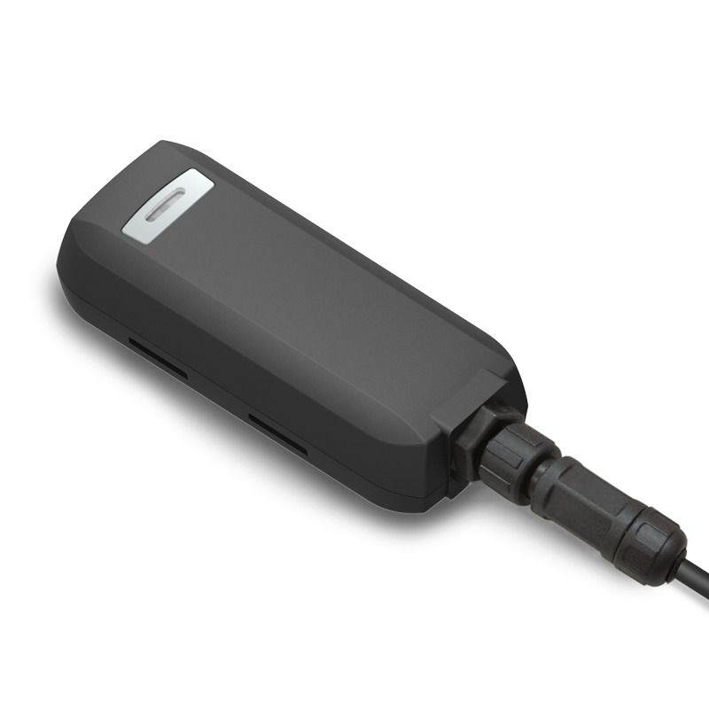

# GlobalSat - GTR-388

##### GTR-388 está diseñado como un rastreador GPS 3G duradera y multifuncional. Se integra el módulo GPS de alta sensibilidad y un módulo de comunicación 3G con un potente microcontrolador que encaja en una carcasa compacta. El dispositivo es capaz de ser resistente al agua y es ideal para su uso en una motocicleta, carros de golf y vehículos. Proporciona posiciones GPS en tiempo real cualquier momento y lugar con una vista abierta hacia el cielo, y ofrece un posicionamiento preciso, y los informes de estado del vehículo al servidor con la información necesaria se muestra en el mapa. Beneficios tales como la gestión de flotas mejorada, una mejor seguridad de los vehículos, respuesta a emergencias, están todos a cabo a través de la implementación del sistema de GTR-388. Las antenas incorporadas en 3G y GPS son para una instalación fácil y sin complicaciones.

