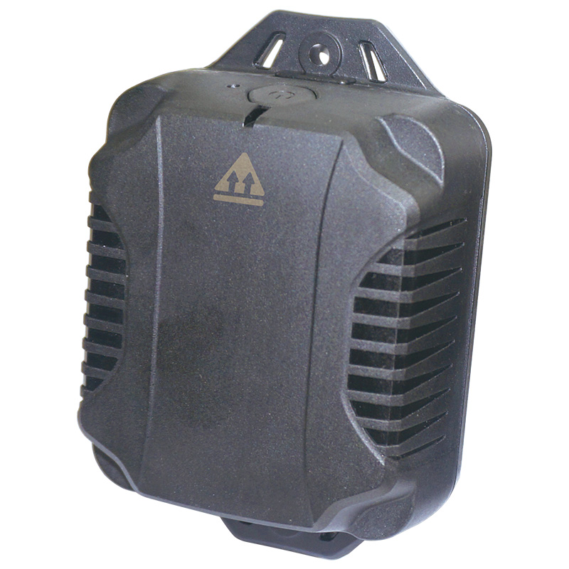

# GlobalSat - KT-520M

El KT-520M es un rastreador GPS resistente pensado para despliegues a largo plazo con bajo requerimiento de mantenimiento. Combina conectividad celular LTE M con respaldo satelital Kineis y posicionamiento GNSS integrado para ofrecer informes continuos de ubicación de vehículos y activos móviles que se mueven entre zonas urbanas y áreas remotas. Diseñado para la durabilidad, el KT-520M prioriza la larga vida de la batería, la resistencia ambiental y la detección de movimiento para satisfacer necesidades de seguimiento persistente.

Como dispositivo compatible con Plaspy, el KT-520M integra su ubicación, eventos de movimiento y telemetría de batería en los paneles y flujos de trabajo de Plaspy. Esta compatibilidad facilita incluir unidades KT-520M en la supervisión de flotas, las alertas y los informes dentro de Plaspy, permitiendo a los equipos operativos mantener visibilidad en áreas con cobertura mixta y correlacionar las señales del dispositivo con otros datos de la flota gestionados en Plaspy.

## Características principales

- Compatibilidad con Plaspy para paneles centralizados de flota, alertas y registro histórico.
- Conectividad en modo dual con LTE M como primaria y respaldo satelital Kineis para áreas con cobertura mixta.
- Batería SAFT de 17Ah sin mantenimiento y diseñada para despliegues de varios años.
- Posicionamiento GNSS integrado y acelerómetro de 3 ejes para detección de movimiento y manipulación.
- Configuración local y gestión de firmware OTA vía BLE, además de actualizaciones remotas por celular.
- Carcasa robusta con clasificación IP69K y amplio rango de funcionamiento para instalaciones exigentes en vehículos y activos.
- Factor de forma compacto y liviano, apropiado para montaje permanente o discreto en activos móviles.

## Cómo funciona con Plaspy

Al conectarse a Plaspy, el KT-520M proporciona ubicación GNSS, eventos de movimiento o manipulación y el estado de la batería, de modo que usted puede rastrear activos casi en tiempo real cuando hay servicio celular y mantener continuidad mediante el respaldo satelital cuando no lo hay. Plaspy procesa esas corrientes de telemetría para habilitar alertas, trazas históricas e informes operativos que ayudan a gestionar flotas y equipos desplegados.

- Ubicación GNSS y telemetría casi en tiempo real por celular con actualizaciones periódicas preservadas cuando se emplea el respaldo satelital.
- Notificaciones de movimiento y manipulación desde el acelerómetro integrado que Plaspy puede mostrar como alertas o eventos.
- Reporte de nivel de batería y estado de alimentación para que Plaspy alerte sobre disminución de energía y permita planificar mantenimiento o reemplazo.
- Continuidad automática de las trazas de ubicación mediante mensajes satelitales cuando la cobertura LTE M no está disponible.
- Configuración local por BLE y opción OTA para puesta en marcha y gestión del ciclo de vida en sitio, combinado con actualizaciones de firmware remotas por celular.
- Correlación de la telemetría KT-520M con otras señales gestionadas en Plaspy para informes combinados e información operativa.

## Casos de uso típicos

- Operaciones de flota que recorren rutas con cobertura mixta y requieren seguimiento consistente entre ciudad y zonas remotas.
- Monitoreo antirrobo donde eventos de movimiento o manipulación deben activar alertas y flujos de respuesta.
- Despliegues de activos a largo plazo, como remolques o maquinaria, que se benefician de batería de varios años y bajo mantenimiento.
- Rastreo de equipos remotos para mantener visibilidad cuando los activos operan fuera de red o en áreas con servicio celular intermitente.
- Proyectos de agregación de telemetría que combinan datos GNSS y de movimiento con otras señales del vehículo para reportes operativos.

## Por qué elegir este rastreador con Plaspy

El KT-520M está orientado a despliegues donde la durabilidad, la larga duración de batería y la continuidad de conectividad son prioridades. Su combinación de LTE M con respaldo satelital y su robusta carcasa reduce el riesgo de brechas de cobertura o fallos por condiciones ambientales, mientras que la detección de movimiento y la telemetría de batería proporcionan las señales principales que muchos responsables de flota necesitan para prevención de robos, planificación de mantenimiento y supervisión operativa.

Usar el KT-520M con Plaspy ofrece a los equipos un único panel para monitorear ubicación, eventos de movimiento y estado energético junto con otros datos de la flota. Esa integración simplifica las alertas, el análisis histórico y la generación de informes para que los operadores tomen decisiones informadas sin gestionar múltiples sistemas puntuales. Para saber más sobre Plaspy y cómo dispositivos compatibles como el KT-520M encajan en la gestión de flotas y activos, visite https://www.plaspy.com. Las especificaciones del producto, la disponibilidad y los datos del fabricante pueden cambiar con el tiempo, por favor verifique la información técnica y de soporte actual en el sitio oficial de GlobalSat https://www.globalsat.com.tw/.
