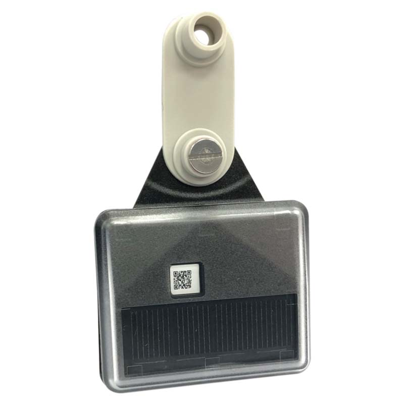

# GlobalSat - LT-10

El GlobalSat LT-10 es un rastreador GPS tipo arete alimentado por energía solar, diseñado específicamente para ganado y animales en pastoreo. Combina una celda solar de alto rendimiento con un receptor GNSS de alta sensibilidad y conectividad LoRaWAN para ofrecer seguimiento de ubicación de larga duración en entornos de pastizales remotos. Pensado para condiciones de campo, el LT-10 es compacto y resistente, cuenta con resistencia al agua IPX7, detección de movimiento, indicadores visuales y configuración sencilla mediante aplicaciones para iOS y Android.

Como dispositivo compatible con Plaspy, el LT-10 puede enviar datos de ubicación y actividad a Plaspy para brindar visibilidad operativa e informes. Su autonomía solar y su modelo de reportes periódicos lo hacen una opción práctica para monitoreo animal a largo plazo, mientras que funciones como alertas de batería baja y eventos de movimiento ayudan a que usted mantenga el control sin revisiones manuales frecuentes. Los intervalos de reporte pueden variar según la incidencia de luz solar, por lo que los paneles y alertas de Plaspy pueden ajustarse en consecuencia.

## Características principales

- Factor de forma tipo arete auricular optimizado para ganado y animales de pastoreo
- Conectividad basada en LoRaWAN para cobertura de largo alcance en zonas rurales
- GNSS de alta sensibilidad para mejorar la precisión de ubicación en campo
- Acelerómetro de 3 ejes integrado para detección de movimiento y reporte de actividad
- Resistencia al agua certificada IPX7 para protección ante inmersión durante uso en campo
- Configurable desde aplicaciones para iOS y Android con reportes periódicos y alertas de batería baja
- Diseño compacto y ligero, apto para su fijación en animales

## Cómo funciona con Plaspy

Plaspy puede recibir la transmisión de datos del LT-10 y mostrarlos junto con otra información de flotas y activos, permitiendo un monitoreo consolidado de los movimientos del ganado y el estado de los dispositivos. La integración se centra en la visibilidad de ubicación, reporte de actividad y generación de alertas para que usted gestione animales y dispositivos desde la plataforma Plaspy.

- Seguimiento en mapa de ubicaciones animales e historial de movimiento en Plaspy
- Indicadores de eventos de movimiento y actividad derivados del acelerómetro del LT-10
- Notificaciones de reportes periódicos y batería baja integradas en los flujos de alerta de Plaspy
- Vistas agregadas de estado y tiempo de actividad de dispositivos para apoyar la planificación de mantenimiento
- Informes históricos y registros de ubicación exportables para análisis operativos

## Casos de uso típicos

- Monitoreo de patrones de pastoreo y ubicación general del ganado en grandes extensiones
- Rastreo a largo plazo donde la energía solar reduce las visitas de mantenimiento
- Detección de movimiento o inactividad prolongada mediante eventos de movimiento para conocimiento operativo
- Gestión de inventario de dispositivos y salud de baterías en grandes hatos desde paneles centrales
- Monitoreo remoto en áreas estacionales o fuera de la red donde se requiere conectividad de largo alcance

## Por qué elegir este rastreador con Plaspy

El LT-10 combina hardware orientado a la autonomía con un diseño tipo arete compacto que se adapta a las operaciones ganaderas donde minimizar el mantenimiento es prioritario. Su capacidad de carga solar y su construcción robusta disminuyen la necesidad de cambios frecuentes de batería y ayudan a asegurar la recopilación continua de datos durante despliegues prolongados. Al integrarlo con Plaspy, el LT-10 forma parte de un flujo unificado de monitoreo e informes que apoya la toma de decisiones operativas para la gestión de pasturas y hatos.

Elegir el LT-10 para usar con Plaspy tiene sentido para organizaciones que necesitan rastreadores duraderos y de bajo mantenimiento para ganado distribuido y que desean consolidar datos de ubicación y actividad animal en una sola plataforma de gestión. Las características del dispositivo y las funcionalidades de Plaspy ofrecen visibilidad, alertas y análisis histórico sin una carga operativa excesiva.

Para saber más sobre Plaspy y cómo dispositivos compatibles como el LT-10 pueden integrarse en sus flujos de monitoreo visite https://www.plaspy.com. Las especificaciones del producto y su disponibilidad pueden cambiar con el tiempo, por favor verifique los detalles técnicos actuales y las opciones regionales en el sitio del fabricante https://www.globalsat.com.tw/.
