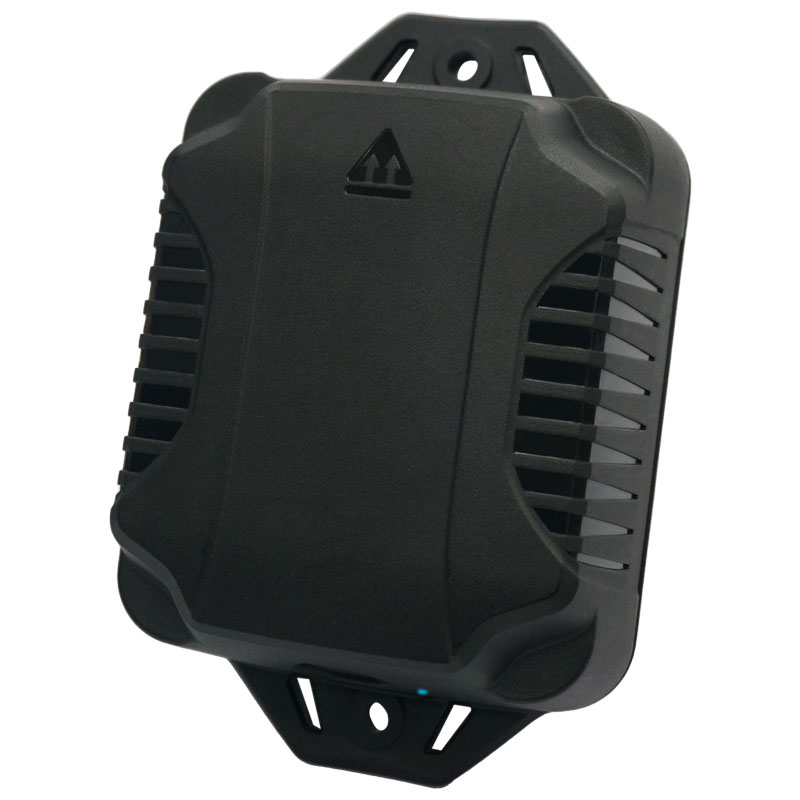

# GlobalSat - LT-520AZ

El LT-520AZ es un localizador GPS compatible con Plaspy, diseñado para el seguimiento de activos y vehículos a largo plazo y con bajo mantenimiento en la red compartida Amazon Sidewalk. Combinando GNSS \(GPS + GLONASS\) para posicionamiento al aire libre con Bluetooth Low Energy \(BLE\) para detección interior mejorada y sensado de corto alcance, el LT-520AZ ofrece telemetría fiable de ubicación y movimiento para implementaciones mixtas interior/exterior donde la durabilidad y la vida de la batería son importantes.

El resistente LT-520AZ es ideal para la gestión de flotas, monitorización de equipos remotos y concienciación antirrobo cuando los activos se desplazan por grandes áreas cubiertas por Amazon Sidewalk. Con un acelerómetro integrado de 3 ejes, reportes periódicos configurables y estimación de la batería, y soporte para actualizaciones de firmware basadas en BLE, el LT-520AZ minimiza el mantenimiento en campo mientras proporciona los datos esenciales de seguimiento que Plaspy necesita para ofrecer vistas de rastreo en tiempo real, alertas e informes históricos.

## Aspectos clave

- Localizador GPS compatible con Plaspy que combina GPS + GLONASS GNSS con BLE para ubicación exterior y mejora en interiores.
- Diseñado para despliegues de larga duración: batería no recargable de 19 Ah y una vida útil prevista de hasta 2 años con un informe periódico típico cada 20 minutos.
- Construcción ultrarrobusta para entornos difíciles con un rango de operación de −20°C a +60°C.
- Monitoreo continuo de movimiento y eventos de parada mediante un acelerómetro integrado de 3 ejes para una telemetría precisa.
- Conectividad a la red compartida Amazon Sidewalk para una cobertura amplia y de bajo consumo sin gestión de SIM celular.
- Soporte BLE para detección de corto alcance y sensores Bluetooth, y actualizaciones de firmware OTA basadas en BLE para el mantenimiento remoto.
- Informes configurables y medición/estimación del nivel de batería para simplificar el despliegue en campo y la planificación del ciclo de vida de los activos.

## Cómo funciona con Plaspy

Cuando se empareja con Plaspy, el LT-520AZ proporciona telemetría de ubicación y movimiento que Plaspy agrega a paneles, geocercas, alertas e informes históricos. Plaspy puede ingerir las lecturas GNSS, detecciones interiores asistidas por BLE, eventos de movimiento/parada impulsados por el acelerómetro y los informes del estado de la batería que el dispositivo proporciona a través de la red compartida Amazon Sidewalk. Esto hace que el LT-520AZ sea una adición sencilla a una solución de gestión de flotas o monitoreo de activos impulsada por Plaspy.

- Actualizaciones de ubicación y telemetría en tiempo real \(casi en tiempo real cuando hay cobertura de Sidewalk; informes periódicos configurables\).
- Eventos de movimiento y parada derivados del acelerómetro integrado de 3 ejes para el análisis de rutas y tiempo de inactividad.
- Medición o estimación del nivel de batería para alimentar alertas de Plaspy y planes de mantenimiento.
- Detección de corto alcance por BLE y sensores Bluetooth para presencia en interiores, transferencias de corto alcance y mayor precisión a nivel de recinto.
- Actualizaciones de firmware OTA basadas en BLE para simplificar la gestión remota de dispositivos y asegurar un firmware seguro y actualizado en todo el despliegue.

## Resumen técnico

| Model | LT-520AZ |
| --- | --- |
| Connectivity | Red compartida de Amazon Sidewalk; GNSS integrado \(GPS + GLONASS\); Bluetooth Low Energy \(BLE\) |
| Bandas | Red compartida de Sidewalk \(el dispositivo utiliza conectividad Amazon Sidewalk\); no se especifican bandas celulares |
| Power & Battery | Batería no recargable de 19 Ah; vida útil de la batería de hasta 2 años en condiciones típicas de reporte cada 20 minutos |
| Interfaces | Acelerómetro integrado de 3 ejes; informes periódicos configurables; medición/estimación del nivel de batería |
| GNSS | GPS + GLONASS para posicionamiento al aire libre |
| Bluetooth | Bluetooth Low Energy \(BLE\) para detección interior, sensado de corto alcance y actualizaciones de firmware OTA basadas en BLE |
| Remote Management | Actualizaciones de firmware OTA basadas en BLE compatibles |
| Environmental | Temperatura de operación: −20°C a +60°C; diseño robusto para despliegue exterior a largo plazo |
| Form Factor | Localizador ultrarrobusto para activos/vehículos y de larga vida útil, apto para instalaciones de bajo mantenimiento |

## Casos de uso

- Gestión de flotas: rastrear vehículos y remolques a lo largo de áreas extensas, con eventos de movimiento y parada para analizar la utilización y el tiempo de inactividad.
- Monitoreo de equipos a largo plazo: desplegar durante meses o años sin cambios frecuentes de batería, reduciendo la carga de mantenimiento.
- Conciencia de anti-robo de activos: detectar movimientos inesperados y usar alertas de Plaspy para notificar a los operadores sobre posibles robos o reubicaciones no autorizadas.
- Seguimiento mixto interior/exterior: GNSS para fijaciones al aire libre y BLE para detección en interiores cuando los activos entran en edificios o instalaciones de almacenamiento.
- Monitoreo de sitios remotos: vigilar activos y equipos dispersos en condiciones ambientales adversas donde la durabilidad y la vida de la batería son prioritarias.

## Por qué elegir este rastreador con Plaspy

El LT-520AZ aporta un equilibrio pragmático entre larga vida de la batería, construcción robusta y posicionamiento híbrido \(GPS + GLONASS + BLE\) que se ajusta a implementaciones de Plaspy que requieren un seguimiento fiable y de bajo mantenimiento. Para organizaciones centradas en la gestión de flotas, telemetría y flujos de trabajo de anti-robo, el LT-520AZ proporciona los datos esenciales de ubicación, movimiento y estado de la batería que Plaspy necesita para ofrecer rastreo en tiempo real, alertas e informes históricos.

Aunque el LT-520AZ no incluye interfaces CAN/OBD para vehículos ni sensores analógicos de combustible dedicados y de encendido/inmovilizador, Plaspy puede combinar su telemetría GNSS y BLE con otras entradas conectadas en la plataforma para respaldar escenarios más amplios de telemática de flotas, como monitorización de encendido o combustible y flujos de inmovilización remota. Esa flexibilidad convierte al LT-520AZ en una opción sólida cuando se necesita un localizador GPS duradero compatible con Plaspy y un endpoint de sensor Bluetooth que minimice las visitas de campo y mantenga las flotas y activos visibles en áreas cubiertas por Amazon Sidewalk.

