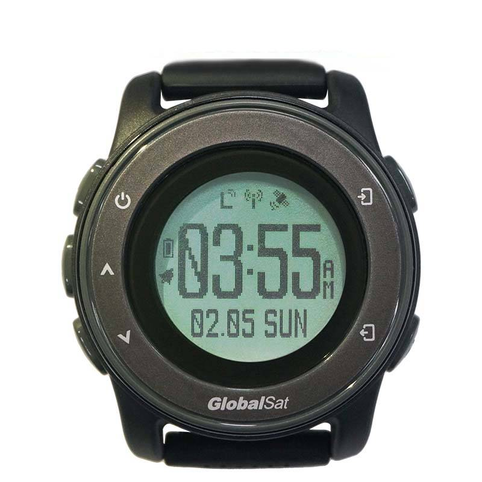

# GlobalSat - LW-360HR

El LW-360HR es un reloj rastreador GPS con tecnología LoRa, diseñado para una monitorización fiable de la ubicación y la salud, con bajo consumo de energía. Listo para usar con Plaspy, el LW-360HR combina conectividad LoRaWAN™ de largo alcance \(compatibilidad con Helium\) con posicionamiento GPS y BLE 4.0 para ofrecer seguimiento seguro en tiempo real y monitorización remota para personas mayores, equipos y grupos al aire libre.

Diseñado para el cuidado de personas mayores, la seguridad de grupos y la gestión de equipos al aire libre, este compacto rastreador GPS combina telemetría de actividad y salud —incluyendo ritmo cardíaco óptico y temperatura de la piel— con alertas SOS y geocerca. El LW-360HR es adecuado para implementaciones que requieren cobertura en áreas extensas sin necesidad de servicio celular continuo, manteniendo al mismo tiempo acceso móvil local y actualizaciones de firmware OTA a través de Bluetooth.

## Key Highlights

- Rastreador GPS portátil compatible con Plaspy: se integra con flujos de trabajo en la nube LoRaWAN para seguimiento y alertas en tiempo real.
- Conectividad LoRaWAN de largo alcance \(Clase A\) con compatibilidad con la red Helium, para hasta ~10 km en espacios abiertos.
- Posicionamiento GPS integrado para reportes de ubicación exterior precisos y notificaciones activadas por geocerca.
- Telemetría continua de salud y actividad — ritmo cardíaco óptico \(±3 bpm en reposo / ±10 bpm en movimiento\), temperatura de la piel, pasos y calorías.
- BLE 4.0 para emparejamiento móvil local, soporte para sensores Bluetooth y actualizaciones de firmware OTA mediante conexión móvil.
- Diseño práctico tipo wearable: pantalla redonda 0.96" FSTN \(128×128\), tamaño 45×45×13 mm, peso total ≈45 g y resistencia al agua de 5 ATM.
- Autonomía de varios días gracias a la célula integrada de 250 mAh — uso típico de unas 4 días en condiciones normales.

## Cómo Funciona con Plaspy

El LW-360HR envía posiciones GPS y telemetría de salud y actividad a través de LoRaWAN™ a plataformas en la nube. Cuando se despliega como compatible con Plaspy, la ubicación y los datos de sensores se envían a Plaspy para seguimiento en tiempo real, escalamiento de SOS y reportes de geocercas. BLE proporciona conectividad de corto alcance a smartphones para el aprovisionamiento, alertas locales y actualizaciones de firmware OTA.

- Actualizaciones de ubicación y telemetría en tiempo real: fijaciones GPS transmitidas por LoRaWAN a Plaspy para mapas en vivo e historial.
- Métricas de salud y actividad: ritmo cardíaco óptico, temperatura de la piel y datos de podómetro transmitidos como telemetría para tableros de monitoreo.
- Alertas SOS y geocerca: eventos disparados por botón o por geocerca generan notificaciones inmediatas a través de los canales de Plaspy.
- Sensores Bluetooth y emparejamiento BLE: BLE 4.0 admite interacción móvil local y sensores accesorios cuando corresponda.
- Ignición / inmovilizador / monitorización de combustible: el LW-360HR es un dispositivo ponible y no ofrece entradas de encendido de vehículos, control de inmovilizador ni detección directa de combustible; sin embargo, Plaspy puede incorporar telemetría de dispositivos de grado vehicular para escenarios completos de gestión de flotas junto con el rastreo de wearables.

## Visión General Técnica

| Modelo | LW-360HR |
| --- | --- |
| Conectividad | LoRaWAN™ \(Clase A\), GPS, BLE 4.0 |
| Alcance de LoRa | ~1 km \(urbano típico\), hasta 10+ km \(espacios abiertos\) |
| Distancia de Enlace Bluetooth | Aproximadamente 10 m |
| GNSS | Posicionamiento GPS \(exterior\) |
| Sensores | Monitor óptico de ritmo cardíaco, sensor de temperatura de la piel, sensor G \(acelerómetro\) |
| Precisión de Frecuencia Cardíaca | ±3 bpm en reposo; ±10 bpm durante movimiento \(\<10 km/h\) |
| Batería | 250 mAh Li‑ion; típico ~4 días en uso normal |
| Pantalla | 0.96" round FSTN \(128×128\) |
| Tamaño / Peso | 45 × 45 × 13 mm; unidad ≈30 g \(total ≈45 g con accesorios\) |
| Resistencia al Agua | 5 ATM |
| Temperatura de Funcionamiento | -10 °C a 60 °C |
| Carga y Firmware | Cable de carga con clip de 4 pines; actualizaciones de firmware vía BLE OTA o modo USB almacenamiento masivo |
| Accesorios Incluidos | Guía de Inicio Rápido, cable de carga con clip |

## Casos de Uso

- Seguridad de personas mayores y monitorización remota del bienestar — el reloj rastreador GPS proporciona ubicación, ritmo cardíaco y SOS para adultos mayores que viven de forma independiente.
- Seguridad al aire libre y coordinación de equipos — seguimiento de actividad grupal y protección de trabajadores solitarios en parques, senderos y sitios de trabajo remotos.
- Rastreo de grupos escolares y de cuidado infantil — monitoreo fácil de niños en excursiones o actividades en campus con alertas de geocerca.
- Gestión de eventos y grupos — coordinar equipos o voluntarios en grandes espacios abiertos con cobertura celular limitada.
- Antirrobo y recuperación de activos wearables — la localización y alertas ayudan a recuperar dispositivos perdidos o extraviados.

## Por qué Elegir Este Rastreador con Plaspy

Elegir el LW-360HR como rastreador GPS compatible con Plaspy te ofrece un wearable compacto que combina la conectividad LoRaWAN de largo alcance con una telemetría rica de sensores de salud y movimiento. Para organizaciones y cuidadores, la integración con Plaspy posibilita rastreo en tiempo real, escalamiento de SOS y alertas de geocerca sin depender de costosos planes celulares. BLE 4.0 simplifica el aprovisionamiento y las actualizaciones de firmware OTA en el propio dispositivo, mientras que la resistencia al agua de 5 ATM y varios días de autonomía hacen que el dispositivo sea práctico para uso diario.

Aunque el LW-360HR no es un dispositivo telemático para vehículos y no incluye interfaces de encendido, inmovilizador o detección de combustible integradas, sus fortalezas se centran en la telemetría orientada a la persona y la coordinación de grupos. En despliegues mixtos, Plaspy puede unificar la telemetría de wearables del LW-360HR con datos de vehículos o activos de otros rastreadores para ofrecer vistas integrales de gestión de flotas, flujos de anti‑robo y paneles de monitoreo consolidados.

