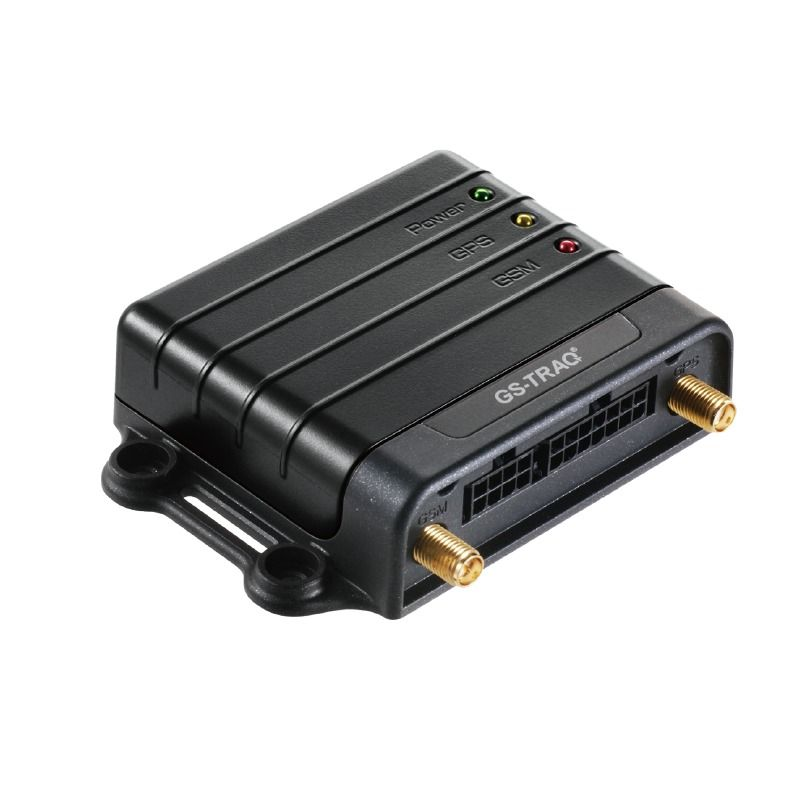

# GlobalSat - TR-606

El GlobalSat TR-606 es un rastreador GPS compacto y económico diseñado para una amplia variedad de aplicaciones de Localización Automática de Vehículos (AVL). Combina un chipset GPS de alta sensibilidad con comunicaciones celulares multibanda en una carcasa resistente, entregando actualizaciones en tiempo real sobre la ubicación y el estado del vehículo. El dispositivo está pensado para ser ligero y de fácil despliegue, mientras ofrece las funciones básicas de seguimiento y control remoto necesarias para la gestión de flotas y el monitoreo de activos.

Como dispositivo compatible con Plaspy, el TR-606 puede enviar su información de ubicación y estado en tiempo real a Plaspy para visibilidad centralizada y supervisión operativa. Esa compatibilidad convierte al TR-606 en una opción práctica para organizaciones que quieran combinar las capacidades del hardware del rastreador con el software de Plaspy para mapas, alertas, reportes y flujos de trabajo básicos de comandos remotos.

## Características principales

- Factor de forma compacto y ligero, adecuado para instalación en vehículos
- Chipset GPS de alta sensibilidad que garantiza reportes de ubicación confiables
- Soporte UMTS HSDPA de doble banda y GSM cuatribanda para amplia cobertura celular
- Carcasa resistente diseñada para uso en vehículos y operaciones rutinarias
- Actualizaciones en tiempo real de ubicación GPS y estado del vehículo a un servidor
- Capacidades de control remoto para acciones de comando básicas

## Cómo funciona con Plaspy

Cuando se utiliza con Plaspy, el TR-606 envía actualizaciones de ubicación y estado a la plataforma Plaspy, lo que permite el seguimiento centralizado y la supervisión de la flota. Plaspy recibe esas actualizaciones y las presenta junto con otros datos de la flota para que los equipos puedan monitorear las operaciones desde un único lugar.

- Ubicación en vivo de los vehículos en los mapas de Plaspy para visibilidad en tiempo real
- Actualizaciones de estado y alertas gestionadas por Plaspy para notificar a los operadores
- Reproducción de rutas históricas e informes para análisis de viajes y registros
- Paneles y monitoreo a nivel de flota que apoyan decisiones operativas
- Uso de capacidades de control remoto vía Plaspy donde estén soportadas para acciones de comando simples

## Casos de uso típicos

- Seguimiento estándar de flotas para operaciones de vehículos ligeros y medianos
- Monitoreo de entregas y logística para rastrear envíos y rutas
- Coordinación de seguridad vehicular y respuesta ante emergencias
- Supervisión del transporte de mercancías y paquetes
- Localización y reporte de estado para vehículos comerciales de alquiler o servicio

## Por qué elegir este rastreador con Plaspy

El TR-606 es una opción práctica para organizaciones que requieren un rastreador directo y económico que se integre en un flujo de trabajo más amplio de gestión de flotas. Su combinación de recepción GPS sensible y comunicaciones celulares multibanda lo hace adecuado para muchos escenarios comunes de rastreo vehicular, y la carcasa del dispositivo soporta el uso rutinario en entornos de vehículos.

En conjunto con Plaspy, el TR-606 ofrece un camino claro desde los datos del dispositivo hasta información accionable. Plaspy organiza las fuentes de ubicación, las actualizaciones de estado, las alertas y los comandos remotos básicos en una sola plataforma para que los equipos operativos puedan supervisar flotas, investigar eventos y generar informes sencillos sin cambiar de sistema.

Learn more about how Plaspy can work with compatible trackers such as the GlobalSat TR-606 on the Plaspy main website https://www.plaspy.com. Product specifications and availability can change over time, so please verify current technical details and documentation on the manufacturer site https://www.globalsat.com.tw/.
