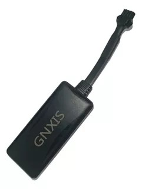

# Gnxis - 4-wire

El Gnxis 4-wire es un rastreador GPS compacto diseñado para el monitoreo de ubicación en tiempo real y la generación de alertas de seguridad en vehículos. Está pensado para su uso en automóviles particulares, flotas comerciales y motocicletas, ofreciendo posicionamiento preciso y varias opciones de alarma para proteger y supervisar activos. El dispositivo mantiene conectividad en redes celulares comunes e incluye funciones orientadas al ahorro de energía cuando el vehículo está estacionado.

Como dispositivo compatible con Plaspy, el Gnxis 4-wire puede enviar datos de ubicación en vivo y notificaciones de estado a la plataforma Plaspy para una supervisión centralizada de la flota. Esta compatibilidad facilita la incorporación de unidades Gnxis 4-wire en una implementación de Plaspy para monitoreo, alertas y reportes básicos, ayudando a los equipos operativos a conservar situacionalidad en distintos tipos de vehículos.

## Características principales

- Rastreo en tiempo real preciso, apto para autos particulares, motocicletas y flotas comerciales  
- Antenas integradas que simplifican el diseño del equipo y ofrecen flexibilidad en la instalación  
- Alertas de encendido y movimiento para avisar cuando un vehículo arranca o se detiene  
- Notificaciones por exceso de velocidad y estado de ignición para supervisión básica de seguridad  
- Actualizaciones basadas en ángulo que refinan el reporte de posición durante giros y maniobras  
- Alarma por corte de energía para notificar cuando se desconecta la alimentación externa  
- Modo de ahorro de energía que reduce la frecuencia de reportes mientras el vehículo está estacionado

## Cómo funciona con Plaspy

Al integrarse con Plaspy, el Gnxis 4-wire ofrece actualizaciones continuas de posición y notificaciones de eventos que se muestran en el panel y las herramientas de reporte de Plaspy. Plaspy procesa los datos del equipo para ofrecer visualización y contexto operativo, permitiendo que los equipos usen el rastreador en sus flujos de trabajo diarios de gestión de flota y seguridad.

- Vista de mapa en vivo con posiciones de vehículos e historial de desplazamiento reciente  
- Entrega de eventos y alarmas a Plaspy por encendido, movimiento, desconexión de energía y velocidad  
- Supervisión centralizada de flotas mixtas, incluyendo automóviles y motocicletas  
- Informes históricos para revisar viajes y realizar análisis operativos básicos  
- Enrutamiento de alertas al personal de operaciones para respuesta oportuna y supervisión

## Casos de uso típicos

- Rastreo y protección de vehículos particulares con ubicación en tiempo real y alertas por desconexión de energía  
- Monitoreo de flotas comerciales para supervisión de rutas y notificaciones básicas de seguridad  
- Rastreo de motocicletas cuando se requiere hardware compacto y actualizaciones de ubicación confiables  
- Seguridad de activos y disuasión de robo mediante notificaciones de movimiento y alarmas  
- Visibilidad operativa diaria para flotas pequeñas y medianas

## Por qué elegir este rastreador con Plaspy

El Gnxis 4-wire es una opción práctica cuando necesita un rastreador GPS sencillo que se integre con una plataforma de flotas como Plaspy. Su enfoque en reportes de ubicación fiables, tipos de alarma esenciales y gestión de energía lo hace adecuado para organizaciones que desean añadir seguimiento a diferentes tipos de vehículos sin complejidad excesiva.

En conjunto con Plaspy, el equipo ofrece visibilidad centralizada y alertas que apoyan las operaciones de flota y necesidades básicas de seguridad. Si su despliegue requiere posicionamiento estable, gestión sencilla de alarmas y conectividad celular sólida en redes comunes, el Gnxis 4-wire merece consideración como parte de una solución de flota con Plaspy.

To learn more about using Plaspy with compatible trackers visit https://www.plaspy.com. Product specifications and availability can change over time so please verify current details with the device manufacturer before purchase or deployment.
