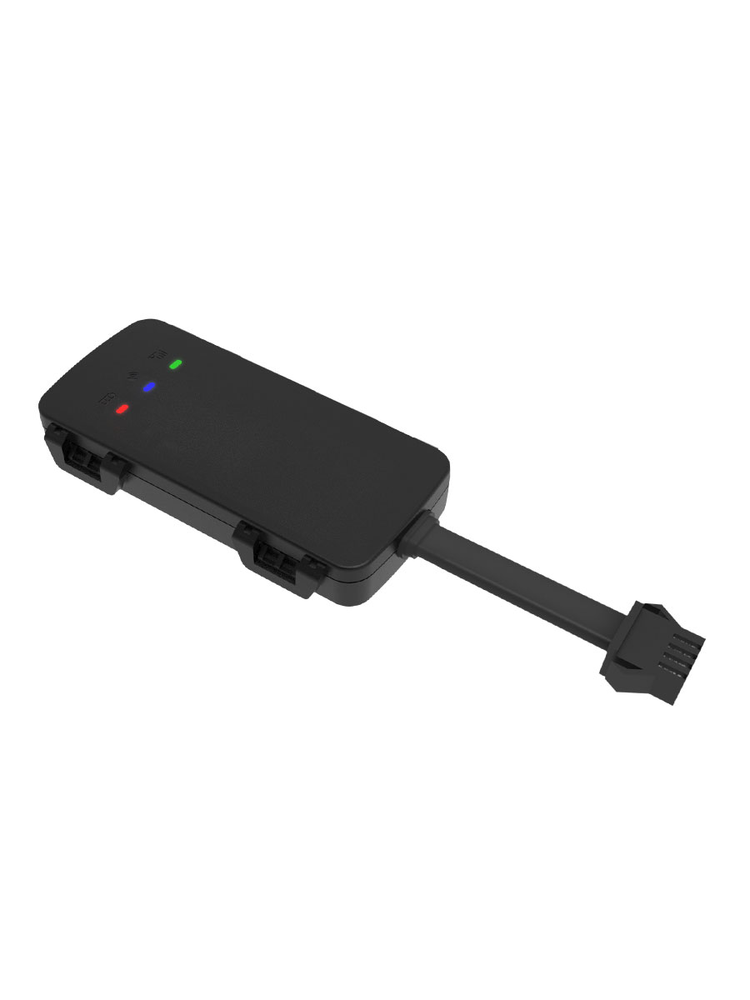

# Gosafe - G1C

El Gosafe G1C es un pequeño rastreador GPS que ofrece una variedad de características y es ideal para su uso en automóviles y motocicletas. Es una solución económica y completa para diversas aplicaciones automotrices como UBI, recuperación de vehículos robados, BHPH, alquiler de autos, motocicletas, deportes de motor y más.

Una de las características destacadas del G1C-5W son sus opciones de conectividad. Ofrece conectividad LTE CAT 1 y GPRS, lo que garantiza una comunicación confiable y rápida. Además, cuenta con un GPS extremadamente sensible a bordo, lo que permite un seguimiento y una información de ubicación precisos.

El G1C está diseñado para una instalación fácil y uso encubierto. Cuenta con antenas internas tanto para la comunicación celular como para el GPS, lo que elimina la necesidad de antenas con cable. Esto permite montarlo prácticamente en cualquier lugar del vehículo, asegurando un proceso de instalación sin complicaciones y económico.

Algunas de las características clave del Gosafe G1C incluyen la grabación de datos de choque con una frecuencia de 100Hz, soporte para monitoreo del comportamiento de conducción, detección de encendido, entrada digital para botón de pánico, diseño resistente al agua conforme a los estándares IP65 y bajo consumo de energía.

En resumen, el Gosafe G1C es un pequeño rastreador GPS que ofrece una variedad de características y es adecuado para diversas aplicaciones automotrices. Sus opciones de conectividad, GPS sensible e instalación fácil lo convierten en una opción confiable y conveniente para el seguimiento y monitoreo de vehículos.

### Características destacadas:

- Conectividad 4G CAT-1 a nivel mundial
- Grabación de datos de choque con una frecuencia de 100Hz
- Soporte para monitoreo del comportamiento de conducción
- Detección de encendido
- Entrada digital para botón de pánico
- Diseño resistente al agua conforme a los estándares IP65
- Bajo consumo de energía

