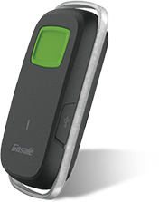

# Gosafe - G2P

El Gosafe G2P es un rastreador personal compacto pensado para la supervisión de ubicación cotidiana. Es ligero y fácil de llevar o portar, por lo que resulta adecuado para localizar seres queridos, personas mayores y trabajadores móviles. El equipo prioriza la sencillez de uso con una interfaz directa y la posibilidad de enviar comandos por SMS o consultar la ubicación desde una plataforma web o móvil.

Como dispositivo compatible con Plaspy, el G2P puede enviar datos de ubicación al entorno de gestión de flotas y activos de Plaspy, ofreciendo visibilidad centralizada y capacidades básicas de monitoreo. Su diseño simple y su formato portátil lo convierten en una opción práctica cuando se requieren actualizaciones de posición constantes sin hardware complejo.

## Aspectos destacados

- Diseño compacto y liviano, apto para llevar o portar
- Fácil de sujetar a pertenencias personales o usar como colgante
- Interfaz intuitiva para un manejo sencillo
- Seguimiento de ubicación en tiempo real para visibilidad continua
- Comandos SMS simples para comprobaciones rápidas del estado
- Diseñado para familias, cuidadores y empleadores que supervisan personal móvil

## Cómo funciona con Plaspy

Cuando se conecta a Plaspy, el Gosafe G2P suministra actualizaciones de ubicación que Plaspy muestra y organiza para monitoreo e informes. Plaspy actúa como la plataforma central para ver posiciones del dispositivo, revisar el historial reciente y gestionar notificaciones, facilitando la supervisión de personas o activos rastreados por el G2P.

- Vista de mapa en vivo en Plaspy para ver la ubicación y el movimiento actual del dispositivo
- Notificaciones y alertas configurables en Plaspy para eventos como movimiento o entrada y salida de zonas definidas
- Historial de ubicaciones e informes para revisar movimientos pasados y generar reportes sencillos
- Agrupación de dispositivos y controles de acceso de usuarios en Plaspy para la gestión de equipos o familias
- Uso de comandos SMS del G2P junto con el monitoreo en Plaspy para consultas rápidas o comprobaciones remotas

## Casos de uso típicos

- Mantener el seguimiento de familiares mayores para mayor tranquilidad del cuidador
- Monitorear trabajadores móviles o personal solitario en pequeñas organizaciones
- Proteger pertenencias personales que se mueven o transportan con frecuencia
- Supervisión de activos a corto alcance donde la portabilidad y la simplicidad son prioridad
- Rastreo básico de grupos o flotas pequeñas que usan dispositivos personales compactos

## Por qué elegir este rastreador con Plaspy

El G2P es una opción sensata cuando la prioridad es la portabilidad, la facilidad de uso y actualizaciones de ubicación sencillas. Su diseño ligero y la capacidad de recibir comandos por SMS lo hacen accesible para usuarios que prefieren una configuración mínima y un equipo que se pueda llevar o usar sin molestias. Al integrar el G2P con Plaspy se suma gestión centralizada, vistas históricas y opciones de notificación que mejoran la supervisión operativa para familias, cuidadores y equipos pequeños.

Dado que las descripciones de producto disponibles son breves, las organizaciones que requieren telemática avanzada o datos detallados de vehículos deberían evaluar si un rastreador personal cubre sus necesidades. Para muchos escenarios de consumo y negocios ligeros, el G2P junto con Plaspy ofrece una solución clara y fácil de gestionar para obtener visibilidad de ubicación en tiempo real.

Para obtener más información sobre Plaspy y cómo dispositivos compatibles como el Gosafe G2P funcionan en la plataforma visite https://www.plaspy.com. Las especificaciones del producto y la disponibilidad pueden cambiar con el tiempo, por lo que le recomendamos verificar los detalles actuales y la documentación técnica con el fabricante en https://gosafesystem.com/.
