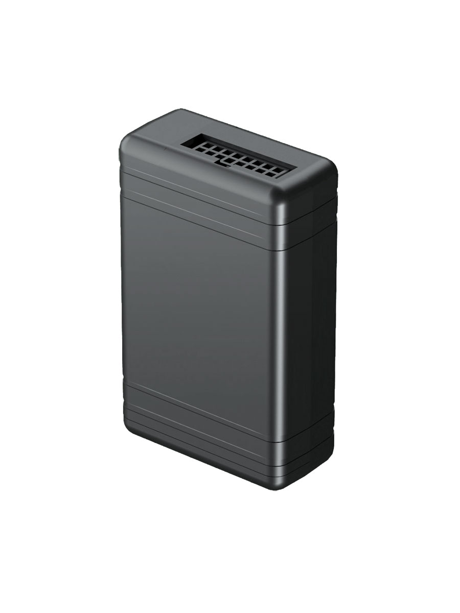

# Gosafe - G616

El Gosafe G616 es un rastreador GPS robusto y de nivel profesional diseñado para telemática empresarial y gestión de flotas. Ofrece seguimiento en tiempo real fiable, captura de datos de choque a alta frecuencia para reconstrucción de accidentes y telemetría vehicular integral. Con posicionamiento multi-GNSS y conectividad celular, el G616 está orientado a flujos de trabajo exigentes de despacho, recuperación y análisis donde se requiere ubicación precisa y datos de eventos confiables.

Como dispositivo compatible con Plaspy, el G616 puede transmitir ubicación, telemetría e información de eventos a Plaspy para habilitar seguimiento en mapa en vivo, reproducción histórica y reportes de flota. Su monitoreo de ignición, soporte extensible de sensores y opciones flexibles de E/S lo hacen adecuado para integradores y proveedores de servicio que necesitan alimentar datos vehiculares en Plaspy para supervisión operativa, análisis de seguridad y optimización de flotas.

## Características principales

- Rastreador robusto de nivel profesional orientado a gestión de flotas empresariales y telemática para aseguradoras.
- Posicionamiento multi-GNSS para mayor precisión y verificación fiable de rutas.
- Sensado de choques a alta frecuencia y actualizaciones GPS frecuentes para soportar reconstrucción de accidentes y análisis de conducta del conductor.
- Amplio soporte de E/S vehicular para monitoreo de ignición, entradas analógicas y digitales, y salidas para funciones de control remoto.
- Compatibilidad con sensores inalámbricos y conectividad de periféricos para sensores de combustible e identificación del conductor.
- Diseñado para escala de flota con actualizaciones de firmware remotas y almacenamiento a bordo para manejar conectividad intermitente.

## Cómo funciona con Plaspy

Al integrarse con Plaspy, el G616 proporciona visibilidad continua de la posición del vehículo, eventos y telemetría de sensores, de modo que los equipos operativos puedan monitorear flotas y reaccionar ante incidentes. Plaspy ingiere los datos del equipo para generar alertas, reportes y líneas de tiempo históricas que apoyan despacho, cumplimiento y programas de seguridad.

- Actualizaciones de ubicación y telemetría en tiempo real a Plaspy para seguimiento en mapa en vivo y reproducción de rutas.
- Monitoreo de ignición y entradas para segmentar viajes, calcular tiempo de motor en marcha y mejorar los reportes de actividad.
- Integración de sensores y telemetría de combustible para que Plaspy muestre tendencias de consumo y dispare alertas ante anomalías.
- Soporte de control remoto mediante salidas para habilitar flujos de trabajo de inmovilización u otras intervenciones vehiculares a través de Plaspy.
- Registros de eventos a alta frecuencia utilizados por Plaspy para reconstrucción de choques, puntuación de conductores e informes de incidentes.

## Casos de uso típicos

- Gestión de flotas y despacho para servicios y flotas de reparto que requieren seguimiento en tiempo real y reproducción histórica.
- Antirrobo y recuperación de vehículos con alertas de geocerca y control remoto de salidas.
- Telemática para aseguradoras y reconstrucción de accidentes usando datos de choque de alta frecuencia y líneas de tiempo GPS.
- Monitoreo de combustible y programas de mantenimiento preventivo que combinan datos de sensores analógicos con uso del vehículo.
- Identificación de conductores y monitoreo de sensores auxiliares para registros de conductor validados y seguimiento de carga o temperatura.

## Por qué elegir este rastreador con Plaspy

El G616 es ideal para organizaciones que necesitan un rastreador resistente y extensible capaz de alimentar telemetría de alta fidelidad a una plataforma de flota como Plaspy. Su combinación de posicionamiento preciso, sensado de nivel choque y E/S flexibles lo hace valioso donde importan la seguridad, la recuperación y el análisis. Para integradores y operadores que gestionan grandes flotas, el soporte FOTA y el almacenamiento a bordo ayudan a minimizar la intervención manual mientras se mantiene la continuidad de los datos.

Para obtener más información sobre cómo Plaspy puede trabajar con dispositivos compatibles como el Gosafe G616 visite https://www.plaspy.com. Las especificaciones del producto, la disponibilidad y los detalles del fabricante pueden cambiar con el tiempo, por lo que le recomendamos verificar la información técnica y de compatibilidad actual con la documentación del fabricante en https://gosafesystem.com/.
