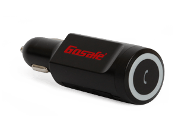

# Gosafe - G717

El GoSafe G717 es un rastreador GPS miniatura que se conecta al encendedor de cigarrillos del vehículo, lo que lo hace extremadamente fácil de instalar y puede ser utilizado en cualquier vehículo que tenga un cargador de encendedor de cigarrillos. Este dispositivo no solo es un gadget atractivo, sino que también es un rastreador confiable con todas las características básicas de un rastreador de vehículos, e incluso algunas veces más.

Una de las características destacadas del GoSafe G717 es su proceso de instalación sencillo. Simplemente conéctelo al encendedor del automóvil y listo. Admite tecnología 2G y 3G, LTE, lo que garantiza una conexión estable y confiable.

Este rastreador GPS está repleto de funciones de monitoreo de eventos, que incluyen detección de accidentes, gestión de geovallas, gestión de exceso de velocidad y gestión de energía inteligente. También cuenta con un sensor de fuerza G de 16G, que proporciona datos de seguimiento precisos y precisos.

El GoSafe G717 viene en versiones de módem 2G/3G y está equipado con un módulo AGPS de 50 canales de alta sensibilidad para una mayor precisión del GPS. También tiene una batería de respaldo interna, lo que permite un seguimiento ininterrumpido incluso si se desconecta la fuente de alimentación.

Con su funcionalidad plug and play, el GoSafe G717 es extremadamente fácil de usar. También admite comunicación TCP y SMS, lo que le brinda múltiples opciones para rastrear y monitorear su vehículo. Además, tiene una función de perfil de usuario, lo que permite configuraciones y preferencias personalizadas.

En resumen, el GoSafe G717 es un rastreador GPS miniatura para encendedor de cigarrillos que ofrece una instalación fácil, seguimiento confiable y una variedad de funciones de monitoreo de eventos. Ya sea que lo utilice para uso comercial o personal, este rastreador seguramente cumplirá con sus necesidades.

Características destacadas:

- Instalación fácil
- Admite tecnología 2G y 3G, LTE
- Rico en funciones de monitoreo de eventos
- Sensor de fuerza G de 16G
- Módulo AGPS de 50 canales de alta sensibilidad
- Batería de respaldo interna
- Funcionalidad plug and play
- Soporte TCP y SMS
- Función de perfil de usuario

