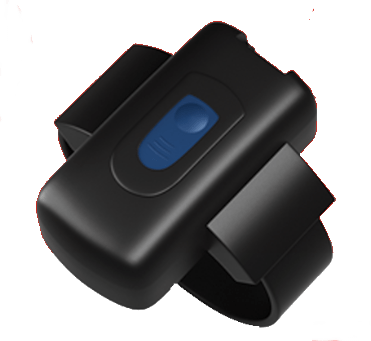

# Gosafe - G737

El G737 de Gosafe es un dispositivo de rastreo de pulsera diseñado específicamente para el seguimiento y monitoreo electrónico de prisioneros no violentos. Ofrece una alternativa viable para mantener a estas personas encerradas en prisión, permitiendo un enfoque más flexible y rentable para el seguimiento de los liberados condicionales.

Una de las características destacadas del G737 es su batería recargable de Li-on de larga duración, que se encuentra dentro de la pulsera de rastreo. Esto asegura que el dispositivo permanezca operativo durante períodos prolongados sin necesidad de recargas frecuentes.

Además, el G737 está equipado con una correa de fibra óptica que no puede ser fácilmente cortada. Esto proporciona una capa adicional de seguridad, ya que cualquier intento de interferir o manipular el dispositivo activará notificaciones al sistema de monitoreo.

El G737 ofrece una variedad de características y funcionalidades para mejorar la visibilidad y las capacidades de monitoreo. Estas incluyen la gestión de zonas de prisión, detección de desconexión de fibra óptica, detección de movimiento y notificaciones de entrada y salida de áreas designadas.

### Características destacadas:

- Fibra óptica para detectar cualquier intento de abuso o ruptura del equipo
- Impermeable con aislamiento perfecto
- Gestión de Geo-Fence
- Ubicación basada en torres GSM \(secundaria\)
- Movimiento interno/accelerómetro
- Conectividad LTE CAT-1
- Beacon doméstico basado en BLE
- Botón de SOS para ayuda de emergencia
- Almacenamiento de hasta 50000 registros a bordo
- Motor GPS uBlox-8 a bordo
- Indicación de estado basada en vibración
- Actualización de firmware OTA \(FOTA\)
- Puntos de referencia con fecha y hora

El G737 es una solución confiable y eficiente para el rastreo de pulseras de tobillo, proporcionando las herramientas necesarias para el monitoreo electrónico efectivo de los liberados condicionales. Con sus características avanzadas y diseño robusto, garantiza un seguimiento preciso y seguro, brindando tranquilidad tanto a las agencias de aplicación de la ley como al público en general.

