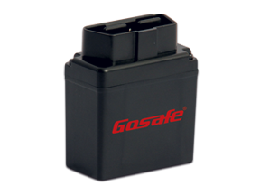

# Gosafe - G777

El rastreador GPS Gosafe G777 es una solución de seguimiento y rastreo de vehículos que utiliza el sistema de alerta de conducción para aplicar normas de programación flexibles. Este avanzado dispositivo monitorea constantemente las condiciones del vehículo y responde de manera instantánea a umbrales predefinidos relacionados con el tiempo, la fecha, el movimiento, la ubicación, la zona geográfica, la velocidad y otras combinaciones de eventos.

Con el Gosafe G777, puede personalizar las reglas basadas en excepciones definidas por el usuario para satisfacer las necesidades específicas de su aplicación. Esto le permite recibir alertas y notificaciones en tiempo real cuando se produzcan eventos o condiciones específicas, lo que le brinda un mayor control y seguridad sobre su flota de vehículos.

Además de su capacidad de alerta y seguimiento en tiempo real, el Gosafe G777 también ofrece una amplia gama de características destacadas, que incluyen:

- Seguimiento de ubicación en tiempo real
- Historial de rutas y registros de viaje
- Geocercas y alertas de entrada/salida de zonas
- Alertas de exceso de velocidad
- Informes detallados de actividad y rendimiento del vehículo
- Compatibilidad con la mayoría de los vehículos equipados con OBD II

En resumen, el rastreador GPS Gosafe G777 es una solución confiable y versátil para el seguimiento y rastreo de vehículos. Con su sistema de alerta de conducción y su capacidad de personalización, le brinda un mayor control y seguridad sobre su flota de vehículos, lo que le permite tomar decisiones informadas y mejorar la eficiencia operativa.

