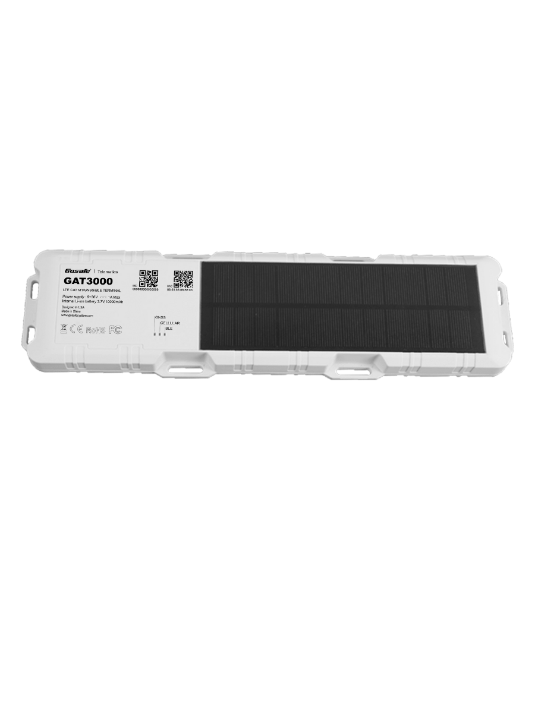

# Gosafe - GAT3000

El GAT3000 Solar Powered Tracker es un dispositivo GPS robusto diseñado para el monitoreo prolongado de activos en exteriores. Pensado para remolques, contenedores, maquinaria pesada y otros activos de alto valor, combina una amplia batería recargable con un panel solar para extender el tiempo en espera y reducir la frecuencia de mantenimiento. El equipo incluye una carcasa con clasificación IP67, GNSS multiconstelación y conectividad celular para ofrecer actualizaciones de ubicación fiables en tiempo real y supervisión de flotas.

Como dispositivo compatible con Plaspy, el GAT3000 puede enviar datos de ubicación, eventos y telemetría ambiental a Plaspy para monitoreo centralizado, alertas e informes. Su perfil de bajo consumo y la capacidad de configuración por aire lo hacen adecuado para implementaciones escalables administradas desde Plaspy, permitiendo a los operadores mantener la visibilidad de activos dispersos y ajustar remotamente el comportamiento de los reportes según las necesidades operativas.

## Aspectos clave

- Rastreador GPS compatible con Plaspy, optimizado para despliegues prolongados en exteriores y flujos de trabajo de flotas.
- Operación asistida por energía solar con batería recargable de 10000 mAh y panel solar integrado para mayor autonomía y reportes regulares.
- GNSS multiconstelación para fijaciones de posición confiables y mayor precisión en condiciones de cielo abierto.
- Conectividad celular diseñada para cobertura amplia, con opciones que favorecen el roaming y la redundancia.
- Carcasa resistente con certificación IP67, adecuada para aplicaciones al aire libre de seguimiento y antirrobo.
- Soporte Bluetooth para integrar sensores inalámbricos y detección de manipulación a bordo para alertas antirrobo.
- Configuración por aire y gestión remota de dispositivos para simplificar operaciones a gran escala.

## Cómo funciona con Plaspy

Al integrarse con Plaspy, el GAT3000 transmite periódicamente datos de ubicación y eventos para que los operadores puedan monitorear activos en tiempo real, recibir notificaciones y analizar movimientos históricos. Plaspy ingiere la telemetría y la presenta en mapas e informes, mientras que los administradores pueden ajustar la frecuencia de reporte y los umbrales para equilibrar la vida de la batería y la rapidez de las actualizaciones.

- Ubicación en vivo y reproducción del historial en los mapas de Plaspy para conocimiento situacional y revisión de rutas.
- Alertas por manipulación y movimiento enviadas a Plaspy para notificación y respuesta inmediatas.
- Telemetría ambiental proveniente de sensores inalámbricos integrada en los paneles de Plaspy para monitoreo de condiciones.
- Alarmas configurables por geocerca y umbrales para activar notificaciones y acciones dentro de los flujos de trabajo en Plaspy.
- Flujos de trabajo de configuración remota y gestión de firmware para mantener los dispositivos desplegados alineados con las políticas operativas.

## Casos de uso típicos

- Seguimiento de remolques y contenedores donde la autonomía prolongada y la recarga solar reducen las necesidades de servicio in situ.
- Monitoreo de maquinaria pesada para detectar eventos de movimiento y apoyar medidas antirrobo.
- Detección remota de manipulación y antirrobo para activos exteriores distribuidos.
- Monitoreo de condiciones ambientales al emparejar sensores inalámbricos para registros de temperatura o humedad.
- Telemetría de flotas y supervisión centralizada para despacho, análisis de utilización y planificación de mantenimiento.

## Por qué elegir este rastreador con Plaspy

El GAT3000 es una opción práctica para organizaciones que requieren rastreo duradero y de bajo mantenimiento para activos en exteriores. Su sistema de alimentación asistido por energía solar y su carcasa robusta reducen el servicio físico, mientras que el posicionamiento multiconstelación y la conectividad celular respaldan actualizaciones precisas y oportunas. Combinado con Plaspy, el rastreador forma parte de un sistema gestionado que proporciona alertas, informes y supervisión de dispositivos para apoyar decisiones operativas y flujos de trabajo de seguridad.

Si desea explorar la compatibilidad con Plaspy con más detalle o ver cómo el GAT3000 puede integrarse en su programa de flota, obtenga más información sobre Plaspy en el sitio principal https://www.plaspy.com. Las especificaciones de producto y la disponibilidad pueden cambiar con el tiempo, por lo que le recomendamos verificar los detalles actuales con el fabricante en https://gosafesystem.com/ antes de la adquisición.
