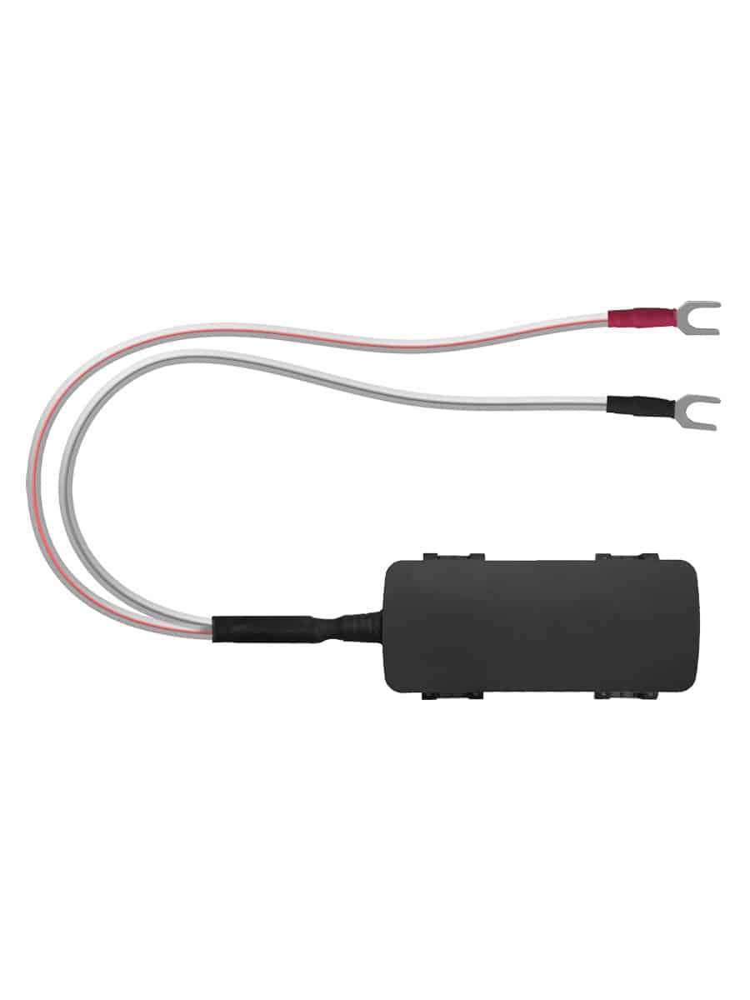

# Gosafe - GTU30

El GTU30 Easy Install es un rastreador GPS compacto y económico diseñado para instalaciones rápidas y telemetría vehicular confiable. Con un receptor multi GNSS y conectividad celular, el GTU30 está pensado para despliegues ágiles en vehículos ligeros, ofreciendo reportes continuos de posición, detección de eventos y una carcasa robusta con protección IP65 adecuada para uso automotriz.

Como dispositivo compatible con Plaspy desde el primer momento, el GTU30 puede enviar ubicaciones y datos de eventos en vivo a Plaspy para monitoreo de flotas, generación de informes y configuraciones de alerta. Esa compatibilidad convierte al GTU30 en una opción práctica para operadores que necesitan desplegar rastreo en flotas de alquiler, arrendamiento o servicios con tiempo de inactividad mínimo y manejo de hardware sencillo.

## Puntos clave

- Diseñado para una instalación rápida y de bajo costo, con una carcasa compacta certificada IP65 y opciones de montaje simples.
- Posicionamiento multi GNSS mediante receptor de 32 canales para seguimiento confiable y un historial de posiciones consistente.
- Conectividad celular dual que soporta LTE CAT1 y 2G para reportes en tiempo real y cobertura de respaldo.
- Acelerómetro integrado y detección de viaje para capturar choques y comportamientos de conducción para análisis posterior a incidentes.
- Batería interna de respaldo y amplio rango de tensión de operación que permite reportes limitados durante cortes de energía.
- Factor de forma reducido y bajo consumo apropiado para instalaciones temporales o despliegues densos en flotas.

## Cómo funciona con Plaspy

Al integrarse con Plaspy, el GTU30 transmite fijaciones GNSS, datos de eventos y actualizaciones de estado para que Plaspy muestre mapas en vivo, alertas e informes históricos. Plaspy procesa la telemetría del rastreador y ofrece visibilidad operativa sobre la flota, permitiendo a los gestores responder a incidentes, auditar viajes y analizar la actividad vehicular.

- Actualizaciones de ubicación en tiempo real e historial de posiciones mostrados en los mapas de Plaspy para monitoreo y reproducción.
- Detección de viajes y señales virtuales de ignición que Plaspy utiliza para calcular kilometraje, tiempo de operación y resúmenes básicos de actividad del conductor.
- Alertas de choques y eventos bruscos basadas en datos del acelerómetro para apoyar la respuesta rápida a incidentes y su investigación.
- Notificaciones de pérdida de energía e informes respaldados por batería que ayudan a Plaspy a alertar sobre posibles robos o manipulación.
- Informes a nivel de plataforma y exportaciones programadas que permiten a los responsables de flota incluir datos del GTU30 en paneles operativos y registros de cumplimiento.

## Casos de uso típicos

- Despliegue rápido de seguimiento en tiempo real para flotas de vehículos ligeros en operaciones de alquiler, arrendamiento y servicios.
- Telemática para seguros con registro de eventos, resúmenes de viajes y detección de choques en programas basados en uso.
- Monitoreo antirrobo y flujos de recuperación que aprovechan los reportes con respaldo de batería y las alertas de la plataforma.
- Programas de seguridad y capacitación de conductores mediante detección de viajes y análisis de eventos bruscos capturados por el acelerómetro.
- Instalaciones temporales o estacionales donde el tamaño reducido y el montaje rápido reducen los costos de instalación.

## Por qué elegir este rastreador con Plaspy

El GTU30 es ideal para organizaciones que requieren un rastreador GPS económico y fácil de desplegar que se integre en una plataforma de gestión de flotas más amplia. Su equilibrio entre diseño compacto, posicionamiento multi GNSS y respaldo celular ayuda a mantener la visibilidad en flotas ligeras sin incrementar las demandas de instalación y mantenimiento. Con Plaspy, los operadores pueden transformar las transmisiones de ubicación y eventos del GTU30 en información accionable como seguimiento en vivo, alertas de incidentes e informes de desempeño de la flota.

Para equipos enfocados en despliegues escalables y resultados telemáticos prácticos, el GTU30 combinado con Plaspy ofrece un camino directo desde el hardware hasta la supervisión operativa. Para conocer más sobre cómo Plaspy puede funcionar con dispositivos compatibles como el GTU30 visite https://www.plaspy.com. Las especificaciones y la disponibilidad del producto pueden cambiar con el tiempo, por lo que le recomendamos verificar los detalles actuales con el fabricante en https://gosafesystem.com/ para obtener la información más reciente.
