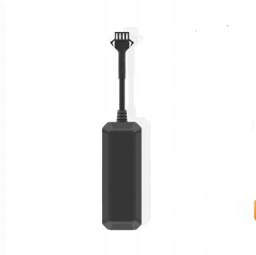

# GOTOP - C780

El GOTOP C780 es un rastreador GPS compacto pensado para automóviles, motocicletas, bicicletas eléctricas y otros vehículos ligeros que requieren monitoreo de ubicación y seguridad confiables. Combina posicionamiento satelital con conectividad celular para ofrecer actualizaciones de posición continuas, reproducción del historial y notificaciones de alarma; su tamaño reducido facilita una instalación discreta en distintos vehículos.

Al ser compatible con Plaspy desde su configuración inicial, el C780 puede transmitir información de ubicación y estado directamente a Plaspy para monitoreo centralizado, generación de reportes y respuesta a incidentes. Esa compatibilidad hace al C780 una opción práctica para operadores que desean consolidar telemetría, alarmas e historial de rutas dentro de Plaspy para operaciones diarias y supervisión de flotas.

## Aspectos destacados

- Seguimiento en tiempo real compatible con Plaspy mediante subidas GPRS y reporte de posición por SMS como canal de respaldo.
- Carcasa compacta y liviana apta para montaje discreto en autos, motocicletas y bicicletas eléctricas.
- Batería de respaldo integrada y amplio rango de entrada para mantener el reporte tras pérdida de alimentación externa.
- Posicionamiento U‑BLOX GNSS para fijaciones confiables y precisión adecuada para flotas y recuperación.
- Funciones de seguridad vehicular como detección de encendido, alertas por corte de cable y por movimiento para soporte en programas antirrobo.
- Diseño resistente con protección contra el agua para garantizar seguimiento 24/7 en condiciones variadas.

## Cómo funciona con Plaspy

Integrado con Plaspy, el C780 envía datos de posición y estado a la plataforma para que los operadores puedan ver la ubicación en vivo, revisar rutas históricas y recibir alertas configurables. Plaspy procesa la telemetría del equipo y la presenta en paneles, mapas e informes para facilitar el monitoreo, la respuesta a incidentes y la generación de reportes operativos.

- Actualizaciones continuas de ubicación y datos de estado enviados a Plaspy para visualización en mapas en vivo y supervisión de flota.
- Alertas por manipulación y movimiento enviadas a Plaspy para activar notificaciones y flujos de respuesta rápida.
- Reproducción de historial y registros de eventos disponibles en Plaspy para verificación de rutas, cumplimiento y análisis de incidentes.
- Estado de encendido o ACC mostrado en los paneles de Plaspy para apoyar análisis de viajes y reportes de tiempo de uso.
- Reporte de posición por SMS con enlaces a mapas disponible como canal de respaldo cuando las condiciones de red o las preferencias de flujo de trabajo lo requieran.
- Si se requieren sensores locales adicionales, sus datos pueden coordinarse junto con la telemetría del C780 dentro de Plaspy mediante enfoques de gateway compatibles.

## Casos de uso típicos

- Gestión de flotas para vehículos comerciales ligeros donde se necesita visibilidad centralizada, historial de viajes y telemetría básica.
- Programas antirrobo y recuperación usando alertas de manipulación, detección de movimiento e informes de ubicación para apoyar una respuesta rápida.
- Protección de vehículos personales como motocicletas y bicicletas eléctricas con rastreo discreto y reporte de ubicación en emergencias.
- Monitoreo remoto de vehículos de servicio y reparto para verificar rutas, respaldar la prueba de entrega y analizar la utilización.
- Alertas de mantenimiento y operaciones impulsadas por pérdida de energía y eventos de encendido para mejorar la gestión del tiempo operativo de los vehículos.

## Por qué elegir este rastreador con Plaspy

El C780 es una opción práctica para organizaciones que usan Plaspy y requieren un rastreador compacto orientado a vehículos con posicionamiento confiable y múltiples canales de alerta. Su combinación de batería de respaldo, detección de manipulación y resistencia al agua ayuda a mantener el seguimiento continuo y la entrega de alarmas en despliegues vehiculares habituales, mientras que Plaspy ofrece la vista unificada para visibilidad en tiempo real y análisis histórico.

Si busca un rastreador discreto y de grado vehicular que entregue datos de ubicación y alarma directamente a Plaspy para monitoreo centralizado, reportes y respuesta a incidentes, el GOTOP C780 es un candidato adecuado. Conozca más sobre Plaspy en el sitio principal https://www.plaspy.com y verifique las especificaciones actuales del producto, disponibilidad y detalles del fabricante en el sitio oficial de GOTOP https://www.gotop.cc/. Las especificaciones y la disponibilidad pueden cambiar con el tiempo, por lo que le recomendamos confirmar la información más reciente con el fabricante.
