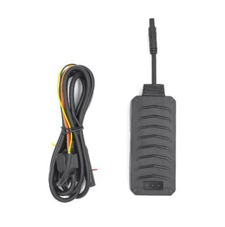

# GOTOP - C790

El GOTOP C790 es un rastreador GPS compacto para vehículos diseñado para una amplia variedad de modelos. Combina posicionamiento por GPS y Beidou con comunicación GPRS para ofrecer localización en tiempo real. El equipo incluye funciones prácticas de seguridad y monitoreo vehicular como corte remoto de combustible, detección de ACC, capacidad anti detección, múltiples tipos de alarma, botón SOS y revisión de historial de conducción de hasta 180 días.

Como dispositivo compatible con Plaspy, el C790 puede enviar sus datos de ubicación y eventos a Plaspy para un monitoreo centralizado y supervisión operativa. Plaspy puede utilizar la información del rastreador para mostrar el historial de posiciones, gestionar alertas y ofrecer visibilidad a nivel de flota, por lo que el C790 es una opción adecuada para quienes desean integrar controles de vehículo y eventos de seguridad dentro de una plataforma de seguimiento más amplia.

## Características clave

- Factor de forma compacto, apto para muchos modelos de vehículo e instalación discreta
- Posicionamiento dual por satélite con comunicación GPRS para actualizaciones en tiempo real
- Capacidad de corte remoto de combustible para controlar aceite y alimentación por comando remoto
- Detección de ACC integrada y función anti detección para un monitoreo más robusto
- Múltiples alarmas, incluyendo vibración, exceso de velocidad, fallo de alimentación y emergencia SOS
- Alertas de geocerca y almacenamiento de historial de conducción de hasta 180 días

## Cómo funciona con Plaspy

El GOTOP C790 se integra con Plaspy para ofrecer informes continuos de ubicación y eventos a una plataforma centralizada de gestión de flota. Una vez configurado, Plaspy puede visualizar posiciones en un mapa, registrar historiales y utilizar los eventos del dispositivo para activar notificaciones o flujos operativos.

- Visibilidad de la ubicación en tiempo real y seguimiento en mapa dentro de la plataforma Plaspy
- Reenvío de eventos y alarmas para vibración, exceso de velocidad, pérdida de alimentación y SOS
- Alertas de geocerca enviadas a Plaspy cuando un vehículo entra o sale de zonas predefinidas
- Reproducción de rutas históricas y revisión de historial de conducción almacenado para análisis
- Monitoreo centralizado de flota para ver múltiples unidades C790 y sus estados

## Casos de uso típicos

- Seguridad de vehículos particulares y disuasión de robo con corte remoto de combustible y botón SOS
- Monitoreo de vehículos de flotas pequeñas y medianas para operadores comerciales
- Supervisión de autos de alquiler para controlar patrones de uso y responder a alertas
- Seguimiento de vehículos de reparto o servicio para mejorar visibilidad de rutas y responsabilidad
- Apoyo en recuperación vehicular mediante reporte de posición en tiempo real tras un incidente

## Por qué elegir este rastreador con Plaspy

El GOTOP C790 ofrece un conjunto equilibrado de funciones para rastreo vehicular y seguridad básica, lo que lo convierte en una opción práctica para organizaciones que necesitan informes de posición fiables y alertas de eventos. Al integrarlo con Plaspy, estas capacidades forman parte de un entorno de monitoreo unificado que facilita la toma de decisiones operativas, el enrutamiento de alertas y el análisis histórico.

Si usted busca un rastreador sencillo que proporcione ubicación, alarmas y funciones de control remoto, el C790 es una alternativa razonable. Su compatibilidad con Plaspy ayuda a convertir las señales del dispositivo en información centralizada para gerentes de flota, equipos de seguridad y propietarios de vehículos sin añadir complejidad innecesaria.

Para obtener más información sobre cómo funciona el GOTOP C790 con Plaspy, visite https://www.plaspy.com para información sobre producto y plataforma. Las especificaciones del producto, la disponibilidad y los datos del fabricante pueden cambiar con el tiempo, por lo que le recomendamos verificar las especificaciones técnicas actuales en el sitio del fabricante https://www.gotop.cc/.
