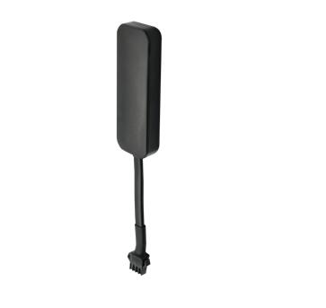

# GOTOP - D10

El Mini Rastreador GPS D10 es un dispositivo compacto, compatible con Plaspy, diseñado para ofrecer seguridad discreta en vehículos y rastreo confiable en tiempo real. Ideal para autos, motocicletas, bicicletas eléctricas y pequeños activos portátiles, el D10 emplea un posicionamiento híbrido —GPS, BeiDou (BD), WiFi y LBS— junto con conectividad GSM cuatribanda para proporcionar reportes de ubicación, eventos de alarma y telemetría básica. Su carcasa ABS con protección IP65 y su bajo peso lo hacen adecuado para instalaciones encubiertas y espacios reducidos.

Como rastreador compatible con Plaspy, el D10 está pensado para integrarse con los paneles centrales, las alertas y los flujos de informes de Plaspy. Los modos de alarma del dispositivo, las notificaciones de energía y batería, y los accesorios opcionales de emergencia e inmovilizador entregan las señales y puntos de control que los operadores gestionan desde Plaspy para supervisión en tiempo real y control operativo en flotas mixtas.

## Aspectos clave

- Carcasa ABS con protección IP65 y factor de forma muy reducido para instalaciones discretas en vehículos y activos pequeños
- Posicionamiento híbrido mediante GPS, BeiDou, WiFi y LBS para mejorar la fiabilidad de la localización en distintos entornos
- Soporte GSM cuatribanda para amplia cobertura celular en muchas regiones de despliegue
- Múltiples modos de alarma, incluyendo encendido/defensa automática, vibración, geocerca, desconexión y batería baja
- Botón SOS opcional y relé inmovilizador opcional para reforzar seguridad y procesos de recuperación
- Batería integrada y bajo consumo en reposo para mantener monitorización en espera cuando no hay alimentación externa
- Configuración de doble servidor para permitir enrutamiento flexible y redundancia con Plaspy

## Cómo funciona con Plaspy

Una vez instalado, el D10 envía mensajes de ubicación y estado a través de la red celular hacia Plaspy, donde la telemetría entrante se normaliza y se presenta para seguimiento en vivo, alertas y revisión histórica. Plaspy utiliza los eventos y estados reportados por el D10 para alimentar paneles, notificaciones y flujos básicos de control remoto que ayudan a los operadores a gestionar dispositivos en una flota.

- Actualizaciones de ubicación en tiempo real y reproducción del historial disponibles en Plaspy para visibilidad operativa y revisión postincidente
- Eventos de alarma como vibración, violaciones de geocerca y detección de encendido/defensa automática reportados a Plaspy para notificación rápida
- Avisos por fallo de alimentación y batería baja que alimentan procesos de mantenimiento y recuperación dentro de Plaspy
- El soporte de relé inmovilizador opcional permite acciones remotas de inmovilizar/desinmovilizar a través de Plaspy cuando sea operativo y apropiado
- Los datos del dispositivo y los eventos pueden incorporarse en los informes y reglas de alerta de Plaspy para ajustarse a los flujos de trabajo de la empresa

## Casos de uso típicos

- Seguimiento de flotas y monitoreo de última milla para vehículos pequeños, scooters y bicicletas de reparto
- Protección antirrobo y recuperación rápida para motocicletas, bicicletas eléctricas e instalaciones encubiertas en vehículos
- Monitoreo remoto de activos cuando la alimentación por cable es poco fiable o inexistente, aprovechando la batería interna
- Mantenimiento programado y monitorización del tiempo de actividad mediante alertas de energía y batería que se integran en los flujos de Plaspy
- Telemetría y control suplementarios al combinarse con periféricos opcionales durante la instalación

## Por qué elegir este rastreador con Plaspy

El D10 es una opción práctica para organizaciones que requieren un rastreador pequeño y discreto compatible con Plaspy para monitoreo centralizado. Su mezcla de posicionamiento híbrido y alarmas multifunción ofrece las señales básicas de ubicación y eventos en las que confían los operadores de flotas y los equipos de seguridad, mientras que el soporte celular cuatribanda y la configuración de doble servidor ayudan a mantener la conectividad y la flexibilidad del backend.

Si desea evaluar el D10 para su despliegue con Plaspy, obtenga más información sobre Plaspy en el sitio principal https://www.plaspy.com. Las especificaciones del producto, la disponibilidad y los detalles del fabricante pueden cambiar con el tiempo, por lo que le recomendamos verificar los detalles técnicos actuales y las opciones de accesorios en el sitio oficial de GOTOP https://www.gotop.cc/.
