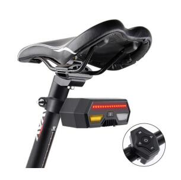

# GOTOP - D16

El D16 4G Bike GPS Tracker es un rastreador GPS compacto y diseñado específicamente para la seguridad de la bicicleta, la protección contra robos y la gestión de flotas. Pensado para una instalación sencilla en bicicletas urbanas, e-bikes y flotas de alquiler, el D16 ofrece seguimiento en tiempo real mediante conectividad 4G LTE, reproducción del historial de rutas, alertas geofence y un sistema de señalización LED distintivo que aumenta la visibilidad del ciclista en la vía.

Compatible con Plaspy desde el inicio, el D16 se integra con la plataforma y las aplicaciones móviles de Plaspy para proporcionar a operadores y usuarios feeds de ubicación en tiempo real, notificaciones de alarmas y un control remoto sencillo de las señales LED. Ya sea que gestiones una operación de alquiler de bicicletas o busques cobertura antirrobo para tu trayecto personal, el D16 ofrece una solución enfocada y confiable para la telemetría de bicicletas y la conciencia situacional.

## Aspectos clave

- Rastreador GPS compatible con Plaspy para un seguimiento en tiempo real fiable y la gestión de flotas de bicicletas.
- Conectividad 4G LTE \(opción de variante 2G\) para actualizaciones de posición con baja latencia y una integración web/móvil.
- Señalización LED integrada: tira LED roja para frenado y dos LEDs amarillos para indicación de giro a izquierda/derecha, que mejora la visibilidad y la seguridad del ciclista.
- Control remoto incluido para activar/desactivar los indicadores LED y emitir comandos remotos para mayor comodidad y seguridad.
- Caja estanca con clasificación IPX4 protege la unidad de salpicaduras y lluvia ligera, diseñada para entornos de ciclismo al aire libre.
- Alarmas esenciales: alerta de geovalla y alarma de batería baja para ayudar a prevenir robos y facilitar la recuperación oportuna.
- Formato compacto y enfocado en bicicletas, con autonomía de hasta aproximadamente un mes en modo de espera con la batería interna en condiciones normales.

## Cómo funciona con Plaspy

Cuando se empareja con Plaspy, el D16 envía actualizaciones de posición y estado a la nube de Plaspy para que puedas monitorizar las bicicletas en tiempo real, revisar el historial de viajes y recibir alarmas en la web o en móviles. La integración es sencilla: Plaspy ingiere los paquetes de ubicación 4G del dispositivo, los traduce en marcadores en el mapa y registros de eventos, y genera notificaciones ante infracciones de geovalla o condiciones de batería baja.

- Actualizaciones de ubicación y telemetría en tiempo real \(posición, estado de movimiento, nivel de batería\).
- Alertas de geovalla y registro de eventos para notificaciones rápidas de movimientos no autorizados.
- Reproducción del historial de rutas para análisis, optimización de rutas y conciliación de facturación de alquiler.
- Control remoto de LED vía Plaspy para señalización \(indicadores de freno y giro\) para mejorar la seguridad del ciclista.
- Alarma de batería baja enviada a operadores y usuarios para solicitar recarga o verificación del dispositivo.
- Integración en aplicaciones web y móviles para paneles de gestión de flotas, monitorización en tiempo real y reglas de alerta.

## Resumen técnico

| Conectividad | 4G LTE \(principal\); versión opcional 2G disponible |
| --- | --- |
| Bandas | No especificadas \(varía según modelo/región\) |
| Alimentación y batería | Batería recargable interna; aproximadamente un mes de autonomía en modo de espera bajo condiciones típicas |
| Interfaces | Salidas de señalización LED \(barra LED roja de frenado, dos LEDs amarillos de giro\); comandos de control remoto para activación/desactivación de LED |
| GNSS | Posicionamiento basado en GPS con actualizaciones en tiempo real para mapeo y reproducción de historial |
| Bluetooth | No especificado / no se reportan sensores Bluetooth en la descripción |
| Gestión remota | Integración web y móvil; soporte de comandos remotos vía control remoto suministrado y plataforma en la nube |
| Formato | Rastreador compacto para montaje en bicicleta en carcasa resistente al agua IPX4 |

## Casos de uso

- Gestión de flotas para operaciones de alquiler de bicicletas — seguimiento en tiempo real, historial de rutas y aplicación de geovallas para proteger activos y facturar con precisión.
- Antirrobo y recuperación para bicicletas personales y compartidas — alertas de geovalla y ubicación en tiempo real para acelerar la recuperación.
- Seguridad del ciclista mejorada con indicadores LED de freno y giro controlados de forma remota o vía el rastreador para mejorar la visibilidad en el tráfico.
- Análisis de rutas y monitorización del rendimiento — la reproducción histórica soporta decisiones operativas y conocimientos sobre el comportamiento del conductor.

## Por qué elegir este rastreador con Plaspy

El D16, combinado con Plaspy, ofrece una experiencia de rastreador GPS centrada en la bicicleta que equilibra seguridad, simplicidad y control operativo. La plataforma de Plaspy soporta telemetría amplia y gestión de eventos—como geocercas, notificaciones de batería baja y historiales de rutas—para que operadores y usuarios gestionen tanto flotas como individuos. Aunque Plaspy también admite categorías de telemetría avanzada en algunos dispositivos \(monitoreo de combustible, entradas de encendido/inmovilizador, sensores Bluetooth\), el D16 se concentra en las necesidades básicas de la bicicleta: ubicación GPS fiable, señales LED visuales para la seguridad del ciclista, control remoto y reportes de alarmas concisos.

Elige el D16 con Plaspy cuando necesites un rastreador GPS para bicicletas fácil de desplegar, compatible con Plaspy, que ponga énfasis en el seguimiento en tiempo real, protecciones antirrobo y características prácticas de visibilidad para el ciclista, todo ello en un formato compacto y resistente a la intemperie que se integra con herramientas de gestión de flotas web y móvil.

