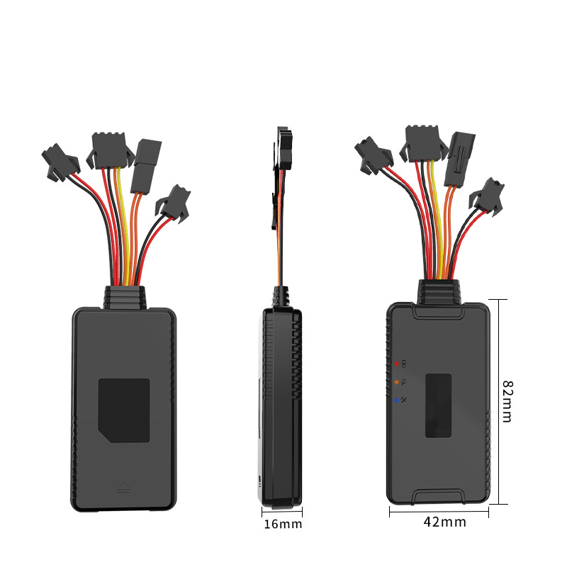

# GOTOP - D22-4G

El GOTOP D22-4G es un rastreador GPS vehicular resistente al agua diseñado para ofrecer seguimiento en tiempo real y gestión de flotas confiable. Pensado para autos, vehículos comerciales y activos de flota, combina posicionamiento por GPS y BDS de alta sensibilidad con comunicaciones 4G y antenas integradas para entregar datos consistentes de ubicación, estado y telemetría. Su formato industrial y funciones a bordo cubren necesidades operativas habituales como disuasión de robo, alarmas por eventos y control de kilometraje.

Como terminal compatible con Plaspy, el D22-4G envía datos de ubicación y eventos a Plaspy para facilitar visibilidad centralizada y supervisión operativa. Sus entradas de telemetría y salidas de alarma se integran fácilmente con los flujos de trabajo de Plaspy para monitorear encendido, accesos, alertas de exceso de velocidad o vibración, acciones de inmovilizador y garantizar continuidad de datos gracias al almacenamiento local. Esa compatibilidad lo hace adecuado para flotas que requieren seguimiento fiable, funciones de seguridad y un historial auditable dentro de la plataforma Plaspy.

## Características principales

- Diseñado específicamente para seguimiento vehicular y de flotas con carcasa industrial resistente al agua.
- Posicionamiento por GPS y BDS de alta sensibilidad combinado con diseño de antena integrado.
- Comunicaciones 4G para subida constante de ubicación y telemetría a plataformas en la nube.
- Sensores y entradas integradas para detección de ignición (ACC), estado de puertas, alertas por exceso de velocidad y vibración.
- Funciones antirrobo como alarma SOS y corte remoto de combustible mediante relay externo para flujos de trabajo de inmovilizador.
- Gran capacidad de almacenamiento local y retransmisión en zonas sin cobertura para preservar la continuidad de la telemetría.
- Soporte de voz bidireccional para escucha y comunicación manos libres cuando se requiera.

## Cómo funciona con Plaspy

Al integrarse con Plaspy, el D22-4G transmite la posición del vehículo y los eventos para que usted y su equipo de gestión de flotas puedan rastrear activos, recibir alertas y revisar registros históricos desde una única interfaz. Plaspy procesa mensajes de estado e entradas de sensores del dispositivo, habilitando alertas, informes y respuestas operativas basadas en la telemetría y las alarmas del rastreador.

- Actualizaciones de ubicación y movimiento en tiempo real enviadas a Plaspy para monitorización en vivo y visualización en mapa.
- Reporte de eventos de ignición y acceso para flujos de trabajo sensibles al encendido y seguimiento de actividad de conductores.
- Reenvío de alarmas y eventos como exceso de velocidad, vibración o movimiento, alertas de alimentación y notificaciones SOS para atención inmediata.
- Eventos de inmovilizador y control remoto, como corte de combustible mediante relay externo, visibles en Plaspy para acciones de recuperación o seguridad.
- Almacenamiento offline y retransmisión en áreas sin cobertura garantizan que Plaspy conserve un historial continuo aun durante pérdidas temporales de señal.

## Casos de uso típicos

- Gestión de flotas de autos y vehículos comerciales con seguimiento en tiempo real e informes de kilometraje.
- Operaciones de prevención y recuperación por robo mediante alertas SOS, detección de movimiento e inmovilización remota.
- Programas de seguridad vial para conductores que monitorean exceso de velocidad y eventos de vibración para identificar comportamientos de riesgo o incidentes.
- Monitoreo remoto de estado y comunicaciones de despacho usando entradas de ignición y voz bidireccional.
- Cumplimiento y generación de informes donde se requiere un historial de telemetría continuo a pesar de coberturas intermitentes.

## Por qué elegir este rastreador con Plaspy

El D22-4G combina hardware resistente y funciones prácticas para vehículos con la visibilidad centralizada que ofrece Plaspy. Su construcción impermeable, antenas integradas y almacenamiento a bordo lo hacen idóneo para instalaciones de flota a largo plazo donde la durabilidad y la continuidad de datos son esenciales. Para organizaciones que necesitan capacidades antirrobo, alertas por eventos y una telemetría que se integre de forma sencilla en una plataforma de gestión de flotas, el D22-4G representa una opción equilibrada.

Al ser compatible con Plaspy, las flotas pueden confiar en un flujo constante de datos de ubicación y eventos hacia los paneles y reportes de Plaspy para apoyar procesos de recuperación, supervisión operativa y análisis histórico. Si necesita un terminal robusto y orientado a vehículos que se alinee con los flujos de trabajo de Plaspy, el D22-4G es una alternativa sólida.

Para obtener más información sobre Plaspy y cómo dispositivos compatibles como el GOTOP D22-4G funcionan con la plataforma, visite https://www.plaspy.com. Las especificaciones del producto, la disponibilidad y los detalles del fabricante pueden cambiar con el tiempo, por lo que le recomendamos verificar la información técnica y la compatibilidad actual en el sitio del fabricante https://www.gotop.cc/.
