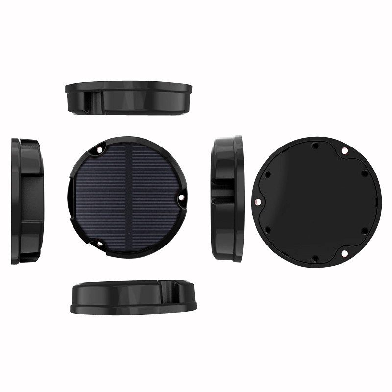

# GOTOP - D26

El D26 4G Solar Tracking terminal es un rastreador robusto, con clasificación IP67, diseñado para el seguimiento de activos al aire libre a largo plazo y despliegues de IoT. Compatible con Plaspy de fábrica, el D26 combina carga solar, GNSS de alta sensibilidad y comunicaciones 4G/GPRS para ofrecer seguimiento en tiempo real confiable, telemetría remota y alertas basadas en eventos para contenedores, remolques, maquinaria y otros activos de difícil acceso.

La carcasa industrial con antena completamente integrada y la construcción duradera minimizan el mantenimiento y maximizan el tiempo de actividad. Características integradas como un sistema de carga solar incorporado, sensor de aceleración de 3 ejes para activación inteligente y ahorro de energía, AGPS rápido y memoria integrada para almacenamiento fuera de línea hacen del D26 una opción atractiva para la gestión de flotas y la monitorización anti-robo cuando se combina con la plataforma de Plaspy para mapas en tiempo real, alertas y telemática de flotas.

## Puntos destacados

- Operación prolongada al aire libre con carga solar integrada para ciclos continuos de carga y descarga, ideal para activos remotos.
- Carcasa resistente con clasificación IP67 y antena industrial completamente integrada para despliegues al aire libre duraderos y de bajo mantenimiento.
- Conectividad 4G LTE y GPRS para seguimiento en tiempo real y telemetría a través de redes celulares, con soporte TCP/IP para conexiones confiables con el servidor.
- Posicionamiento GPS/BDS de alta sensibilidad, con soporte AGPS para un posicionamiento inicial más rápido y una mejor recepción satelital gracias a una antena anti-interferencias.
- Sensor de aceleración de 3 ejes que permite activación inteligente, detección de movimiento y modos de ahorro de energía para prolongar la vida operativa.
- Múltiples tipos de alarmas: alarma por vibración, alarma de sobrevelocidad, geocerca \(cerca electrónica\) y alertas SOS vía SMS/llamada, cargadas a la plataforma en tiempo real.
- Memoria integrada para almacenamiento de datos fuera de línea y transmisión suplementaria para manejar escenarios de zonas sin cobertura o conectividad intermitente.
- Configuración remota y actualizaciones de firmware en línea para la gestión a nivel de flota y reducción de visitas en campo.

## Resumen técnico

| Conectividad | 4G LTE y GPRS \(soporte TCP/IP\) |
| --- | --- |
| Bandas | No especificadas / dependientes de la región |
| Alimentación y Batería | Sistema de carga solar integrado para ciclos de carga y descarga; diseñado para operación al aire libre a largo plazo |
| Interfaces | Las funciones de alarma y rastreo incluyen alarma por vibración, alarma de sobrevelocidad, geocerca y alertas SOS vía SMS/llamada; detalles de E/S no especificados |
| GNSS | Posicionamiento GPS y BDS con posicionamiento AGPS rápido y antena anti-interferencias para una recepción satelital estable |
| Aceleración | Sensor de aceleración de 3 ejes incorporado para detección de movimiento, activación inteligente y ahorro de energía |
| Memoria | Almacenamiento de datos fuera de línea integrado con transmisión suplementaria para escenarios de zonas sin cobertura |
| Gestión remota | Configuración remota y actualizaciones de firmware en línea soportadas |
| Procesador | MCU STM32 de 32 bits de alto rendimiento \(grado industrial\) |
| Factor de forma | Carcasa industrial robusta con clasificación IP67 y antena completamente integrada; optimizada para activos al aire libre y montaje en contenedores |
| Bluetooth | No especificado |

## Casos de uso

- Rastreo de contenedores y remolques: monitorización a largo plazo al aire libre con carga solar y alertas de geocerca para prevenir pérdidas de carga.
- Monitorización remota de equipos y maquinaria: detección de vibraciones y movimiento combinada con telemetría para mantenimiento preventivo.
- Gestión de flotas de activos fuera de carretera o semi-permanentes: posicionamiento en tiempo real, alertas de sobrevelocidad y almacenamiento en búfer para áreas con cobertura intermitente.
- Protección de activos de construcción y agrícola: diseño robusto IP67 y alarmas SOS y de velocidad excesiva para ayudar a reducir el robo y el uso indebido.
- Telemetría general de activos al aire libre: transmite ubicación GNSS, eventos de movimiento y datos de alarmas a Plaspy para informes centralizados y reproducción histórica.

## Por qué elegir este rastreador con Plaspy

Combinado con Plaspy, el D26 se convierte en una solución de bajo mantenimiento y alta fiabilidad para la visibilidad de activos al aire libre. La carga solar integrada y la gestión inteligente de la energía prolongan significativamente los intervalos operativos entre visitas de servicio, reduciendo el costo total de propiedad. Combinado con el seguimiento en tiempo real, alertas y telemática de flotas de Plaspy, las implementaciones de D26 proporcionan información accionable para la gestión de flotas, flujos de trabajo anti robo y telemetría remota.

El diseño industrial del D26, el GNSS asistido por AGPS y las comunicaciones robustas ofrecen a los operadores de flotas una precisión de ubicación y reporte de eventos fiables. Para implementaciones que requieran señales adicionales—como arranque, control de inmovilizador, monitorización de combustible o sensores Bluetooth—confirme las interfaces de hardware disponibles e integraciones para su variante de D26. Configurado para su caso de uso, D26 + Plaspy proporciona una plataforma escalable y segura para gestionar activos, responder a incidentes y optimizar las operaciones en campo.

