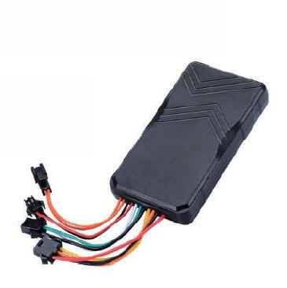

# GOTOP - G01-4G

El GOTOP G01-4G es un rastreador GPS para vehículos diseñado para ofrecer seguimiento en tiempo real confiable y gestión de flotas. Pensado para autos, taxis, vehículos de renta y camiones ligeros, el equipo emplea 4G LTE con respaldo por SMS para entregar actualizaciones de posición rápidas, alarmas configurables por geocerca, reporte de emergencia SOS, detección de encendido ACC y control remoto de corte de motor. Su carcasa ABS con clasificación IP67 y amplio rango de voltaje operativo lo hacen apto para despliegues profesionales de flotas y entornos automotrices exigentes.

Como dispositivo compatible con Plaspy, el G01-4G integra sus flujos de ubicación, alarmas y telemetría en Plaspy para crear una herramienta centralizada de monitoreo y antirobo. Plaspy consume las actualizaciones y eventos del rastreador para presentar mapas en vivo, alertas de eventos e informes históricos, de modo que usted pueda supervisar vehículos, responder incidentes y generar reportes operativos desde una sola plataforma. Las funciones de audio y las alarmas por corte de alimentación o vibración amplían la visibilidad de incidentes dentro de los flujos de trabajo de Plaspy.

## Características principales

- Rastreador GPS 4G compatible con Plaspy para actualizaciones de ubicación en tiempo real con baja latencia y respaldo por SMS para continuidad
- Diseñado para vehículos como autos, taxis, flotas de renta y camiones ligeros
- Telemetría vehicular: detección de encendido ACC, botón SOS, alarmas por vibración y por corte de alimentación principal
- Capacidad de inmovilizador remoto para apoyar la respuesta antirobo gestionada desde Plaspy
- Carcasa ABS robusta con certificación IP67 y amplio rango de voltaje para uso profesional en flotas
- Micrófono integrado y soporte para altavoz externo para escucha remota y escenarios de audio bidireccional
- Múltiples interfaces I/O y seriales para conectar periféricos externos y ampliar la telemetría según sea necesario

## Cómo funciona con Plaspy

Cuando usted conecta el G01-4G a Plaspy, el dispositivo convierte las posiciones y los eventos del vehículo en inteligencia operativa accesible desde los paneles de Plaspy. La plataforma recibe actualizaciones por 4G o SMS desde el rastreador y muestra ubicación, eventos de geocerca y alarmas junto con datos históricos para análisis y respuesta.

- Ubicación y telemetría en tiempo real visibles en los mapas en vivo y en las listas de vehículos de Plaspy
- Alertas de geocerca, vibración y pérdida de energía entregadas a los flujos de eventos de Plaspy para notificación inmediata
- Estado de encendido y control de inmovilizador remoto visibles en el estado del vehículo y disponibles para flujos de respuesta gestionados
- Eventos SOS y de escucha dirigidos al manejo de incidentes en Plaspy para apoyar la respuesta de emergencia y la verificación
- Informes históricos y registros de eventos exportables para análisis de desempeño de la flota y para investigaciones
- Integración de periféricos y sensores externos capturados por el dispositivo e incluidos en los reportes de Plaspy cuando corresponda

## Casos de uso típicos

- Gestión de flotas para taxis, vehículos de reparto y unidades de servicio que requieren seguimiento en vivo y reporte de eventos
- Supervisión de vehículos de renta y financiados mediante geocercas e inmovilización remota para reducir riesgo de robo
- Monitoreo de seguridad en vehículos particulares con manejo de SOS y validación de incidentes mediante audio
- Protección de activos y flujos antirobo que combinan detección de vibración, corte de alimentación y control de motor con alertas en Plaspy
- Extensiones telemáticas como integración de sensores de combustible o periféricos para ampliar la visibilidad operativa

## Por qué elegir este rastreador con Plaspy

El G01-4G es una opción práctica para organizaciones que requieren seguimiento vehicular fiable, controles antirobo esenciales e integración sencilla en una plataforma centralizada. Su combinación de actualizaciones celulares rápidas, entradas para el vehículo y diseño robusto para uso automotriz se alinea con las necesidades habituales de flotas, mientras que Plaspy convierte los flujos del rastreador en paneles accionables, alertas e informes que apoyan las operaciones diarias y la respuesta a incidentes.

Para obtener más información sobre el uso de Plaspy con rastreadores compatibles y revisar opciones de despliegue, visite https://www.plaspy.com. Las especificaciones del producto, disponibilidad y detalles del fabricante pueden cambiar con el tiempo, por lo que verifique las especificaciones actuales y las configuraciones regionales en el sitio del fabricante https://www.gotop.cc/.
