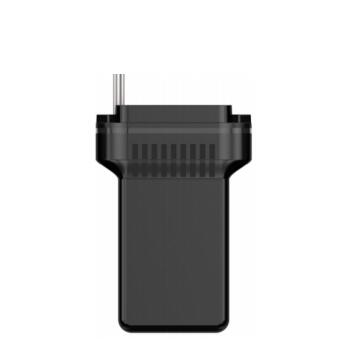

# GOTOP - G02-4G

El GOTOP G02-4G es un rastreador GPS compacto y resistente, diseñado para motos, e-bikes y automóviles. Ofrece seguimiento en tiempo real mediante 4G LTE con conmutación a 3G/2G y reporte por SMS como respaldo, y su carcasa con certificación IP67 lo hace apto para uso exterior. El equipo está concebido para entornos vehiculares, con un amplio rango de voltaje de entrada y rendimiento de posicionamiento adecuado para seguimiento rutinario de flotas y activos.

Como dispositivo compatible con Plaspy desde el primer momento, el G02-4G se integra con Plaspy para mapas en vivo, alertas basadas en eventos y datos históricos de posición. Al combinarlo con Plaspy, el rastreador entrega visibilidad de ubicación y telemetría lista para usar, lo que facilita la supervisión de la flota, procesos anti robo y la vigilancia continua del vehículo sin integraciones personalizadas complejas.

## Puntos clave

- Compatible con Plaspy para seguimiento en tiempo real vía 4G o SMS, con integración directa de telemetría a paneles y alertas de Plaspy
- Carcasa resistente IP67 y formato compacto ideal para motocicletas, e-bikes y automóviles
- Amplio rango de voltaje para simplificar instalaciones en distintos tipos de vehículos
- Posicionamiento preciso con rendimiento GNSS que reporta ubicaciones con una precisión aproximada de 5 metros
- Alarmas integradas para eventos como detección de encendido, geocercas, vibración y movimiento, batería baja y corte de alimentación principal
- Conectividad multinetwork que ofrece resiliencia regional y mejora la confiabilidad del seguimiento en tiempo real

## Cómo funciona con Plaspy

El G02-4G envía datos de ubicación y eventos a Plaspy mediante su enlace celular o por SMS como vía redundante. Plaspy recibe esas actualizaciones para mostrar mapas en vivo, paneles de telemetría, alertas automáticas y reportes históricos que facilitan la supervisión operativa. La integración está pensada para presentar posiciones y eventos del dispositivo en contexto dentro de Plaspy, de modo que su equipo pueda reaccionar y analizar con los flujos de trabajo existentes.

- Actualizaciones de ubicación y telemetría en tiempo real por celular o SMS para redundancia
- Detección de encendido para reportes de conducción e inactividad y para disparar reglas dentro de Plaspy
- Alarmas por geocercas, movimiento y vibración para apoyar respuestas anti robo y acciones de recuperación
- Alertas por batería baja y corte de alimentación principal para detectar manipulación o problemas de energía
- Datos disponibles para alertas, reportes, reproducción de rutas y automatizaciones vía API en Plaspy

## Casos de uso típicos

- Gestión centralizada de flotas mixtas que incluya autos, motocicletas y e-bikes
- Monitoreo anti robo y flujos de recuperación para motos y e-bikes usando geocercas y alarmas de movimiento
- Seguimiento de micromovilidad y e-bikes donde el tamaño compacto y la protección IP67 son determinantes
- Recuperación ante robos y detección de manipulación en vehículos ligeros mediante seguimiento celular continuo
- Rastreo de activos robustos como remolques, equipos o generadores móviles que requieren rendimiento fiable en exterior

## Por qué elegir este rastreador con Plaspy

El G02-4G combina hardware resistente y flexibilidad de red, lo que lo hace adecuado para muchas implementaciones con Plaspy. Su diseño compacto IP67 y la amplia aceptación de voltaje lo convierten en una opción única para organizaciones que buscan un solo modelo de equipo para distintos tipos de vehículos. Al emparejarlo con Plaspy, las señales de eventos y las actualizaciones de posición del dispositivo se transforman en alertas accionables, reportes de flota y análisis históricos sin necesidad de personalizaciones extensas.

Para equipos enfocados en la visibilidad de la flota y procesos anti robo, el G02-4G ofrece compatibilidad directa con Plaspy para soportar la supervisión en tiempo real y la generación de informes operativos. Si sus necesidades de despliegue crecen, Plaspy puede incorporar los datos del dispositivo en flujos de trabajo y estrategias de reporte más amplias, manteniendo claridad sobre las funcionalidades que proporciona el rastreador.

Aprenda más sobre el uso de rastreadores compatibles y Plaspy en el sitio principal de Plaspy https://www.plaspy.com. Las especificaciones del producto y su disponibilidad pueden variar con el tiempo, por lo que por favor verifique los detalles técnicos actuales en el sitio del fabricante https://www.gotop.cc/ antes de comprar o desplegar dispositivos.
