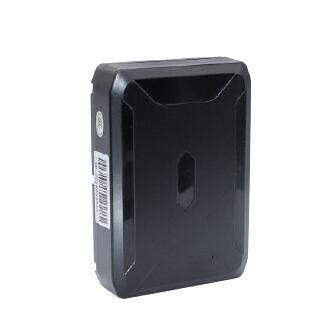

# GOTOP - G07

El G07 es un rastreador GPS resistente diseñado para el seguimiento a largo plazo y bajo mantenimiento de vehículos, contenedores y otros activos móviles de alto valor. Combina opciones de batería interna de gran capacidad con una carcasa IP65 y seis imanes potentes para una fijación discreta y resistente a la intemperie. Incluye posicionamiento GNSS, alarmas en el dispositivo y monitoreo de audio remoto para ofrecer telemetría continua de ubicación y eventos.

Como dispositivo compatible con Plaspy, el G07 integra sus actualizaciones de posición y eventos de alarma en la plataforma de seguimiento de Plaspy, permitiendo a los equipos monitorear activos en tiempo real, reproducir históricos y recibir alertas de incidentes. Sus características de larga autonomía y su diseño robusto hacen del G07 una opción práctica cuando la implementación prolongada y el mantenimiento mínimo en sitio son prioridades para los usuarios de Plaspy.

## Principales ventajas

- Operación de larga duración gracias a opciones de batería interna de litio de gran capacidad que prolongan el tiempo entre mantenimientos.
- Compatibilidad con Plaspy para visualización en mapa en vivo, alertas y reproducción histórica de ubicaciones y telemetría del dispositivo.
- Posicionamiento GNSS híbrido con BeiDou y GPS, además de fallback por LBS para obtener ubicaciones fiables en distintas condiciones.
- Carcasa ABS con protección IP65 y seis imanes NdFeB para montaje discreto y resistente en activos metálicos expuestos al clima.
- Alarmas integradas por manipulación, desmontaje, movimiento y exceso de velocidad que apoyan flujos de trabajo anti robo.
- Monitoreo de audio remoto y grabación activada por sonido para mayor conocimiento situacional durante recuperaciones.
- Comportamiento diseñado para bajo consumo en espera, manteniendo los activos localizables durante largos períodos con reportes infrecuentes.

## Cómo funciona con Plaspy

Al utilizarse con Plaspy, el G07 envía reportes de posición y telemetría de eventos al tablero de Plaspy para que los operadores mantengan visibilidad, configuren alertas y generen informes sobre su flota o inventario de activos. Las alarmas y las funciones de audio del dispositivo pueden mostrarse en Plaspy para apoyar respuestas e investigaciones oportunas.

- Actualizaciones de posición en tiempo real y reproducción histórica disponibles en Plaspy para seguimiento y revisión de rutas.
- Alertas instantáneas por manipulación, movimiento, exceso de velocidad y batería baja que se enrutan a Plaspy para los flujos de respuesta.
- Telemetría de batería y voltaje presentada en Plaspy para programar mantenimiento y evitar tiempos de inactividad inesperados.
- Acceso a audio remoto y grabaciones activadas por sonido a través de Plaspy cuando las funciones de audio están habilitadas en el dispositivo.
- Geocercas, reporte de incidentes y supervisión de flota facilitados al combinar la telemetría del G07 con las herramientas de informe de Plaspy.

## Casos de uso típicos

- Monitoreo de flotas de alquiler donde el montaje discreto y la larga autonomía reducen mantenimientos y mejoran la recuperación de activos.
- Seguimiento de contenedores y carga en condiciones exteriores que requieren fijación resistente y a prueba de intemperie.
- Operaciones de recuperación de activos y anti robo que se benefician de alertas por manipulación, detección de movimiento y audio remoto.
- Instalaciones remotas con ventanas de conectividad poco frecuentes que necesitan larga espera y reportes de ubicación confiables.
- Supervisión a largo plazo de equipos de alto valor que deben mantenerse localizables sin alimentación continua ni intervenciones frecuentes.

## Por qué elegir este rastreador con Plaspy

El GOTOP G07 está indicado para organizaciones que priorizan un despliegue resistente, bajo mantenimiento y reportes de ubicación confiables. Su combinación de baterías internas de gran capacidad, carcasa resistente al clima y montaje magnético potente reduce la necesidad de intervenciones frecuentes en sitio, sin dejar de ofrecer las alarmas y capacidades de audio que apoyan los flujos de recuperación y seguridad en Plaspy.

Si necesita seguimiento persistente y visibilidad de eventos para activos remotos o de alto valor, emparejar el G07 con Plaspy ofrece una solución de monitoreo práctica que integra la telemetría del dispositivo en las funciones de mapeo, alertas e informes de Plaspy. Conozca más sobre Plaspy en el sitio principal https://www.plaspy.com. Las especificaciones del producto, disponibilidad y datos del fabricante pueden cambiar con el tiempo, por lo que se recomienda verificar la información técnica y de pedido actual en el sitio del fabricante https://www.gotop.cc/
