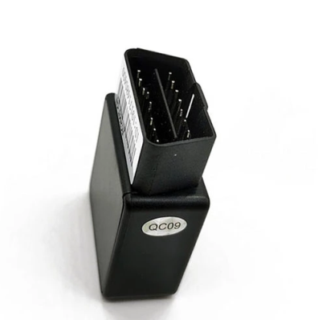

# GOTOP - G08-4G

El G08-4G es un rastreador vehicular OBD compacto de instalar y usar, diseñado para rastreo en tiempo real y gestión de flotas. Funciona como un conector OBD con antenas GPS y GSM integradas y conectividad 4G, ofreciendo reportes continuos de posición, geocercas, notificaciones de alarma y registro de historial de rutas sin necesidad de instalaciones de cableado separadas.

Como dispositivo compatible con Plaspy, el G08-4G se conecta a la plataforma para entregar ubicación en vivo, telemetría y flujos de alertas que apoyan la supervisión anti robo y la visibilidad operativa. Su formato plug-and-play y su diseño de comunicaciones lo convierten en una opción práctica para propietarios de vehículos y operadores de flota que requieren despliegue rápido y seguimiento centralizado en Plaspy.

## Características destacadas

- Instalación OBD plug-and-play para integración inmediata con sistemas de rastreo y gestión de flotas con configuración mínima.
- Comunicaciones 4G LTE con cambio automático entre redes y reporte por SMS para mantener conectividad en zonas con cobertura variable.
- Antenas GPS y GSM integradas con precisión de posición adecuada para reportes exactos y registro de historial de rutas.
- Capacidades de alarma incluyendo geocercas, alertas por vibración o movimiento, notificaciones de batería baja y corte de alimentación principal para apoyar detección de robo.
- Batería interna de respaldo para reportes a corto plazo cuando se interrumpe la alimentación externa.
- Dimensiones compactas y amplio rango de voltaje de operación para compatibilidad con autos, camionetas ligeras y otros vehículos.
- Soporta reporte por datos y por SMS hacia Plaspy para entregar telemetría y alertas de forma flexible.

## Integración con Plaspy

Al integrarse con Plaspy, el G08-4G transmite ubicación, estado y mensajes de alarma por datos celulares o SMS para que Plaspy muestre posiciones en tiempo real, active alertas y conserve el historial de viajes. Plaspy recibe esas actualizaciones y las presenta mediante paneles, vistas de mapa y canales de notificación para facilitar supervisión operativa y respuesta a incidentes.

- Actualizaciones de ubicación y estado en tiempo real entregadas a Plaspy vía datos celulares con respaldo por SMS cuando sea necesario.
- Alertas de entrada y salida de geocerca y alarmas por movimiento o vibración enviadas a los paneles y flujos de notificación de Plaspy.
- Notificaciones de batería baja y corte de alimentación principal marcadas en Plaspy para ayudar a detectar manipulación o desconexión de dispositivos.
- Reporte de ubicación a corto plazo desde la batería interna de respaldo cuando se pierde la alimentación externa.
- Historial de rutas y registros de viajes disponibles en Plaspy para análisis posterior y reportes operativos.
- Cuando hay telemetría a nivel OBD disponible, Plaspy puede consumir esos datos para enriquecer paneles y detección de eventos.

## Casos de uso típicos

- Monitoreo anti robo de flotas con alertas instantáneas por movimiento inesperado, vibración o pérdida de alimentación.
- Gestión de flotas y supervisión de conductores mediante rastreo en tiempo real e historial de rutas para optimización.
- Programas de renta y carsharing que se benefician de despliegue plug-and-play y registros de ubicación precisos.
- Flotas de última milla y servicios que dependen de geocercas y flujos de notificación para hacer cumplir zonas de servicio.
- Propietarios de vehículos que desean monitoreo continuo e integración sencilla en una plataforma centralizada de rastreo.

## Por qué elegir este rastreador con Plaspy

El G08-4G combina simplicidad práctica con las funciones que los operadores de flotas suelen necesitar: instalación rápida, reporte continuo, alarmas ante manipulación o pérdida de energía y historial de rutas. Unido a Plaspy, el dispositivo forma parte de un flujo centralizado de monitoreo y reportes que ayuda a los equipos a mantener visibilidad sobre sus vehículos y a responder a eventos desde una única plataforma.

Para organizaciones que priorizan la facilidad de despliegue y la confiabilidad en el reporte de ubicación, el G08-4G es una opción sensata para integrar con Plaspy. Para obtener más información sobre Plaspy y cómo se usan los rastreadores compatibles dentro de la plataforma visite https://www.plaspy.com. Las especificaciones y la disponibilidad de producto pueden cambiar con el tiempo, por favor verifique los detalles actuales con el fabricante en https://www.gotop.cc/.
