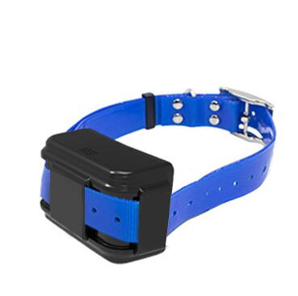

# GOTOP - G11B

El GOTOP G11B es un rastreador GPS compacto diseñado para montarse en collares y proporcionar ubicación confiable y protección para mascotas y animales de granja. Construido para uso rudo, incorpora conectividad 4G LTE, antenas integradas de GPS y 4G, y protección IP65 para mantener el seguimiento y las alertas en tiempo real incluso en condiciones húmedas. El dispositivo está optimizado para una instalación inalámbrica en collares y arneses y ofrece envío de ubicaciones por SMS además de funcionar con la plataforma web y móvil de GOTOP.

Como dispositivo compatible con Plaspy, el G11B puede reenviar posiciones GPS, actualizaciones de estado y eventos de alarma a Plaspy para su monitoreo y gestión centralizada. Esta compatibilidad facilita incluir rastreadores de animales dentro de una supervisión más amplia de activos, habilitando mapas en vivo, captura de telemetría, gestión de geocercas y reproducción de historial para pequeñas manadas o despliegues mixtos gestionados desde la plataforma Plaspy.

## Características principales

- Rastreador GPS compatible con Plaspy que integra la ubicación de animales en una plataforma de monitoreo unificada
- Conectividad 4G LTE con enlaces de ubicación por SMS para compartir rápidamente y como respaldo
- Diseño robusto para montaje en collar con protección IP65 para uso en exteriores
- Batería de larga duración 30000 mAh y modos de ahorro de energía que prolongan la operación en campo
- Antenas integradas de GPS y 4G para posicionamiento y comunicación estables sin antenas externas
- Alarmas por geocerca y detección de movimiento, además de alertas de batería baja para agilizar la respuesta

## Cómo funciona con Plaspy

Al integrarse con Plaspy, el GOTOP G11B envía sus fijaciones GPS y eventos de alarma a la plataforma Plaspy para que los operadores gestionen el seguimiento, las alertas y las rutas históricas desde un solo panel. Plaspy recopila y visualiza la telemetría del dispositivo, mostrando ubicación, movimiento y estado de batería en mapas, paneles y reportes para apoyar la supervisión operativa.

- Las ubicaciones y la telemetría en tiempo real aparecen en Plaspy para seguimiento y mapeo en vivo
- Las alarmas por geocerca y detección de movimiento reportadas a Plaspy permiten notificaciones instantáneas
- Las alertas de batería baja reenviadas a Plaspy ayudan a programar recargas y reducir tiempos de inactividad
- Los enlaces de ubicación por SMS permanecen disponibles como respaldo rápido para compartir posiciones de forma inmediata
- Reproducción de historial y revisión de rutas desde los registros del dispositivo dentro de Plaspy

## Casos de uso típicos

- Rastreo y recuperación de mascotas durante paseos, salidas o tiempo libre
- Monitoreo de animales de granja para observar el movimiento del ganado entre potreros
- Protección al aire libre de animales de trabajo y despliegues en entornos húmedos
- Reporte de ubicación remota cuando el acceso a la app es limitado utilizando enlaces de Google Maps por SMS

## Por qué elegir este rastreador con Plaspy

El GOTOP G11B es un rastreador pensado para animales que equilibra resistencia y larga autonomía con una instalación inalámbrica sencilla. Su combinación de rastreo 4G, resistencia al agua y antenas integradas lo hace ideal para escenarios al aire libre donde la visibilidad continua de la ubicación es esencial. Enviar la telemetría del G11B a Plaspy coloca la ubicación y las alertas de los animales junto con otros activos gestionados, permitiendo a los equipos consolidar el monitoreo y responder con mayor eficiencia.

Para saber más sobre Plaspy y cómo puede centralizar el monitoreo de dispositivos como el GOTOP G11B visite https://www.plaspy.com. Las especificaciones del producto, la disponibilidad y los detalles del fabricante pueden cambiar con el tiempo, por favor verifique las especificaciones actuales y la compatibilidad en el sitio del fabricante https://www.gotop.cc/.
