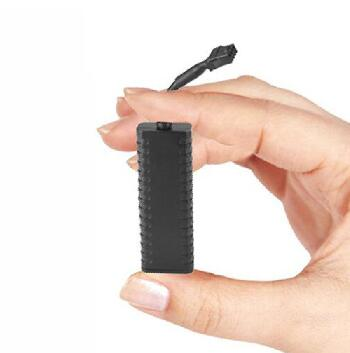

# GOTOP - G23

El GOTOP G23 es un rastreador GPS mini con cable diseñado para instalaciones discretas en vehículos y para ofrecer monitorización continua de la ubicación. Su carcasa compacta de ABS, antenas internas y perfil delgado lo hacen ideal para automóviles, motocicletas, bicicletas eléctricas y vehículos comerciales ligeros donde se requiere un dispositivo de baja visibilidad. El G23 utiliza posicionamiento híbrido con GPS, BeiDou y LBS, logrando precisiones típicas alrededor de cinco metros, e incluye entradas y alarmas de vehículo habituales para prevención de robos y supervisión de flotas.

Como dispositivo compatible con Plaspy, el G23 puede enviar su telemetría de ubicación y eventos a Plaspy para monitoreo centralizado, alertas e informes. Esta compatibilidad permite a operadores de flotas y equipos de seguridad incorporar el G23 en los paneles y flujos de trabajo de Plaspy para rastrear vehículos en tiempo real, recibir alertas por corte de energía o manipulación y actuar sobre eventos de encendido e inmovilizador sin cambiar su plataforma de seguimiento.

## Características principales

- Factor de forma mini con cable que facilita instalaciones discretas y ocultas para prevenir robos.
- Posicionamiento GNSS híbrido con GPS y BeiDou más LBS para fijaciones de ubicación fiables y reproducción de rutas.
- Soporte de telemetría vehicular, incluyendo detección de encendido, alertas por exceso de velocidad y alarmas por vibración o movimiento.
- Capacidad de corte remoto de alimentación o combustible, útil para intervenciones tipo inmovilizador cuando la instalación y la normativa local lo permiten.
- Amplio rango de entrada DC para uso en automóviles, motocicletas, bicicletas eléctricas y vehículos comerciales ligeros.
- Bajo consumo en reposo y batería de respaldo de 80 mAh para reportar eventos sin conexión y alertas por pérdida de energía.

## Cómo funciona con Plaspy

Una vez instalado y conectado, el G23 transmite datos de ubicación y eventos a Plaspy, donde esos mensajes se convierten en mapas en vivo, alertas e informes históricos. Plaspy recibe los reportes del rastreador y los asigna a notificaciones, reglas y vistas de flota para que usted pueda supervisar vehículos, responder a incidentes y generar informes operativos.

- Las actualizaciones de ubicación GNSS y LBS en tiempo real aparecen en los mapas de Plaspy para seguimiento en vivo y reproducción de rutas.
- La detección ACC de encendido y las alertas por arranque no autorizado se muestran en Plaspy para ayudar a identificar usos indebidos.
- Los comandos de corte remoto de alimentación o combustible se pueden gestionar desde las interfaces de Plaspy cuando la instalación y las normas locales lo permiten.
- Las notificaciones de corte de energía y batería de respaldo son usadas por Plaspy para señalar posibles manipulaciones o pérdidas de suministro.
- Las alarmas por exceso de velocidad y vibración alimentan directamente las reglas de Plaspy para alertas, flujos de trabajo de seguridad y capacitación de conductores.
- Los datos históricos del G23 están disponibles en Plaspy para informes, análisis y revisiones operativas.

## Casos de uso típicos

- Gestión de flotas para camionetas de reparto pequeñas, vehículos de alquiler y flotas ligeras mixtas.
- Monitoreo antirobo e inmovilización para automóviles y motocicletas.
- Rastreo para motocicletas y bicicletas eléctricas donde el tamaño compacto y la tolerancia a amplio voltaje son importantes.
- Monitoreo de comportamiento del conductor y seguridad mediante alertas de exceso de velocidad y vibración para capacitación y cumplimiento.
- Telemática de flotas mixtas donde un único tipo de rastreador cubre diversas clases de vehículos.

## Por qué elegir este rastreador con Plaspy

El GOTOP G23 combina un perfil de hardware discreto con la visibilidad centralizada y el motor de reglas de Plaspy. Sus entradas y conjunto de alarmas orientadas al vehículo ofrecen los eventos prácticos en los que confían muchos operadores de flotas y seguridad, mientras que Plaspy convierte esos eventos en notificaciones accionables, acciones de control e informes históricos. Para organizaciones que requieren un rastreador de pequeña dimensión que aun así aporte telemetría clave antirobo y de flota, el G23 es una opción práctica para integrar en una implementación con Plaspy.

Para saber más sobre cómo Plaspy puede trabajar con rastreadores compatibles como el GOTOP G23 visite https://www.plaspy.com. Las especificaciones del producto y su disponibilidad pueden cambiar con el tiempo, por lo que le recomendamos verificar los detalles actuales y la documentación del fabricante en https://www.gotop.cc/ antes de la compra.
