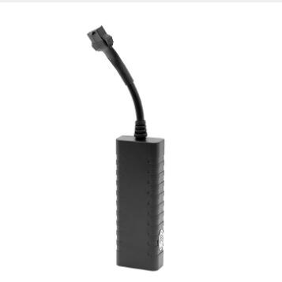

# GOTOP - G23N

El GOTOP G23N es un rastreador NB‑IoT de grado vehicular, compacto, diseñado para el monitoreo continuo de ubicación y el control práctico del vehículo. Construido alrededor del módulo Quectel BC26 NB‑IoT y un motor GNSS ZKMicro, el G23N ofrece posicionamiento multiconstelación (GPS + BDS + LBS) y entradas/salidas para vehículo, como detección de ACC y una salida de baja potencia para corte remoto de alimentación o combustible. Su tamaño reducido y amplio rango de entrada DC lo hacen adecuado para automóviles, motocicletas, bicicletas eléctricas y vehículos comerciales ligeros.

Como dispositivo compatible con Plaspy, el G23N transmite información de ubicación, estado y alarmas a Plaspy para soportar mapas en vivo, notificaciones y reportes de flota. Los usuarios de Plaspy pueden visualizar los eventos y las entradas del rastreador en paneles y flujos de trabajo para respuesta antirrobo, monitoreo de encendido y supervisión operativa, convirtiendo al dispositivo en una opción práctica para flotas y operaciones de renta que requieren telemetría de bajo consumo y amplia cobertura con una integración directa a la plataforma.

## Características principales

- Compatible con Plaspy para seguimiento en tiempo real y paneles de gestión de flotas.
- Conectividad NB‑IoT mediante el módulo Quectel BC26 para telemetría de bajo consumo y amplia cobertura.
- Posicionamiento multiconstelación (GPS + BDS + LBS) para reportes de ubicación fiables.
- Entradas/salidas de grado vehicular, incluyendo detección de ACC y salida para corte remoto de alimentación o combustible.
- Carcasa compacta y resistente a la intemperie, diseñada para una instalación discreta en autos y motocicletas.
- Batería de respaldo opcional y alarmas por pérdida de energía para soportar operación corta sin conexión y flujos de trabajo antirrobo.
- Rápida reacquisición GNSS y alta sensibilidad para mantener el bloqueo de posición en entornos urbanos.

## Cómo funciona con Plaspy

Al integrarse con Plaspy, el G23N entrega actualizaciones continuas de posición, cambios en el estado de entradas y mensajes de alarma que Plaspy transforma en marcadores en el mapa en tiempo real, notificaciones de eventos y reportes de flota. Plaspy ingiere la telemetría del rastreador y la presenta junto con otros activos, de modo que los responsables puedan monitorear ubicación, tiempo de operación y alarmas críticas desde una sola plataforma.

- Ubicación en vivo e historial de movimiento mostrados en los mapas de Plaspy y reproducción de rutas.
- Gestión de eventos y alarmas por pérdida de energía, disparos antirrobo y reglas personalizadas en Plaspy.
- Monitoreo de encendido y tiempo de uso mediante el estado de ACC para soportar reportes de conductores y análisis de uso.
- Inmovilización remota y señales de control representadas como eventos accionables dentro de los flujos de trabajo de Plaspy.
- Batería de respaldo y alertas por modo fuera de línea visibles en Plaspy para que los equipos reaccionen ante cortes de energía temporales.

## Casos de uso típicos

- Seguimiento de flotas pequeñas y medianas para visibilidad continua e informes operativos.
- Monitoreo de vehículos de renta y vehículos con crédito, con alertas antirrobo e inmovilización remota.
- Automóviles particulares, taxis y motocicletas que requieren instalación compacta y rápida reacquisición GNSS.
- Vehículos de reparto ligero que se benefician de un amplio rango de entrada DC y telemetría de bajo mantenimiento.
- Despliegues prolongados donde la eficiencia energética de NB‑IoT y el mantenimiento mínimo son prioridad.

## Por qué elegir este rastreador con Plaspy

El G23N combina la eficiencia del NB‑IoT, posicionamiento GNSS multiconstelación y entradas vehiculares prácticas que se integran de forma natural en las funciones de monitoreo y reporte de Plaspy. Su diseño prioriza una larga vida de despliegue y un mapeo sencillo de los eventos del dispositivo hacia los flujos de trabajo de la plataforma, lo que ayuda a las operaciones a implementar procedimientos antirrobo, monitoreo de encendido y lógica de control remoto sin grandes modificaciones a sus sistemas de flota.

Para organizaciones que buscan un rastreador compacto con bajo consumo y una integración clara en una única plataforma de flotas, el G23N ofrece una opción equilibrada que se alinea con las capacidades de seguimiento y alertas en tiempo real de Plaspy. Aunque el dispositivo está orientado a telemetría NB‑IoT y entradas vehiculares, la plataforma de Plaspy contextualiza esas señales para necesidades de despacho, recuperación y generación de reportes.

Para obtener más información sobre Plaspy y cómo puede funcionar con rastreadores compatibles como el GOTOP G23N visite https://www.plaspy.com. Las especificaciones de producto y su disponibilidad pueden cambiar con el tiempo, por lo que le recomendamos verificar los detalles técnicos actuales y la documentación más reciente del fabricante en el sitio oficial de GOTOP https://www.gotop.cc/.
