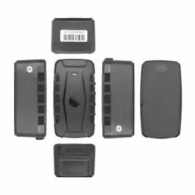

# GOTOP - G25C

El GOTOP G25C es un rastreador GPS 4G compacto pensado para aplicaciones de Internet de las Cosas y el seguimiento de activos en general. Combina comunicación LTE con posicionamiento por satélite GPS y BDS para ofrecer información de localización en tiempo real. Con una antena interna de grado industrial y una carcasa resistente, el G25C está diseñado para su uso en autos particulares, vehículos de alquiler, camiones de flota, bicicletas y otros activos móviles.

Como dispositivo compatible con Plaspy, el G25C puede enviar datos de ubicación y alertas a una plataforma centralizada para mayor visibilidad operativa. Su batería de larga duración y los modos configurables de ahorro de energía lo hacen una opción práctica en despliegues que requieren actualizaciones periódicas, alertas por eventos y monitoreo remoto. Los usuarios de Plaspy pueden integrar el rastreador para supervisión, notificaciones e informes básicos en flotas mixtas.

## Características principales

- Conectividad inalámbrica 4G LTE combinada con posicionamiento por GPS y BDS para seguimiento en tiempo real
- Batería de alta capacidad de 20000 mAh que ofrece tiempos de espera muy prolongados y operación extendida en campo
- Tres modos configurables de ahorro de energía para equilibrar la frecuencia de reporte y la duración de la batería
- Múltiples funciones de alarma, incluyendo alarma por desprendimiento, alarma de movimiento, alarma de batería baja, alarma por vibración y alarma de geocerca
- Capacidad de monitoreo y grabación de voz para verificaciones remotas de audio donde esté permitido
- Protección IP65 y montaje con imán resistente para despliegues flexibles en campo
- Compatible con plataformas web y aplicaciones móviles; admite configuración por SMS y enlaces de mapa vía SMS

## Cómo funciona con Plaspy

Plaspy puede recibir actualizaciones de ubicación y notificaciones de eventos desde rastreadores compatibles como el G25C, de modo que los administradores de flota y operadores tengan una vista unificada de la ubicación, el estado y las alertas de sus activos. Una vez conectado, la información del dispositivo puede utilizarse para monitoreo, control de geocercas y revisión histórica dentro de Plaspy.

- Visualización de ubicación en tiempo real para unidades individuales y vistas agrupadas en los paneles de Plaspy
- Reenvío de alertas para que eventos como desprendimiento, movimiento, batería baja, vibración y geocerca aparezcan como notificaciones
- Visibilidad del estado de la batería para controlar la capacidad restante y planificar mantenimiento o ciclos de recarga
- Seguimiento histórico y reproducción de rutas para análisis de recorridos y revisión de incidentes
- Informes y exportación de registros de ubicación para supervisión operativa y archivo

## Casos de uso típicos

- Seguimiento de vehículos de flota para operaciones de transporte o entrega de pequeña y mediana escala
- Monitoreo de autos de alquiler y vehículos compartidos para controlar uso y ubicación
- Protección de activos de alto valor, equipo portátil y bicicletas
- Monitoreo de ubicación a largo plazo para activos que requieren reportes poco frecuentes
- Seguimiento de herramientas de obra y equipos temporales donde la impermeabilidad y el montaje magnético son útiles

## ¿Por qué elegir este rastreador con Plaspy?

El G25C es una opción práctica para organizaciones que requieren un equilibrio entre una gran autonomía de batería y un posicionamiento satelital confiable. Sus funciones de alarma y los modos de energía flexibles lo hacen adecuado para despliegues en los que las actualizaciones intermitentes y las alertas por eventos son más importantes que un reporte continuo de alta frecuencia. Al integrarlo con Plaspy, el equipo se transforma en parte de una solución de visibilidad que centraliza los datos de seguimiento para la toma de decisiones operativas.

Para equipos que evalúan hardware para usar con Plaspy, el G25C destaca por su autonomía de batería, sus opciones de montaje robustas y un conjunto de funciones orientadas a escenarios comunes de rastreo. Su compatibilidad con plataformas web y móviles permite que los datos del dispositivo lleguen tanto a personal en campo como a oficinas mediante las herramientas de Plaspy.

Para obtener más información sobre Plaspy y cómo se usan los dispositivos compatibles en la plataforma visite https://www.plaspy.com. Las especificaciones del producto, disponibilidad y detalles del fabricante pueden cambiar con el tiempo, por lo que le recomendamos verificar las especificaciones actuales en el sitio oficial de GOTOP https://www.gotop.cc/.
