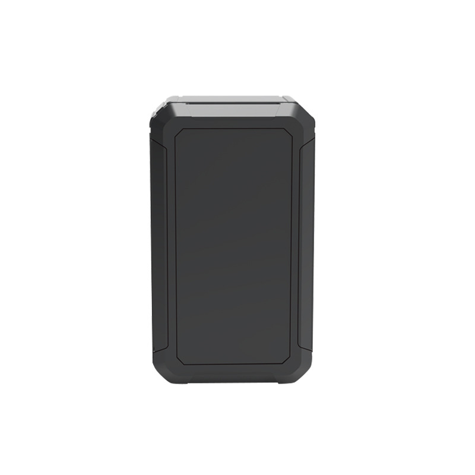

# GOTOP - G30B

El G30B es un rastreador GPS compacto con montaje magnético, diseñado para el seguimiento prolongado y de bajo mantenimiento de vehículos y activos móviles. Comercializado en catálogos de equipos como una unidad discreta, el dispositivo combina posicionamiento GNSS híbrido (GPS y Beidou) con respaldo LBS, una batería interna de gran capacidad y potentes imanes NdFeB para una fijación no permanente. Su formato reducido y su enfoque en una larga autonomía en modo espera lo hacen ideal cuando se priorizan las intervenciones infrecuentes y actualizaciones de ubicación confiables.

Como dispositivo compatible con Plaspy, el G30B puede enviar información de ubicación y estado a la plataforma para obtener visibilidad centralizada de la flota y gestión de eventos. Su larga duración de batería, alertas por manipulación, ventanas de reporte configurables y opciones básicas de integración externa se alinean con los flujos de trabajo habituales de Plaspy para monitoreo remoto de activos, alertas antirrobo e informes programados que equilibran la visibilidad operativa con la conservación de la batería.

## Características principales

- Compatible con Plaspy para seguimiento centralizado y generación de alertas en flotas y activos.
- Posicionamiento GNSS híbrido (GPS y Beidou) con respaldo LBS para mejorar la disponibilidad de la ubicación.
- Batería interna de gran capacidad diseñada para intervalos de espera prolongados y minimizar el mantenimiento.
- Carcasa ABS con montaje magnético para fijación rápida y no permanente en vehículos o equipos.
- Funciones antirrobo que incluyen alarmas por manipulación y desmontaje, además de modos de operación anti detección.
- Opción de integración UART para conectar módulos externos y soportar flujos de trabajo adicionales de flota.

## Cómo funciona con Plaspy

Al integrarse con Plaspy, el G30B transmite sus fijaciones de ubicación y eventos de estado a la plataforma, donde esos paquetes se procesan para mapas en vivo, alertas, reproducción histórica e informes rutinarios. Plaspy se puede configurar para ajustar el reporte del dispositivo y optimizar entre la oportunidad de los datos y la vida útil de la batería, además de mostrar eventos de seguridad e indicadores de mantenimiento al equipo operativo.

- Actualizaciones de ubicación en tiempo real entregadas a Plaspy para visualización en mapas y monitoreo de rutas.
- Alarmas por manipulación y desmontaje enviadas como eventos de seguridad para activar notificaciones y flujos de recuperación.
- Telemetría de nivel de batería y estados de reposo/activación disponible en Plaspy para planificar mantenimiento y reemplazos.
- Programaciones de reporte configurables para limitar transmisiones durante periodos inactivos y extender la vida del dispositivo.
- Integración de eventos del dispositivo en los informes y la reproducción histórica de Plaspy para auditorías y reconstrucción de incidentes.
- Capacidad para combinar las señales del G30B con otras fuentes de datos en Plaspy y obtener un contexto operativo más rico.

## Casos de uso típicos

- Rastreo de vehículos de alquiler, donde el montaje discreto y la larga autonomía reducen los ciclos de recuperación y mantenimiento.
- Vehículos financiados o en garantía que requieren alertas por manipulación e historial de eventos para apoyar acciones de recuperación.
- Monitoreo de taxis y vehículos de pasajeros en los que actualizaciones precisas y reportes configurables mejoran las operaciones.
- Remolques y equipos que necesitan visibilidad durante periodos prolongados cuando no hay alimentación regular disponible.
- Seguimiento de activos móviles en construcción, contenedores y otros bienes de alto valor.

## Por qué elegir este rastreador con Plaspy

El G30B es una opción práctica para organizaciones que necesitan un rastreador discreto y de bajo mantenimiento que proporcione actualizaciones regulares de posición y alertas de seguridad. Su combinación de posicionamiento híbrido, montaje magnético y larga autonomía en espera complementa las capacidades de Plaspy para supervisión de flotas, gestión de alarmas y análisis histórico sin requerir intervenciones frecuentes en sitio.

Plaspy puede ingerir la telemetría del G30B y mostrarla junto con otros datos de la flota para generar informes operativos, activar flujos de trabajo antirrobo y programar mantenimiento en función del estado de la batería. Para más información sobre cómo Plaspy soporta dispositivos como el G30B visite https://www.plaspy.com. Las especificaciones del producto, la disponibilidad y los detalles del fabricante pueden cambiar con el tiempo, por favor verifique las especificaciones y variantes actuales con el fabricante en https://www.gotop.cc/.
